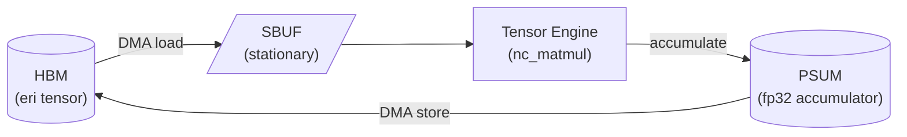

---
hide:
  - navigation
  - toc
---

# Author brief — trnsci technical deep-dives

This page is the editorial brief for technical retrospectives on the [trnsci blog](https://trnsci.dev/blog/). It's designed to be read once and referenced against the template.

## What you're writing

A technical retrospective on a piece of work that just shipped in one of the trnsci libraries — trnfft, trnblas, trnrand, trnsolver, trnsparse, or trntensor.

**Audience:** CUDA programmers evaluating Trainium. Neuron SDK users looking for scientific computing code. Maintainers of the sibling libraries in the trnsci suite. Assume readers know Trainium exists but not what NKI is — link out for NKI, don't redefine it each post.

## Voice — authorless by default, library as subject

**Technical deep-dives are unsigned.** No byline. No "I". No named maintainer.

The library itself is the subject:

> trnfft's butterfly kernel now validates on trn1.2xlarge across 70/70 benchmark cases. Getting there required…

Not:

> I built a butterfly kernel…
> We built a butterfly kernel…

Why: the work is being done collaboratively, the authorship distinctions are arbitrary, and what matters is the technical content. A byline adds nothing and creates false personhood.

Exceptions where a byline is appropriate:

- **Editorial suite digests** — bylined to Scott Friedman as the suite director, because curatorial judgement is exercised.
- **Thinking pieces about accelerator architecture, open-source governance, ecosystem positioning** — bylined to whoever writes them, because opinion is being expressed.

When in doubt on a technical post: no byline.

## Editorial stance — architecture-first, transparency-always

**Two principles stacked.**

### Architecture first, not straight porting

The trnsci suite isn't interesting because it ports cuFFT / cuBLAS / cuRAND / cuSOLVER / cuSPARSE / cuTENSOR techniques to Trainium one-to-one. If all we have to say is "we replicated NVIDIA's approach on different silicon", that's not a post worth writing.

What's worth writing: **what does Trainium's architecture — the four programmable engines, the fixed 128-partition × 512-moving tile, the explicit SBUF/PSUM memory hierarchy, the DMA engine as a first-class resource, the NEFF cache semantics, whole-program NKI compilation — make possible that a GPU wouldn't naturally suggest?**

Concrete examples of the framing we want:

- "Jacobi rotations land on the Tensor Engine because each Givens rotation is a rank-2 matmul that matches the 128-partition tile exactly; that tile-friendliness matters more than the O(n³) FLOP count disadvantage versus Householder." Not: "we chose Jacobi because it's different."
- "BSR at 128×128 isn't a port of cuSPARSE's BSR — it's the native Trainium sparse format because each block is a Tensor Engine tile with zero gather overhead." Not: "we added BSR because cuSPARSE has it."
- "The MP2 energy kernel fuses the per-(i,j) contraction with the orbital-energy denominator division in one NKI pass because intermediates can stay SBUF-resident across a DAG-scheduled kernel — that's a pattern that doesn't translate back to per-op PyTorch cleanly." Not: "we wrote a fused kernel for speed."

The question to hold in your head while drafting: **what about this kernel reveals something about the hardware that a CUDA programmer wouldn't have reached for?** If the answer is "nothing", the post probably isn't ready.

### Transparency over polish

**Post what actually happened, including the parts that didn't work.** Vendor-marketing voice ("trnblas delivers unprecedented DF-MP2 throughput") is not useful and actively harms credibility.

Useful content we want in every technical deep-dive:

- **What was tried that didn't work.** Reverted kernels, approaches that looked plausible on paper and failed on hardware, NKI compiler behaviors that surprised. Name the blind alleys.
- **Honest benchmark numbers, including the ones that disappointed.** If the NKI path is slower than PyTorch CPU at small shapes (it often is), say so and explain why. Readers will find out anyway.
- **Tradeoffs made deliberately.** "Jacobi was chosen over Householder because X, and the cost is Y." The "cost is Y" half is the credibility half.
- **Open questions.** Follow-ups that are known, behaviors that have been observed but not fully explained.
- **NKI and Neuron toolchain observations.** This one is important enough to call out separately — see the next subsection.

**Benchmarks are validation, not the point.** A post full of numbers and no architectural insight is a fail state. A post with modest numbers but a clear articulation of what the hardware enabled that wasn't natural on NVIDIA is a win.

### Be candid about the toolchain, not just the library

The trnsci suite is built on top of NKI and the Neuron SDK. Both are actively evolving. Readers deciding whether to adopt Trainium will benefit more from honest notes on toolchain maturity than from a post that pretends everything was smooth.

Concrete things worth writing about when they apply:

- **NKI compiler bugs or surprising behaviors.** "This `nl.store` pattern produced wrong results with no error until we added an explicit barrier" is the kind of note that saves someone else days. Include the SDK version you were on.
- **Missing primitives.** If you needed `nl.frobnicate` and it didn't exist, say so and describe the workaround. That's a feature request signal AWS can act on, and a warning for other users.
- **Awkward APIs.** If an op took ten lines when it should have taken two, document the shape that felt natural to reach for and the shape that was actually required.
- **Documentation gaps.** If official Neuron docs were silent on a behavior you had to discover empirically, name the behavior. Link to the relevant docs page (or its absence).
- **Error messages.** When a compile error was unhelpful, quote it. "Partition dim must be at position 0" with no pointer to *why* is an example of the kind of message that belongs in a post so future searchers find it.
- **Version drift.** If behavior changed between `neuronxcc` versions and you noticed, log it. Version-pinning guidance is part of a library's public contract.
- **Specific suggestions to AWS Neuron.** If you have a concrete request — "it would help to have X primitive" or "this error should include Y" — write it. The Neuron team reads the ecosystem. Be useful feedback.

The tone here matters. Professional, not bitter. Specific, not vague. Anchored in reproducible experience, not generic gripes. Constructive where possible — suggest a fix, don't just note the problem. The goal is to be the kind of honest technical write-up that makes the whole Trainium ecosystem better, including AWS's own work on the toolchain.

If there's nothing worth saying about the toolchain for a given post, that's fine — don't manufacture complaints. But if there is something, don't leave it out to sound polished.

### Be candid about fit — what Trainium is and isn't well-indexed for

Trainium was designed primarily for large-model training and inference. That design choice over-indexed the silicon toward certain shapes (dense GEMM-heavy workloads with long sequences) and under-indexed it relative to other scientific-computing patterns. A library that sits on top of Trainium has an honest obligation to name both.

Useful framing to include when it applies:

- **Where the workload is a natural fit.** "DF-MP2 is dense-GEMM-heavy with regular basis-set shapes; that's exactly what the Tensor Engine was built for." Good fits aren't accidental — they happen when scientific workload shapes happen to coincide with training workload shapes. Name the coincidence.
- **Where the workload is an awkward fit.** "Large sparse matrices with highly variable nnz are painful on Trainium because the Tensor Engine assumes dense tiles and the DMA gather penalty grows fast. BSR at 128×128 is the pragmatic response, but it's a response to a shape mismatch, not an architectural win." Don't pretend a workaround is a native fit.
- **Where the hardware looks over-indexed.** Trainium's systolic array is larger and more constrained than what some scientific workloads need. A small FFT (N ≤ 256) is memory-latency-bound and leaves most of the Tensor Engine idle. That's not a trnfft failure — it's a silicon sizing observation. Note it.
- **Where the hardware looks under-indexed.** Variable-rate scatter/gather, irregular graph workloads, dynamic-shape inference — these patterns are second-class citizens on Trainium today. If your library bumps into that, say so.
- **Specific suggestions to AWS silicon design.** These go further than toolchain suggestions — they're "a future chip could help this workload by X". Feature creep into hardware design, but AWS reads the ecosystem and hardware roadmaps do respond to real workload feedback. Be the signal.

The stance is the same: professional, specific, anchored in what you actually built. Not "Trainium is bad at sparse" — say which nnz pattern, which tile size, which DMA behavior, and what a better fit would look like. The framing that works: "this library exists because Trainium's current shape makes sense for this workload, and the places where it doesn't are named below."

This matters beyond ecosystem credibility — it also shapes how the suite should grow. A library whose motivating workload is a poor fit for current Trainium should be honest about what future silicon generations would unlock, and prioritize phases accordingly.

## Required structure

Use these section headings in this order. The `posts/_template.md` file has them pre-filled.

1. **Lead** (2–3 sentences) — one sentence on what shipped, one on why it's interesting *architecturally*, one on who should care.
2. **The problem** — what workload is this solving, and what's awkward about solving it on Trainium with a naive port of the CUDA approach. Cite the cuX analog by name but don't privilege its design.
3. **What the architecture suggests** — **required section.** What does Trainium's hardware (engines, tile, memory hierarchy, NEFF, DMA) actually afford for this problem? What's the native-to-Trainium design, independent of CUDA? This section is the heart of the post.
4. **The approach** — the design chosen. How it exploits what Section 3 identified. At least one tradeoff made deliberately. If the design ended up looking like the CUDA approach, say so and say why — but don't default to that framing.
5. **Implementation** — at least one code sample showing the key NKI kernel or dispatch pattern. Real code from the repo, not pseudocode.
6. **What didn't work** — blind alleys, reverted approaches, NKI compiler surprises, numbers that disappointed. Named in full. This section is required; "nothing" is almost never the right answer.
7. **Numbers** — if hardware benchmarks exist, put a table. CPU baseline + Trainium, same inputs, honest numbers including the ones that look bad. Numbers confirm or contextualize the architectural choice in Section 3 — they don't justify it on their own.
8. **What's next** — explicitly link the Phase 2/3/4/5 tracker issues for the library. Readers should know where the project goes from here.
9. **Takeaway** (3–5 sentences) — what one architectural idea should the reader leave with.

## Style rules

- Name the library in the title (e.g., "trnfft: FFT on hardware without a complex dtype"). Not a generic framing.
- Use absolute numbers with units. Not "fast", not "3x speedup". Specific microseconds, TFLOPS, basis-function counts, nnz densities.
- Link back to the suite: [trnsci.dev](https://trnsci.dev), the [roadmap](https://trnsci.dev/roadmap/), the [suite-wide tracker](https://github.com/trnsci/trnsci/issues/1). Act like part of a suite.
- No emoji unless the post is explicitly about emoji. (It isn't.)
- Apache 2.0 code samples only. If borrowed, cite.
- Length: 1,200–2,500 words. Longer splits into two posts.

## Frontmatter

Copy verbatim into the top of the post; change date / slug / categories:

```yaml
---
date: 2026-04-13
categories: [Deep dive, trnfft]   # or trnblas, trnrand, trnsolver, trnsparse, trntensor
comments: true
---
```

The `date` field is required for blog ordering and RSS metadata, but **the date is not displayed on the rendered page or in the URL** (the URL is `/blog/<slug>/`). Don't reference the date inline as if it'll be visible to the reader.

No `authors:` line for technical deep-dives.

Slug and filename: `docs/blog/posts/<YYYY-MM-DD>-<short-slug>.md`. Keep slugs short — `2026-04-13-fft-without-complex-dtype.md`, not the full title.

## Tables, diagrams, and visual aids

Wall-of-text retrospectives are intimidating. Use visuals where they earn their keep — a 200-word paragraph that becomes a 6-row table is almost always a win for the reader.

**Tables.** Standard markdown tables work everywhere. Use them for: benchmark results, per-shape comparisons, NKI-vs-CPU-vs-other-platform numbers, before/after diffs of a tradeoff, mapping a sub-project's APIs to their cuX analogs. Honest tables — including rows where the project loses — are credibility-positive.

**Mermaid diagrams.** Lightweight architecture sketches, dataflow diagrams, kernel pipeline shapes, and decision flowcharts render cleanly via fenced code blocks:

````

````

Don't over-do it. One or two diagrams in a post that genuinely benefit from visual structure beats five decorative ones. Diagram-as-recap (a single picture summarizing what the prose just explained) is usually a win.

**Code samples** stay short. One representative kernel snippet is much better than three near-identical ones. Link to the full source on GitHub for readers who want depth.

**Admonitions** (`!!! note`, `!!! warning`, `!!! info`) work via the `admonition` extension and are useful for sidebar-style content — version compatibility caveats, "if you're skimming, here's the takeaway", links to deeper reading. Use sparingly so they retain visual weight.

## Submitting — PR only, no direct commits

**Do not commit the post directly to `main`. Do not push only to a branch. The PR is how editorial review happens; skipping it is an editorial failure, not a speed win.**

Exact steps, in order:

1. Draft the post on a branch in the umbrella repo (`trnsci/trnsci`) named `blog-<library>-<short-slug>` (e.g. `blog-trnfft-no-complex-dtype`).
2. Commit the post to `docs/blog/posts/<YYYY-MM-DD>-<slug>.md` on that branch.
3. Push the branch to `origin`.
4. Open a pull request against `main`:
   ```
   gh pr create --repo trnsci/trnsci --base main --head <branch> \
     --title "blog: <library> — <title>" \
     --body "Ready for editorial review."
   ```
5. **Do not merge the PR yourself.** Scott (suite director) reviews for structural consistency, fact-checks against the repo, and merges when ready.
6. Expect one or two rounds of review comments. Technical content isn't rewritten; your voice stays.
7. On merge, the post appears at `trnsci.dev/blog/` within minutes (on push) or by 06:00 UTC the next day (daily cron).

Posts that land on `main` without review are treated as a process miss and may need to be reverted + replayed through PR. The review step catches both factual errors and tone drift that's hard to see from inside the post.

## Optional pre-draft pitch

For sanity-checking scope and angle before investing the writing time: open a GitHub issue on [trnsci/trnsci](https://github.com/trnsci/trnsci/issues) with label `blog-pitch`. Title + 3-sentence abstract. Lightweight.

## Questions

Open a discussion on [trnsci/trnsci](https://github.com/trnsci/trnsci/discussions) under the "Editorial" category.
