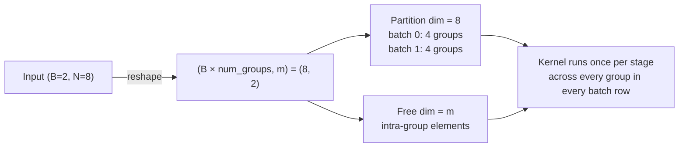

# trnfft: FFT on hardware that doesn't want to be an FFT engine

Between v0.7 and v0.12, [trnfft](https://trnsci.dev/trnfft/)'s NKI story moved from one per-row butterfly dispatch into a batched butterfly plus a fused DFT-as-GEMM fast path, with opt-in Kahan-compensated precision — all hardware-validated on trn1.2xlarge. What landed on silicon looks very little like cuFFT: no complex dtype, no thread-per-butterfly, no bit-reversal in the fast path. What Trainium's architecture — four programmable engines, a fixed 128-partition × 512-moving tile, explicit SBUF/PSUM memory — suggested was a different decomposition, and this post is the retrospective on what that turned out to be.

<!-- more -->

## The problem

FFT is load-bearing for spectral PDE solvers, speech enhancement, radar, convolutional nets, Ewald sums. `torch.fft` and `cuFFT` are the reference APIs; both assume a native complex dtype and a massively threaded SIMT unit — a radix-2 Cooley-Tukey butterfly in that model is "one warp per butterfly, thousands in flight, one complex register, bit-reverse the input index".

Trainium has neither assumption. There is no hardware complex dtype — every complex tensor must be paired real tensors. The execution model isn't SIMT; it's four cooperating engines (Tensor, Vector, Scalar, DMA) with a fixed tile shape of 128 partitions × up to 512 free elements, and a whole-program NKI compiler that schedules their dependencies. A naive "one thread per butterfly" port runs into partition underutilization: filling 128 partitions with radix-2 pairs means reaching across 64 simultaneous butterfly groups, not across threads inside one. Porting cuFFT is a bad starting point; the interesting question is what the architecture suggests if cuFFT didn't exist.

## What the architecture suggests

**No complex dtype.** Every complex tensor becomes two real tensors side by side. The `ComplexTensor(real, imag)` wrapper is a split-real/imag holder, not a new primitive. Complex multiply decomposes to four real multiplies and two real adds; complex matmul to four real matmuls and two real matrix adds. This isn't a workaround — stationary `nisa.nc_matmul` has no complex-typed equivalent and would unpack to four real matmuls in the compiler either way.

**The 128-partition tile prefers many independent small operations.** A radix-2 butterfly acts on pairs, so filling the partition dim means *flattening across butterfly groups*. An FFT of size N at stage s has `N / 2^(s+1)` independent groups; all of them run in parallel along the partition dim. For batched FFT (`(B, N)` input) the math compounds: `B × num_groups` lands in the partition slot, saturating the tile at reasonable B.



**Four engines mean a butterfly stage issues two ops in parallel.** The Tensor Engine does the twiddle × odd-element multiply; the Vector Engine does the `e + prod` / `e - prod` butterfly combination. These aren't sequential the way they are on a GPU warp — the NKI compiler schedules them on separate engines, with DMA prefetch overlapping from HBM. The primitive isn't "one butterfly"; it's "fill the Tensor Engine pipeline with twiddle multiplies while the Vector Engine consumes their outputs".

**PSUM is fp32 and has a ceiling.** The Tensor Engine accumulates products in PSUM in fp32 — generous for one matmul, but a long dependency chain (three power-of-2 FFTs in Bluestein's chirp-z decomposition) compounds rounding error. At N ≥ 500 the default Bluestein path accumulates roughly 2 × 10⁻² relative error against a scipy fp64 reference. That's as much a hardware-sizing observation as an algorithm choice, and it motivated the Kahan-compensated butterfly in the `"kahan"` precision mode: the Vector Engine folds a 2Prod compensation step in cheaply because the extra adds land on the engine that would otherwise sit idle while the Tensor Engine is busy — compensation is architecturally cheap in a way it isn't on a GPU.

## The approach

v0.8.0 landed four NKI kernels built on the above:

1. `_complex_gemm_kernel` — four real `nisa.nc_matmul` calls into two fp32 PSUM accumulators, with stationary-tile reuse: A_real stationary while B_real and B_imag stream, then A_imag stationary with -B_imag and B_real. Halves SBUF loads per PSUM pair.
2. `_complex_mul_kernel` — fused elementwise complex multiply, one SBUF round-trip instead of six.
3. `butterfly_stage_kernel` — batched radix-2 DIT stage. Input `(B, N)` flattens to `(B × num_groups, m)`; partition dim is the combined batch-and-group axis, free dim is the intra-group element. Twiddles are host-broadcast across partition rows so partition dims match when the Vector Engine fires.
4. `butterfly_stage_kernel_kahan` — compensated variant. Dekker 2Prod split of each `t × o`, adding the rounded-off low-order part back into the complex sum. Doubles the butterfly op count, runs mostly on the Vector Engine. Opt-in via `trnfft.set_precision("kahan")`.

STFT, batched FFT, and fft2/fftn all flow through one `_cooley_tukey_nki` dispatcher that flattens leading batch dims into the partition slot and calls the kernel once per stage.

Deliberate tradeoff: radix-2 fills the Vector Engine cleanly but pays `log₂(N)` kernel launches, each carrying NKI dispatch overhead. At N ≥ 1024 that starts to dominate — which motivates Thread B (radix-4 Stockham) under active development.

## Implementation

The butterfly stage kernel is the load-bearing piece. Stripped to its essential shape:

```python
@nki.jit
def butterfly_stage_kernel(x_re, x_im, tw_re, tw_im, n, stage):
    m = 1 << (stage + 1)
    half = m >> 1
    total_groups = x_re.shape[0] * (n // m)

    # Flatten (B, n) -> (total_groups, m). Partition dim = total_groups;
    # every partition row is one independent butterfly group.
    x_re_2d = x_re.reshape((total_groups, m))  # x_im, outputs likewise

    groups_chunk = min(total_groups, PMAX)
    for p in nl.affine_range(total_groups // groups_chunk):
        p_off = p * groups_chunk
        for k in nl.affine_range(half):
            # Load t_re, t_im and the even/odd pair at column k for this tile.
            # ...
            prod_re = nl.subtract(nl.multiply(t_re, o_re),
                                  nl.multiply(t_im, o_im))
            # prod_im symmetric; then even = e + prod, odd = e - prod.
    return out_re, out_im
```

(Apache 2.0, full source: [`trnfft/nki/butterfly.py`](https://github.com/trnsci/trnfft/blob/main/trnfft/nki/butterfly.py).)

A GPU would nest `k` as the outer loop and thread-parallelize over groups. Here the partition dim *is* the group dim, and `k` iterates through butterfly positions inside each group. For non-power-of-2 `B` (STFT's 33 frames), the host pads to the next multiple of 128 — cheaper than irregular-partition support in NKI 2.24, and discarded after the stage.

## What didn't work

**FP32 Bluestein precision.** Bluestein chains three power-of-2 FFTs with chirp multiplies to handle arbitrary-N; in fp32 the relative error grows roughly as O(N) — ~1.4 × 10⁻² at N = 500 against a scipy fp64 reference. The test suite had silently papered over this with `tol = 2e-2` for N ≥ 500, marked "expected fp32 degradation" rather than fixed. v0.11.0 shipped `"fast"` / `"double"` / `"kahan"` precision modes: `"double"` promotes host math to fp64 (~5 × 10⁻¹³, host-side only), and `"kahan"` uses the compensated butterfly. `"kahan"` on CPU is equivalent to `"fast"` because the chirp multiplies aren't where the error lives — the butterfly chain is — and only on NKI does the compensation actually engage.

**NKI kernels silently detached autograd.** Every `@nki.jit` kernel returns a tensor from `nl.shared_hbm` with no registered `grad_fn`. Forward works fine; `loss.backward()` raises `element 0 of tensors does not require grad and does not have a grad_fn` on the first backward call (issue #56). Invisible for inference-only users. v0.10.1 wrapped every kernel in a `torch.autograd.Function` subclass with analytic adjoints.

**`torch.Tensor.unfold` has no XLA backend.** `trnfft.stft` originally used `x.unfold(dim, size, step)` for frame extraction; that raised `aten::unfold not implemented for XLA` the moment anyone set `set_backend("nki")`. Replaced with `torch.arange`-based frame indexing in PR #44.

**Three NKI 0.3.0 API deltas broke our kernels.** `nisa.nc_matmul` went kwargs-only with in-place accumulation (`dst=, stationary=, moving=, accumulate=True`). `nl.copy` now returns a view, so PSUM → SBUF materialization requires `nisa.tensor_copy(dst=, src=)` with a pre-allocated SBUF destination. Python `*`/`+`/`-` are no longer defined on `NkiTensor` — every complex-multiply and butterfly expression rewrote with explicit `nl.multiply` / `nl.add` / `nl.subtract`. All three were surfaced by the CPU simulator (`NKI_SIMULATOR=1`) in under two CI minutes. Release notes calling out operator-overload removal and `nl.copy` becoming a view would save downstream libraries a CI iteration each.

**Full-size DFT-as-GEMM capped at N = 256.** v0.12.0's DFT-as-GEMM fast path beats butterfly by 2.2–5.7× at N ∈ {8..128} and 5.3× at N = 1024 — but fp32 `nisa.nc_matmul` accumulation at N = 1024 reaches ~2.2% relative error, breaking the 1e-3 test tolerance. Real perf win, precision-blocked. Routing past 256 is what motivates Thread B (Stockham radix-4), where a `log₄(N)` chain accumulates only O(r²) error per stage.

## Numbers

Steady-state on trn1.2xlarge, `neuronxcc 2.24.5133.0`, Deep Learning AMI Neuron PyTorch 2.9. All numbers after warmup — the first call pays NEFF compile, subsequent calls are cache hits, and these are the means of the warm side.

### v0.7.0 → v0.8.0 — batched kernel landing

| Operation | v0.7.0 | v0.8.0 | Speedup |
| --- | ---: | ---: | ---: |
| fftn 32×64×64 | 52.3 s | 70.8 ms | 738× |
| fft2 1024×1024 | 32.4 s | 545 ms | 59× |
| batched FFT (128×1024) | 2.07 s | 52 ms | 39× |
| STFT (16 000 samples) | 765 ms | 28 ms | 27× |

v0.7.0 dispatched the butterfly once per (row, stage) pair in Python. v0.8.0 removes that loop; the 27× STFT delta is "fix the dispatch pattern so the kernel sees the batch", not a kernel-level win.

### v0.12.0 — DFT-as-GEMM for small N

| Shape | DFT-GEMM | Butterfly | Speedup |
| --- | ---: | ---: | ---: |
| N = 256, B = 1 | 1 882 μs | 9 862 μs | 5.2× |
| B = 32, N = 256 | 2 049 μs | 29 210 μs | 14.3× |
| STFT (n_fft = 256, 16 k samples) | 2 445 μs | 30 514 μs | 12.5× |

The batched and STFT rows are where the architectural thesis pays off — DFT-GEMM at `(B = 32, N = 256)` collapses the whole batch into one `nisa.nc_matmul` and the partition dim saturates. For context, `torch.fft.fft` on an x86 bench host with MKL is faster than Trainium for isolated cold calls (10–80 μs); the story isn't "beat MKL on cold calls", it's "keep data on-chip across long operator chains".

## What's next

- **Phase 2 #52 — Kahan / Neumaier summation.** Partial delivery in v0.11.0 (precision-modes API + compensated butterfly). The Kahan butterfly compiles on NKI 2.24.5133.0 and matches the stock kernel at fp32 rtol across the 17-test neuron suite; whether the 2Prod compensation *actually* reduces fp32 FFT error on silicon is the measurement question open in #58.
- **Thread B — Stockham radix-4 (v0.13 candidate).** POC shipped this week, CPU reference + NKI port green under the simulator. 5 kernel launches at N = 1024 vs 10 for butterfly, and `log₄(N)` fp32 accumulation vs the O(N²) ceiling that caps DFT-GEMM. Hardware validation pending an AWS DLAMI with Neuron SDK 2.29.
- **Phase 3 #53 — perf.** Plan reuse across shapes, streaming large FFTs that exceed HBM, NEFF cache hit-rate instrumentation.
- **Phase 4 #54 — multi-chip FFT for N > 2²⁰** via cross-core collectives.
- **Phase 5 #55 — trn2.** Larger SBUF, different systolic sizing; some current constraints loosen.

## Takeaway

Trainium was built for large-model training and inference; FFT isn't the workload it was indexed for. A warp-per-butterfly port maps badly onto 128 partitions and a fixed engine hierarchy. What works instead is treating the partition dim as "total independent butterfly groups across every batch row", the four engines as a scheduling substrate, and fp32 PSUM as a real ceiling on algorithm choice. Every trnfft kernel so far is a variation on that theme; the roadmap is about pushing the thesis into medium and large N where the butterfly isn't obviously the right decomposition.
