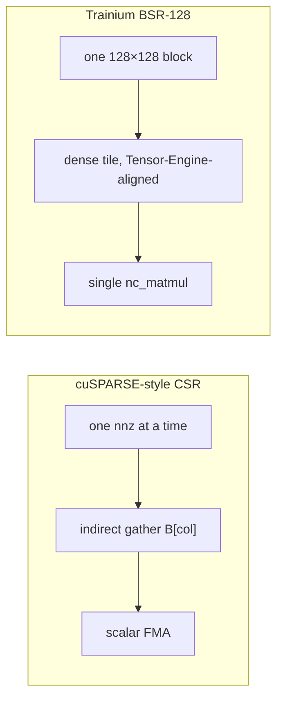

# trnsparse: the tile is the unit, not the nonzero

trnsparse shipped its first hardware-validated NKI SpMM kernel in v0.2.0, and the benchmark table was publicly worse than scipy across every configuration. That's not a failure — it's the evidence that led to the reframe v0.3.0 ships on: **Trainium's sparse primitive isn't CSR, it's the 128×128 Tensor Engine tile**. The CUDA sparse playbook is the wrong starting point for this hardware.

<!-- more -->

## The problem

[trnsparse](https://trnsci.dev/trnsparse/) is trnsci's cuSPARSE-equivalent: CSR/COO, SpMV, SpMM, integral screening for quantum chemistry. The motivating workloads — Schwarz-screened Fock builds, block-structured Hamiltonians, FEM stiffness, block-sparse attention — are sparse, but the zeros are almost never uniformly distributed. They're structured: dense in blocks, sparse between blocks.

cuSPARSE handles this with a CSR-native design tuned for a GPU's cheap arbitrary-pattern indirect gather. Thousands of threads each chasing one pointer is what GPU memory hierarchies are built for. A naive port of that design to Trainium is where trnsparse started, and where the numbers told it to stop.

## What the architecture suggests

Trainium's Tensor Engine is a 128-partition × 512-moving systolic array; `nisa.nc_matmul` is a dense 128×K×N tile multiply. The DMA engine handles HBM ↔ SBUF movement, but — the load-bearing detail for sparse — **as of NKI 2.24 / 0.3.0, the DMA engine does not expose an indirect-gather primitive at the kernel level**. The silicon supports the pattern in principle; the language doesn't expose it yet.

Tile-shaped compute plus no per-element indirect gather has a specific consequence: the natural unit of sparse work on Trainium is not a single nonzero. It's a 128×128 block.



A format that stores sparse matrices as 128×128 dense blocks, with a block-level CSR pattern over *which* blocks are nonzero, maps one-to-one onto the Tensor Engine. Each nonzero block is already in the shape `nc_matmul` wants — no gather step. Zero blocks are skipped in the dispatch loop.

This is Block-Sparse Row (BSR) at `block_size = 128`. cuSPARSE has a BSR implementation, but it's a specialization there. On Trainium it's not a specialization; it's the format the hardware asks for. cuSPARSE's BSR is a port back. Trainium's BSR is native.

**CSR and COO stop being compute formats** on the NKI path. They're interop — how scipy users hand matrices in, how ERIs come out of a chemistry code. The compute path converts to BSR at dispatch time, runs at tile granularity, returns dense. And **block density matters much more than element density**: a Fock matrix at 99.5% zero at the element level might still have 30% of its 128×128 blocks storing something. That's the density BSR cares about, and the one that stays modest for structured workloads.

## The approach

v0.2.0 shipped as the correctness path. The NKI kernel — [`_spmm_dense_kernel`](https://github.com/trnsci/trnsparse/blob/main/trnsparse/nki/kernels.py) — does the simplest thing that validates the Neuron toolchain: materialize CSR into a dense `(M, K)` tile on the host, pad to tile multiples, dispatch a stationary-A GEMM. Effectively the [trnblas GEMM pattern](https://github.com/trnsci/trnblas/blob/main/trnblas/nki/dispatch.py) with a trivial preamble. No sparsity exploitation.

The deliberate tradeoff: publicly slow. At 1024×1024 / density 0.001 / N=128, this does roughly 1000× more arithmetic than scipy. The benchmark table in v0.2.0 documents that directly. The reason to ship it anyway: the full toolchain — compile, NEFF cache, XLA dispatch, PyTorch integration, autograd wrapping — had to be wired end-to-end before the project could credibly commit to BSR. v0.2.0 is the evidence that said "the pipeline works; the shape of the work is wrong."

v0.3.0 introduced [`BSRMatrix`](https://github.com/trnsci/trnsparse/blob/main/trnsparse/formats.py) and [`bsr_spmm`](https://github.com/trnsci/trnsparse/blob/main/trnsparse/ops.py) as the headline. CSR stays in the API for interop; the NKI compute path runs through BSR. v0.4.0 added [`screened_spmm`](https://github.com/trnsci/trnsparse/blob/main/trnsparse/ops.py): one `@nki.jit` kernel fusing Schwarz bounds, mask application, and matmul. The unfused equivalent is four host passes plus a separate CSR build. One dispatch, no mask tensor on HBM — the second architectural pattern Trainium makes natural and CUDA doesn't reach for.

## Implementation

The BSR kernel, stripped of docstrings:

```python
@nki.jit
def _bsr_spmm_kernel(blocks_pad, b_gathered):
    M_tiles, K_max, _, _ = blocks_pad.shape
    _, _, _, N = b_gathered.shape
    TILE_M = 128  # fixed by BSR block_size
    TILE_N = N if N <= 512 else 512

    out = nl.ndarray((M_tiles * TILE_M, N),
                     dtype=blocks_pad.dtype, buffer=nl.shared_hbm)

    for m in nl.affine_range(M_tiles):
        for n in nl.affine_range(N // TILE_N):
            psum = nl.zeros((TILE_M, TILE_N),
                            dtype=nl.float32, buffer=nl.psum)
            for k in nl.affine_range(K_max):
                a_t    = nl.load_transpose2d(blocks_pad[m, k, :, :])
                b_tile = nl.load(b_gathered[m, k, :,
                                            n * TILE_N:(n + 1) * TILE_N])
                psum[...] += nisa.nc_matmul(a_t, b_tile)
            c_sbuf = nl.copy(psum, dtype=blocks_pad.dtype)
            nl.store(out[m * TILE_M:(m + 1) * TILE_M,
                          n * TILE_N:(n + 1) * TILE_N], value=c_sbuf)
    return out
```

The host-side preamble pads each block-row to the same `K_max` with zero blocks so the kernel's `affine_range` bounds are fixed. Block-rows with fewer stored blocks pay for the max. The alternative — row-bucketing by nnz ([#15](https://github.com/trnsci/trnsparse/issues/15)) — requires an indirect-DMA primitive NKI 2.24/0.3.0 does not expose.

The forward is NKI-dispatched via a `torch.autograd.Function` wrapper ([`_BSRSpMMFunction`](https://github.com/trnsci/trnsparse/blob/main/trnsparse/nki/dispatch.py), the suite's reference pattern for [trnsci/trnsci#3](https://github.com/trnsci/trnsci/issues/3)); backward runs at the PyTorch level and projects gradients through the stored blocks only:

```python
# backward sketch — shipped version routes grad_out into stored blocks
grad_blocks[k] = grad_out[row*b:(row+1)*b] @ B[col*b:(col+1)*b].T
grad_B         = A_dense.T @ grad_out
```

The block-selection pattern is non-differentiable by construction. `torch.autograd.gradcheck` at `atol=1e-4` passes on hardware; the same pattern now ships for three NKI kernels (CSR SpMM v0.2.0, BSR SpMM v0.3.0, fused screened SpMM v0.4.0).

## What didn't work

**v0.2.0's benchmark numbers were worse than planning assumed.** The expectation going in was "dense-materialization will be slower at low densities, but the high-N dispatch win narrows the gap."

The measured gap at 1024×1024 / density 0.01 / N=128: **scipy at 257 μs, trnsparse NKI at 2212 μs.** The gap didn't narrow.

The reason turned out to be dispatch overhead, not arithmetic. NKI times are roughly constant at 1.3–2.5 ms across all configurations tested — that's the Neuron dispatch + HBM round-trip floor, not the matmul. The [full benchmark table](https://trnsci.dev/trnsparse/benchmarks/) ships with all the entries where NKI loses by 100×. None were removed before release.

**CG-in-kernel isn't buildable on NKI 2.24/0.3.0.** [#24](https://github.com/trnsci/trnsparse/issues/24) was filed as the v0.4.0 architectural follow-up: a fused CG kernel with `A` SBUF-resident across all iterations, x/r/p cycled in-kernel. The audit killed it on three walls, in order:

1. `nl.affine_range` has no `break`/`continue` — no in-kernel convergence exit.
2. No iteration-carried scalar state across `affine_range` levels (trnblas's `_mp2_energy_kernel` flags this at `dispatch.py:586-588`: *"in-place += across affine_range hits NKI's 'Unexpected output dependencies'"*).
3. No nested kernel calls — the BSR matvec would have to be inlined.

#24 closed as not-buildable; v0.3.2 `cg_bsr` shipped instead as a Python loop around the existing matvec. The door's open for a future NKI release that adds persistent SBUF across calls.

**NKI 0.3.0 migration breaking changes are MLIR-level.** The moves to watch on the migration to the top-level `nki.*` namespace — `nc_matmul` keyword-only args, `nl.copy` returning a view, `nl.divide` dropped in favor of `nl.multiply` + `nl.reciprocal` — manifest at the MLIR verifier, not in a Python trace. The trnsparse kernels were compliant by coincidence (modelled on trnblas, which audited first), so no functional change. For kernels written less cautiously, hardware CI stays the gate.

**The autograd wrapper's block-gradient projection needed care.** The natural first cut — differentiate through `BSRMatrix.from_dense` — flowed gradients back through the block-selection logic, which is structurally wrong because selection is non-differentiable. The shipped wrapper stores block indices in `ctx` and routes `grad_out` into exactly the stored blocks. `torch.autograd.gradcheck` on a tiny synthetic system was the only thing that would have caught the first version.

**Simulator coverage is narrower than the headline.** The [NKI 0.3.0 simulator write-up](https://trnsci.dev/blog/the-dev-loop-just-got-a-lot-shorter/) covers this in detail; the trnsparse-specific note is that `nki.simulate` catches Python-layer errors but not MLIR verifier errors, so hardware CI stays load-bearing for anything touching partition-dim broadcasting. A device-free NEFF compile entry point would close the gap; a concrete request for the Neuron team.

## Fit — where BSR works and where it doesn't

Trainium is well-indexed for dense-GEMM-heavy training — its original motivating workload. trnsparse's Fock-build and block-sparse attention cases are a decent fit because they're block-dense at 128×128. Truly irregular sparse matmul (random CSR at density 0.001, highly variable nnz per row) is a shape mismatch with the silicon, not a library limitation. When a workload doesn't fit BSR — GNNs over non-uniform adjacency, for instance — the library recommends the `torch.sparse` fallback, not the NKI path. A future silicon generation that exposes indirect DMA gather would unblock a real gather-matmul-scatter path; that's a concrete hardware request.

## Numbers

All numbers on `trn1.2xlarge` with DLAMI `ami-07f81955eadf5b89c` (2026-04-10 build, `neuronxcc==2.24.5133` + `nki==0.3.0`). CPU baselines run on the same instance's Xeon.

**v0.2.0 CSR SpMM, mean time in μs.** Lower is better. Columns are size `M=K`, density, `N` (RHS width).

| Size | Density | N | scipy | torch.sparse | trnsparse pytorch | trnsparse nki |
|---:|---:|---:|---:|---:|---:|---:|
| 256 | 0.001 | 32 | 8.8 | 15.4 | 48.3 | 1397 |
| 256 | 0.001 | 128 | 7.6 | 29.1 | 44.7 | 1365 |
| 256 | 0.01 | 32 | 8.8 | 15.6 | 28.9 | 1248 |
| 256 | 0.01 | 128 | 20.4 | 27.5 | 41.7 | 1370 |
| 256 | 0.1 | 32 | 40.0 | 18.5 | 31.7 | 1278 |
| 256 | 0.1 | 128 | 137 | 34.2 | 48.6 | 1428 |
| 1024 | 0.001 | 32 | 14.4 | 28.9 | 43.4 | 1732 |
| 1024 | 0.001 | 128 | 39.8 | 27.2 | 47.0 | 2067 |
| 1024 | 0.01 | 32 | 72.4 | 31.8 | 48.1 | 1847 |
| 1024 | 0.01 | 128 | 257 | 46.5 | 72.5 | 2212 |
| 1024 | 0.1 | 32 | 609 | 75.0 | 95.5 | 2151 |
| 1024 | 0.1 | 128 | 2475 | 248 | 274 | 2479 |

At every data point, the NKI column is slower than both CPU backends. Two structural reasons: no sparsity exploitation (v0.2.0 materializes CSR to dense before the matmul), and dispatch overhead dominates (NKI times constant ~1.3–2.5 ms because kernel-launch + HBM round-trip is the flat floor at these sizes).

**v0.3.0 BSR SpMM.** At `4×4` blocks / 10% density / `N=128`: BSR-NKI 1.85 ms vs BSR-PyTorch 0.11 ms. At `8×8` / 50% / `N=256`: NKI 3.11 ms vs PyTorch 1.05 ms. BSR is validated as Trainium-native at the level of "runs correctly, differentiable, on the Tensor Engine." The performance win against CPU is Phase 3 work.

## What's next

- [#15](https://github.com/trnsci/trnsparse/issues/15) Phase 3 row-bucketing / gather-matmul-scatter — backlog under the BSR reframe; reopens if NKI exposes per-row DMA gather.
- [#22](https://github.com/trnsci/trnsparse/issues/22) on-chip iterative solvers — v0.3.2 plumbing shipped; fused kernel ([#24](https://github.com/trnsci/trnsparse/issues/24)) parked on NKI capability.
- [#16](https://github.com/trnsci/trnsparse/issues/16) Phase 4 sharded BSR across NeuronCores; gated on suite-level multi-chip collectives.
- [#17](https://github.com/trnsci/trnsparse/issues/17) Phase 5 trn2-specific DMA bandwidth exploitation.
- [#21](https://github.com/trnsci/trnsparse/issues/21) block-sparse attention writeup — BSR-128 IS a local-attention mask.

## Takeaway

The v0.2.0 benchmark table is the most important thing trnsparse has published so far. Not because the numbers are good — they're not — but because they're the evidence that anchored the reframe. The CUDA sparse playbook assumes a memory hierarchy where arbitrary-pattern gather is cheap; Trainium has a tile-shaped compute unit and a DMA engine that doesn't yet expose indirect gather at the kernel level. Under those constraints, the native sparse representation isn't a list of nonzeros; it's a list of 128×128 blocks. BSR isn't a cuSPARSE port. It's what the hardware asks for. The honest way to find that out was to ship the naive port, publish the numbers it produced, and let the shape of the failure tell the story.
