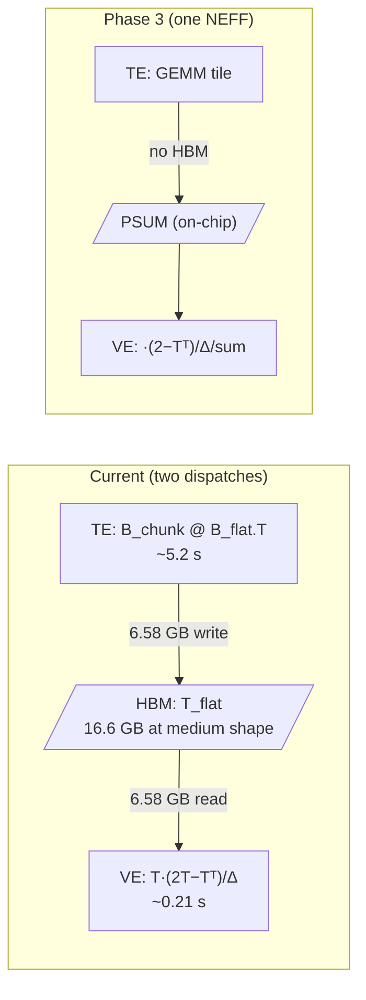

# trnblas: four hypotheses, one profiler trace, and why 1.48× is the correct answer

The [previous trnblas post](https://trnsci.dev/blog/2026/04/trnblas-fusing-df-mp2-energy-reduction-into-one-nki-kernel/) shipped with a 1.48× speedup on the fused MP2 energy reduction and an open admission: the kernel underperforms the 3× RFC target, four hypotheses exist for why, and none had been tested against hardware. One Neuron Profiler 2.0 trace later, the answer is in — Vector Engine at 96.45% active, Tensor Engine at 0.000002%, HBM reads matching the analytical prediction to the byte. The 1.48× ceiling is an exact Amdahl prediction, and the kernel is near-optimal on its own step.

<!-- more -->

## The problem

The fused energy kernel shipped at 1.48× vs. the torch reduction path, with four open hypotheses for the remaining gap to the 3× design target:

| Hypothesis | Tested in | Result |
|---|---|---|
| Denominator hoisting out of `(i, j)` loop | [#32](https://github.com/trnsci/trnblas/pull/32) | 1.48× → 1.50×, within noise |
| Cross-pair SBUF batching (K pairs, one HBM store) | [#36](https://github.com/trnsci/trnblas/pull/36) | 1.48× → 1.49×, within noise |
| Per-pair HBM-store fence overhead | folded into #36 | no change |
| Dispatch overhead above NEFF cache | direct measurement | NEFF cache already amortizes |

All four targeted the energy kernel's own step. None moved the number by more than 0.02×. The profiler investigation ([#33](https://github.com/trnsci/trnblas/issues/33)) was queued to look at what the hardware actually does during a call.

## What the architecture suggests

Trainium's four programmable engines — Tensor, Vector, Scalar, GpSimd — are distinct physical execution units. The profiler reports each independently. That separation is what makes Neuron Profiler output architecturally informative rather than just numerically informative: a 96.45% VE / 0.000002% TE split is a hardware-level readout, not a heuristic estimate.

The MP2 energy expression is:

```
E_partial = T * (2T − Tᵀ) / Δ,   summed over virtual orbital pairs (a, b)
```

Every operation in this chain — multiply, subtract, reciprocal, free-dim sum — is element-wise arithmetic. There is no matrix product. Element-wise ops on Trainium run on the Vector Engine. Systolic matrix multiplication runs on the Tensor Engine. A kernel whose expression is entirely element-wise *should* show near-zero Tensor Engine utilization; 0.000002% is the confirmation.

This is also why the four prior hypotheses were always targeting the wrong thing. The energy kernel's own step takes 0.21 s of the fused path's 5.43 s total. The GEMM that precedes it — `T_flat = B_chunk @ B_flat.T`, running on the Tensor Engine — takes ~5.2 s. No amount of Vector Engine tuning in the energy kernel can move a number that is 4% of the total.

The architecture also points directly at the Phase 3 solution. PSUM is the Tensor Engine's 32-bit accumulation buffer, on-chip. After a GEMM tile completes, its result sits in PSUM before being stored to HBM. A kernel that fuses GEMM and energy reduction can read that PSUM output directly with Vector Engine instructions — T_flat never touches HBM. The current two-kernel split (GEMM → HBM → energy kernel) materializes 6.58 GB of T_flat to HBM per energy step and then reads it back; Phase 3 eliminates that round-trip.



## The approach

Neuron Profiler 2.0, available in Neuron SDK 2.29, replaced the old `inspect`/`show-session` workflow with two commands:

```bash
neuron-profile capture -n <model.neff> -s profile.ntff
neuron-profile view   -n <model.neff> -s profile.ntff --output-format summary-text
```

`capture` executes the NEFF and records a hardware trace. `--io-from=neff` (the default) allocates IO tensors from the NEFF's own declared shapes — no input `.npy` files needed. `view --output-format summary-text` returns per-engine utilization and instruction counts to stdout, with no InfluxDB, no browser, and no local viewer required.

NEFF isolation is clean given NKI's compile-once cache model: clear `/var/tmp/neuron-compile-cache`, run a Python warmup that calls only `nki_mp2_energy`, and the single resulting `model.neff` is unambiguously the energy kernel. NEFF size was 17 MB; captured trace was 191 MB.

## Implementation

```python
# mp2_warmup.py — compiles _mp2_energy_kernel to an isolated NEFF
import sys
sys.path.insert(0, '/home/ubuntu/trnblas')
import torch, trnblas

trnblas.set_backend('nki')
ic, nocc, nvir = 64, 64, 448   # medium bench shape, single-chunk all-pairs form

T_flat        = torch.zeros(ic * nvir, nocc * nvir)
eps_occ_chunk = torch.full((ic,), -0.5)
eps_occ_full  = torch.full((nocc,), -0.5)
eps_vir       = torch.full((nvir,), 0.5)

result = trnblas.nki.nki_mp2_energy(T_flat, eps_occ_chunk, eps_occ_full, eps_vir)
```

```bash
# Isolate, capture, extract
rm -rf /var/tmp/neuron-compile-cache/*
python mp2_warmup.py

NEFF=$(find /var/tmp/neuron-compile-cache -name model.neff | head -1)
sudo -u ubuntu HOME=/home/ubuntu neuron-profile capture -n "$NEFF" -s profile.ntff
sudo -u ubuntu HOME=/home/ubuntu neuron-profile view   -n "$NEFF" -s profile.ntff \
    --output-format summary-json
```

The full orchestration — SSM session management, polling, base64 encoding — is in [`scripts/run_neuron_profile.sh`](https://github.com/trnsci/trnblas/blob/main/scripts/run_neuron_profile.sh). The profiled shape (ic=nocc=64, nvir=448) matches the medium bench's all-pairs form; engine utilization ratios are proportional across chunk sizes since the kernel structure is identical regardless of `i_block`.

## What didn't work

**Neuron Profiler API breaking change without a migration note.** The April-14 first attempt used `neuron-profile inspect` → `show-session` — the workflow in the 2.28 documentation. In 2.29, `show-session` rejects the NTFF format that `inspect` itself writes (error: `rejected: unsupported NTFF version 130`), and `view --disable-ui --ingest-only` requires InfluxDB, which the 2.29 DLAMI doesn't pre-install. Neither the 2.29 release notes nor the DLAMI's bundled documentation marks this as a breaking change. Discovery required a probe SSM command (`neuron-profile --help`, `neuron-profile capture --help`, `neuron-profile view --help | grep output-format`) to find the new API surface. Concrete ask for the Neuron team: the `show-session` rejection message should name the replacement. "Try `neuron-profile capture` + `view --output-format summary-text` instead" in the error text would have saved a failed attempt and a day's gap.

**SSM heredocs.** When bash reads a script from stdin (the SSM pattern `printf '%s' $B64 | base64 -d | bash`), heredocs inside that script also read from stdin and consume the remaining script body as their content, breaking silently at the first `<< 'EOF'` boundary. Workaround: double base64 — the Python warmup is a second base64-encoded string inside the bash body, decoded on the instance with `printf '%s' $PY_B64 | base64 -d > /tmp/mp2_warmup.py`. No heredocs in the transmitted script. This pattern is documented in the script header for future reference.

**`$HOME` not set for `neuron-profile`.** SSM sessions run as root without `$HOME`. Both `capture` and `view` read `$HOME` for a config directory and fail with `$HOME is not defined` when it's absent. The fix — `sudo -u ubuntu HOME=/home/ubuntu neuron-profile ...` — is two words, but the error message offers no hint that `$HOME` is the missing piece. Worth knowing before the next profile run.

**Four falsified hypotheses, all at the wrong level.** In retrospect the Amdahl math makes this obvious: moving the energy kernel's own step from 0.21 s to zero would change the 5.43 s fused total to 5.22 s, a 1.04× improvement on top of the current 1.48×. All four hypotheses were targeting those 0.21 s. The GEMM at 5.2 s was a floor none of them touched. The hypothesis list needed a profiler data point before the next round of kernel tuning; skipping that step cost four PR iterations on the wrong bottleneck.

## Numbers

**Per-engine profile, `trn1.2xlarge`, Neuron runtime 2.31.24, compiler 2.24.5133:**

| Engine | Active % | Wall time | Instructions |
|---|---:|---:|---:|
| Vector | **96.45%** | 206 ms | 403,039 |
| DMA | 26.42% | 57 ms | 18,935 transfers |
| Scalar | 3.67% | 8 ms | 16,407 |
| GpSimd | 0.010% | 22 µs | 42,928 |
| Tensor | **0.000002%** | 0.48 µs | 21 |

Total kernel wall time: 214 ms. The 21 Tensor Engine instructions are XLA graph setup overhead, not kernel body.

**HBM bandwidth:**

| Metric | Measured | Analytical prediction |
|---|---:|---:|
| HBM reads | 6.58 GB | 6.579 GB ✓ |
| HBM writes | 1.75 MB | — |
| Effective read bandwidth | 30.8 GB/s | — |

Analytical prediction: IC × NOCC × NSTRIP × 2 × P_TILE × NVIR × 4 bytes = 64 × 64 × 4 × 2 × 112 × 448 × 4 = 6,578,757,632 bytes. The fusion is working as designed — intermediates are SBUF-resident. The previous 33 GB napkin estimate was for the unfused torch path, where T, Tᵀ, Δ, and the product each round-trip through HBM separately.

**Amdahl decomposition, medium bench (`trn1.2xlarge`, warm cache):**

| Step | Torch path | Fused path |
|---|---:|---:|
| GEMM (T_flat = B_chunk @ B_flat.T) | 5.2 s | 5.2 s |
| Energy reduction | 2.83 s | **0.21 s** |
| **Energy step total** | **8.03 s** | **5.43 s** |

Energy kernel achieves ~13× on the reduction step alone (2.83 s → 0.21 s). With f = 0.35 (fraction of the torch path that is reduction) and s = 13.5:

```
speedup = 1 / ((1 − f) + f/s) = 1 / (0.65 + 0.026) ≈ 1.48×
```

Exact match to the measured result.

## What's next

- **[Phase 3 RFC — fused GEMM+energy](https://github.com/trnsci/trnblas/blob/main/docs/design/fused_df_mp2_energy_kernel.md).** One NEFF: Tensor Engine computes `B_i @ B_j.T`, PSUM output flows directly to Vector Engine instructions for the `T*(2T−Tᵀ)/Δ` chain, scalar partial writes to HBM once per pair. Eliminates the 6.58 GB HBM round-trip. The profiler data now firmly motivates the design.
- **[#26 — GEMM tile-shape autotuner](https://github.com/trnsci/trnblas/issues/26).** Measured-best tile per shape replaces the current fixed `(128, 128, 512)`. Independent of Phase 3.
- **Perfetto artifact.** The `.pftrace` is at `/home/ubuntu/profiles/run-1776296734/` on the CI instance. Opening it in `ui.perfetto.dev` gives instruction-level timeline — relevant if the question of cross-pair pipeline overlap becomes load-bearing in Phase 3 design.

Phase tracker: [trnsci ROADMAP](https://trnsci.dev/roadmap/). The [#33 findings doc](https://github.com/trnsci/trnblas/blob/main/docs/design/mp2_energy_profile_findings.md) has the raw JSON profile data and the full analytical derivation.

## Takeaway

The `_mp2_energy_kernel` is near-optimal as written: Vector Engine at 96.45% active, HBM reads matching the analytical prediction to the byte, ~13× speedup on the step it owns. The 1.48× overall speedup is not a failure of the kernel — it is an exact Amdahl prediction given that the GEMM accounts for 96% of the fused path's wall time. Four successive tuning hypotheses, all targeting the kernel's own 0.21 s step, could not have moved the 5.43 s total meaningfully; one profiler run established this in an afternoon. The path to 3× was already the right design — Phase 3's fused GEMM+energy kernel — and the profiler data now makes the motivation concrete rather than architectural speculation.
