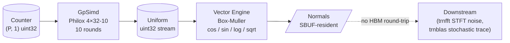

# trnrand: RNG is a four-engine workload, if the silicon lets you say so

trnrand 0.3.0 shipped this week with the Philox 4×32-10 counter-based PRNG
and the Box-Muller transform targeted at two non-Tensor-Engine resources on
Trainium: GpSimd for the integer multiply-XOR rounds, and the Vector Engine
for the `cos`/`sin`/`log`/`sqrt` pairs that turn uniforms into normals. The
kernels compile, dispatch, and run the correct Python algorithm end to end.
They do not currently produce correct numerical output, for a specific and
reproducible reason that traces back to an NKI platform property — not to
the kernel design. This is a retrospective about what the four-engine
framing does for RNG, what shipped in 0.3.0, and the one integer-primitive
gap that stands between the current state and hardware-validated Philox.

<!-- more -->

## The problem

A CUDA programmer writing an RNG reaches for cuRAND. cuRAND is a single-
purpose library: it hides the hardware and ships one answer per
distribution. That's a reasonable shape on an SM-style architecture where
every kernel looks roughly like the same compute primitive. It is a less
interesting shape on Trainium, where an RNG workload naturally touches
four different engines at different stages and the integration points are
what determine whether the RNG is fast *in context* — i.e., when fused with
a downstream consumer rather than measured standalone.

A port of cuRAND patterns to Trainium would put Philox on the Tensor Engine
because the Tensor Engine is the biggest piece of silicon on the chip, and
that's what CUDA programmers are trained to reach for. It would also
produce a slower RNG than the one the architecture wants, because the
Tensor Engine is optimized for contraction, not for counter-round-XOR
loops with sixteen uint16 sub-products per counter.

The architectural question is: what does Trainium want RNG to look like?

## What the architecture suggests

Trainium exposes four compute engines per NeuronCore: Tensor Engine
(contraction), Vector Engine (elementwise floats + transcendentals), Scalar
Engine (per-element scalar math), and GpSimd (general-purpose SIMD,
including integer bit manipulation). A counter-based RNG maps cleanly
across three of them:

- **Counter → uniform uint32 stream on GpSimd.** Philox 4×32-10 is
  ten rounds of `(ctr, key) → mul32_hi_lo → XOR → key-bump → repeat`.
  Integer 32×32→64 multiply, bitwise XOR, 32-bit add. This is the
  workload GpSimd exists for. No float needed, no contraction needed,
  no reliance on the Tensor Engine.

- **Uniform → normal on Vector Engine.** Box-Muller takes uniform
  pairs `(u1, u2)` and emits normal pairs via
  `r = sqrt(-2 · log(u1))`, `θ = 2π · u2`, `z1 = r·cos(θ)`,
  `z2 = r·sin(θ)`. Every op is a Vector Engine primitive. Marsaglia
  polar is rejection-based and serializes branch-divergent lanes,
  killing SIMD throughput — Box-Muller has constant work per pair.

- **Normal → downstream consumer, SBUF-resident.** The output tiles
  from Box-Muller can be handed directly to the next kernel (e.g.
  noise injection into an STFT frame in trnfft) without an HBM
  round-trip. The four-engine framing is not just "RNG uses four
  engines"; it's "the RNG output doesn't need to leave SBUF to be
  consumed by the next stage."



Philox was chosen specifically because it is stateless: outputs are a pure
function of `(counter, key)`. Partition-axis splitting on Trainium's 128-
lane tile is then trivially correct — lane `i` gets counter range `[i·N,
(i+1)·N)` and there is no synchronization between lanes. Mersenne Twister
on an SM-style architecture synchronizes state updates; Philox on
Trainium does not have a state to synchronize. Different architectural
story on the same problem.

That's the spine of the post: RNG on Trainium is not a single-purpose
workload, and the four-engine framing is what makes it native rather than
ported.

## The approach

trnrand 0.3.0 ships two NKI kernels plus a PyTorch fallback path. The
backend dispatcher routes through `set_backend("nki")` (when hardware is
present and the `[neuron]` extra is installed) or `set_backend("pytorch")`
(the default everywhere else).

Philox runs on GpSimd per lane. Each of 128 partition-axis lanes holds
one independent Philox stream; the kernel performs 10 rounds of the
Salmon SC'11 variant, then writes 4 uint32 words per lane to HBM.

Box-Muller runs on the Vector Engine. Input is `(P, 2)` uniform pairs,
output is `(P, 2)` standard normal pairs. All transcendentals are native
Vector Engine primitives, no library calls, no CPU fallback per element.

The scalar `set_backend` API is intentionally minimal — three values
(`auto`/`pytorch`/`nki`), a global switch, no per-call dispatch overhead.
The NKI path is not the default and will not be until it is hardware-
validated.

## Implementation

Philox's outer loop, lifted directly from
[`trnrand/nki/dispatch.py`](https://github.com/trnsci/trnrand/blob/v0.3.0/trnrand/nki/dispatch.py):

```python
@nki.jit
def philox4x32_kernel(counter_lo_ref, key_lo_ref, key_hi_ref):
    P = counter_lo_ref.shape[0]
    c0 = nl.load(counter_lo_ref)
    c1 = nl.zeros_like(c0)
    c2 = nl.zeros_like(c0)
    c3 = nl.zeros_like(c0)
    k0 = nl.load(key_lo_ref)
    k1 = nl.load(key_hi_ref)

    w0_vec = nl.full((P, 1), PHILOX_W0, dtype=nl.uint32)
    w1_vec = nl.full((P, 1), PHILOX_W1, dtype=nl.uint32)

    for _ in nl.static_range(PHILOX_ROUNDS):
        hi0, lo0 = _mul32_hi_lo(c0, _PHILOX_M0_L, _PHILOX_M0_H)
        hi1, lo1 = _mul32_hi_lo(c2, _PHILOX_M1_L, _PHILOX_M1_H)
        new_c0 = nl.bitwise_xor(nl.bitwise_xor(hi1, c1), k0)
        new_c1 = lo1
        new_c2 = nl.bitwise_xor(nl.bitwise_xor(hi0, c3), k1)
        new_c3 = lo0
        c0, c1, c2, c3 = new_c0, new_c1, new_c2, new_c3
        k0_u = nl.add(nl.copy(k0, dtype=nl.uint32), w0_vec, dtype=nl.uint32)
        k1_u = nl.add(nl.copy(k1, dtype=nl.uint32), w1_vec, dtype=nl.uint32)
        k0 = nl.copy(k0_u, dtype=nl.int32)
        k1 = nl.copy(k1_u, dtype=nl.int32)

    out = nl.ndarray((P, 4), dtype=counter_lo_ref.dtype, buffer=nl.shared_hbm)
    out[:, 0:1] = c0
    out[:, 1:2] = c1
    out[:, 2:3] = c2
    out[:, 3:4] = c3
    return out
```

The Box-Muller body (same file, `box_muller_kernel`):

```python
clamp_eps = nl.full((P, 1), 1e-10, dtype=uniforms_ref.dtype)
u1_safe = nl.maximum(u1, clamp_eps)
neg_two = nl.full((P, 1), -2.0, dtype=uniforms_ref.dtype)
r = nl.sqrt(nl.multiply(nl.log(u1_safe), neg_two))
two_pi = nl.full((P, 1), TWO_PI, dtype=uniforms_ref.dtype)
theta = nl.multiply(u2, two_pi)
z1 = nl.multiply(r, nl.cos(theta))
z2 = nl.multiply(r, nl.sin(theta))
```

Every scalar fed into a Vector Engine op (the `1e-10` clamp, the `-2.0`,
the `2π`) is materialized as a `(P, 1)` vector-immediate up front. The
reason is in the next section.

!!! info "Why the next section exists"
    The full curated NKI test suite runs in **~7 seconds on
    `ubuntu-latest`** via `TRNRAND_USE_SIMULATOR=1 pytest -m nki_simulator`,
    versus **~2 minutes** for the equivalent hardware path (SSM round-trip
    + cold NEFF compile on trn1.2xlarge) — about **17× faster iteration**.
    Without it, two failed decompositions plus a precision-loss trace
    would have been several hours of hardware time rather than a single
    afternoon.

## What didn't work

Three things, two of them algorithmic and one structural. All three are
the kind of toolchain-feedback content this blog is for.

**Decomposition attempt #1: 16-bit halves.** Philox needs a 32×32→64
multiply returning both halves (`hi`, `lo`). NKI 0.3.0 has no int64,
so the multiply has to decompose over 32-bit arithmetic. The obvious
first cut was 16-bit halves: `a = (a_h << 16) | a_l`, four sub-products
`p_ij = a_i · b_j`, reassembled through a carry-free mid-term. Each
sub-product is bounded by `0xFFFE0001`, which fits in uint32. The
kernel compiled and ran. The output was wrong.

**Decomposition attempt #2: 8-bit bytes.** The investigation that led
to decomposition #2 started from a simulator `RuntimeWarning: invalid
value encountered in cast` at `nki/backends/simulator/activation.py:96`,
plus output values of exactly `0x80000000` (INT32_MIN) appearing
whenever the input counter had the high bit set. That is the signature
of a float-to-int-with-overflow cast. Tracing back: NKI's `nl.multiply`
on uint32 tiles routes through the Activation Engine's float32 path,
both on the CPU simulator and on trn1 hardware. Float32 exactly
represents integers only up to 2²⁴ (≈ 1.67 × 10⁷). The 16-bit sub-
products reach `0xFFFE0001` ≈ 4.3 × 10⁹ — two orders of magnitude
above the exact-integer ceiling.

The fix was to go finer: decompose into 8-bit bytes. Sub-products are
now 8-bit × 8-bit ≤ `0xFE01` ≈ 2¹⁶, column sums ≤ 2¹⁸, byte-wise
carry accumulator ≤ 2¹⁸. Every intermediate sits comfortably under
2²⁴. The 16 sub-products verify bit-exact against a Python unbounded-
integer ground truth in a numpy port shipped alongside the NKI kernel
(`_mul32_hi_lo_numpy`). The algorithm is correct.

The simulator and hardware tests still fail.

**The actual wall: `nl.copy(..., dtype=nl.uint32)` loses precision
above 2²⁴.** Decomposing *the multiply* is not enough. The moment a
Philox counter value above 2²⁴ enters an NKI tile — via `nl.copy`,
`nl.bitwise_and`, `nl.right_shift`, anything — it gets rounded through
float32 internally. The input itself is outside the exact-integer
envelope. No amount of algorithmic cleverness inside the kernel can
work around a precision loss at the load/cast boundary.

The concrete failure: for input `a = 0x7FFFFFFF` and multiplier
`0xD251`, the high 32 bits of the product should be `1764265896`
(`0x692B6AE8`). The kernel returns `1764265856` (`0x692B6AC0`) — low
six bits clobbered. For inputs with the MSB set (`0x80000000`,
`0xFFFFFFFF`, `0xD2511F53`), the output is `0x80000000` outright:
the NaN-cast sentinel. Distribution mean of the Philox output on
trn1 is 0.31 vs the expected 0.5.

This is tracked upstream as
[aws-neuron-sdk#1308](https://github.com/aws-neuron/aws-neuron-sdk/issues/1308).
Four simulator tests are now marked `xfail` with that reference:
`test_philox_spec_vectors_via_simulator`,
`test_philox_kernel_matches_reference`,
`test_philox_kernel_distribution`,
`test_mul32_simulator_matches_numpy`. They will `XPASS` automatically
once an integer multiply primitive lands in NKI, at which point the
marks come off.

**One adjacent trn1 compiler surprise (Box-Muller).** The trn1
compiler rejects `InstActivation` with a scalar-immediate bias
parameter when the activation is `Ln` (`NCC_IBIR605`). The Box-Muller
kernel originally passed `1e-10`, `-2.0`, and `2π` as Python floats
to `nl.maximum`, `nl.multiply`, and `nl.log`-adjacent ops. The
compiler fused those through a Log activation and rejected the
resulting IR. Fix: materialize every scalar as a `(P, 1)` vector-
immediate tensor before it reaches an activation-fused op. This is
the "why every scalar is an `nl.full`" pattern visible in the snippet
above. Tracked in
[trnrand#2](https://github.com/trnsci/trnrand/issues/2).

## Numbers

No hardware speed numbers worth publishing yet — see above for why.
What's verifiable today:

| Measurement                                              | Value                            | Source                                          |
|----------------------------------------------------------|----------------------------------|-------------------------------------------------|
| Salmon SC'11 test vectors, CPU reference                 | 3 / 3 exact                      | `tests/test_nki_philox.py::TestPhiloxReference` |
| 100k-sample uniform, CPU reference                       | mean 0.5000 ± 0.01, var 1/12 ± 0.005 | same file, distributional tests             |
| NKI kernel on simulator                                  | 4 / 6 xfail (aws-neuron-sdk#1308) | `tests/test_nki_sim.py`                        |
| NKI kernel on trn1 hardware                              | 3 / 3 fail (same root cause)     | `tests/test_nki_philox.py::TestPhiloxNKI`       |

## What's next

Two tracks, one external and one internal.

- **External:** [aws-neuron-sdk#1308](https://github.com/aws-neuron/aws-neuron-sdk/issues/1308).
  Reproducer attached, three asks made: documentation of the 2²⁴
  integer ceiling, a true uint32×uint32 integer multiply primitive,
  and either a bitwise-exact `nl.copy` path or a compile-time error
  when the cast is lossy. Philox hardware validation reopens once any
  of those lands.

- **Internal:** [trnrand#1](https://github.com/trnsci/trnrand/issues/1)
  stays open to track Philox hardware validation. A byte-stream
  kernel (keeping state as four 8-bit tiles instead of one uint32
  tile through all 10 rounds) is the standing workaround if the
  upstream fix slips. It is ~4× the kernel code, which is why it's
  the fallback rather than the primary.
  [trnrand#2](https://github.com/trnsci/trnrand/issues/2) tracks the
  Box-Muller trn1 compile path — kernel compiles and runs post-
  vector-immediate fix, but distributional validation is gated on
  the same activation-path numerical behavior under investigation.

Benchmarks vs cuRAND are deferred to 0.4 — pointless to publish
them until the on-device path is numerically correct.

## Takeaway

The four-engine framing of RNG on Trainium — GpSimd for integer
counter rounds, Vector Engine for transcendentals, SBUF-resident
output for downstream fusion, partition-axis splitting for free
parallelism — is the design the architecture wants. trnrand 0.3.0
ships that design end to end at the Python layer, together with a
CPU simulator dev loop that drops iteration time from minutes to
seconds. The one thing standing between the current state and
hardware-validated Philox is a missing integer multiply primitive
in NKI; that's now on AWS's tracker with a reproducer. The
architectural story is intact; the silicon just needs one more
op to let the library say it out loud.
