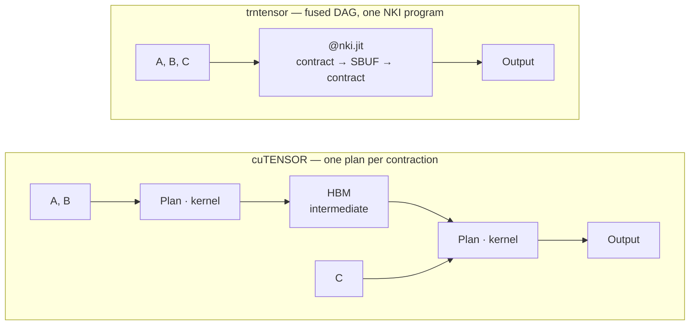

# trntensor: when the kernel boundary is the API

trntensor Phase 1 landed: the 2-index and batched `nc_matmul` NKI kernels validate on trn1, `ContractionPlan.backend` reports `"nki"` when shapes qualify, and two fused multi-step primitives — a DF-MP2 correlation-energy kernel and a 4-index AO→MO integral transform — run the contract → elementwise → reduce and contract → SBUF-resident → contract patterns as single NKI programs. The architectural point isn't "einsum on Trainium." It's that the kernel boundary is the design surface: what cuTENSOR hides behind a `Plan` object, NKI asks you to lay out in source. More work, but also where a tensor library can become a cuTENSOR superset rather than a port.

<!-- more -->

## The problem

Einstein summation generalizes matrix multiplication to arbitrary tensor contractions. A quantum-chemistry workload like density-fitted MP2 is five or six contractions in sequence — a 4-index AO→MO transform, pair-energy contractions over occupied-occupied indices, elementwise denominators, reductions. Every post-Hartree-Fock method has the same shape.

cuTENSOR's model is one plan per contraction (`cutensorInitContractionDescriptor`, then `cutensorContractionExecute`). Each plan becomes a CUDA kernel; multiple contractions compose in Python between plans, with intermediates landing in HBM between calls. The programmer rarely thinks about where one plan ends and the next begins — cuTENSOR hides the kernel boundary.

The naive port of that shape to Trainium produces correct results and leaves most of the performance on the floor. DF-MP2 with 25 pair contractions compiles to 25 NKI dispatches, each paying a fixed XLA overhead. Profiling a 2048² matmul on trn1 ([#33](https://github.com/trnsci/trntensor/issues/33#issuecomment-4239594619)) measured 4,081 µs host→XLA transfer, 2,994 µs XLA→host, and 568 µs of actual kernel time — the wrapper does an order of magnitude more work than the Tensor Engine. The per-kernel compile is fine. The per-dispatch surrounding work is not.

## What the architecture suggests

NKI exposes four engines (Tensor, Vector, Scalar, GpSimd), two partitioned memory regions (PSUM for accumulation, SBUF for staging), and a compile-once-run-many NEFF cache. A single `@nki.jit` program spans arbitrary control flow over those resources. For a tensor library: one program can hold multiple `nisa.nc_matmul` calls, interleaved Vector Engine elementwise ops, and a scalar reduction, without intermediates touching HBM.

cuTENSOR's `Plan` is an opaque object that maps to one kernel. NKI's equivalent is the source of the `@nki.jit`-decorated function — and that function can encapsulate a DAG of contractions rather than a single one:



Two concrete patterns: **contract → elementwise → reduce** (PSUM, copied to SBUF, Vector Engine elementwise, `nl.sum` into a scalar accumulator, one HBM store — the DF-MP2 energy shape); and **contract → SBUF intermediate → contract** (first matmul's PSUM copies to SBUF, becomes the stationary operand of a second matmul, intermediate never materializes — the 4-index AO→MO transform shape).

Neither pattern is new to HPC. cuTENSOR hands you a planner and hides the code; NKI hands you the code and expects you to plan. When the workload matches one of these patterns, the NKI version is a primitive the plan abstraction doesn't name.

## The approach

trntensor has three public-API layers, corresponding to three levels of engagement with the kernel boundary:

- **Generic `einsum(subscripts, *operands)`** — an opinionated router. `ContractionPlan` classifies the contraction (`matmul`, `bmm`, `torch`), estimates FLOPs, and picks a dispatch target. Shapes under a 2-GFLOP threshold skip NKI entirely — dispatch overhead rules it out at sizes where the Tensor Engine can't earn it back. 3+ operand and broadcasting patterns fall through to `torch.einsum`.
- **Named fused primitives** — `trntensor.mp2_energy(...)` and `trntensor.ao_to_mo_transform(...)`. Chemistry-domain operations that compile to one fused NKI program each. Users who know what they want reach for these; others stay with `einsum`.
- **Operand residency** — `to_xla(tensor)` and `from_xla(tensor)`. The same discipline between calls: XLA-resident operands skip the per-dispatch transfer. The DF-MP2 pipeline becomes "transfer once, compute, pull back the scalar" — at the program level, what the kernels do inside a single dispatch.

The deliberate tradeoff: trntensor doesn't try to detect fusion opportunities automatically. A generic multi-`einsum` detector is tracked for v0.3.0, but building that abstraction before it's validated against enough concrete kernels is a good way to ship a framework that's worse at two things than two libraries would be at one each.

## Implementation

The `mp2_energy_kernel`, per `(i, j)` orbital pair:

```python
# trntensor/nki/_kernels.py
@nki.jit
def mp2_energy_kernel(B, eps_occ, eps_vir):
    NOCC, NVIR, NAUX = B.shape
    partial = nl.ndarray((NOCC, NOCC), dtype=nl.float32, buffer=nl.shared_hbm)
    ev = nl.load(eps_vir[0:NVIR, 0:1])  # 2D for unambiguous partition dim

    for i in nl.affine_range(NOCC):
        Bi_t = nl.load_transpose2d(B[i, 0:NVIR, 0:NAUX])
        eo_i = nl.load(eps_occ[i : i + 1, 0:1])

        for j in nl.affine_range(NOCC):
            Bj_t = nl.load_transpose2d(B[j, 0:NVIR, 0:NAUX])
            eo_sum = nl.add(eo_i, nl.load(eps_occ[j : j + 1, 0:1]))

            # Two nc_matmul in PSUM: T = Bi @ Bj.T and T^T = Bj @ Bi.T
            psum_T  = nl.zeros((NVIR, NVIR), dtype=nl.float32, buffer=nl.psum)
            psum_Tt = nl.zeros((NVIR, NVIR), dtype=nl.float32, buffer=nl.psum)
            nisa.nc_matmul(dst=psum_T,  stationary=Bi_t, moving=Bj_t, accumulate=True)
            nisa.nc_matmul(dst=psum_Tt, stationary=Bj_t, moving=Bi_t, accumulate=True)

            # PSUM → SBUF (NKI 0.3.0 requires explicit copy)
            t   = nl.ndarray((NVIR, NVIR), dtype=B.dtype, buffer=nl.sbuf)
            t_T = nl.ndarray((NVIR, NVIR), dtype=B.dtype, buffer=nl.sbuf)
            nisa.tensor_copy(src=psum_T,  dst=t)
            nisa.tensor_copy(src=psum_Tt, dst=t_T)

            # Vector Engine: Δ_ab = (ε_i+ε_j) - ε_a - ε_b
            denom = nl.subtract(nl.subtract(eo_sum, ev), ev.reshape((1, NVIR)))

            # term = T * (2T - T^T) / Δ  (divide-as-reciprocal for 0.3.0)
            term = nl.multiply(
                nl.multiply(t, nl.subtract(nl.multiply(t, 2.0), t_T)),
                nl.reciprocal(denom),
            )

            # Scalar accumulator — avoids 0-D SBUF allocation
            acc = nl.zeros((1, 1), dtype=nl.float32, buffer=nl.sbuf)
            acc[...] = nl.add(acc, nl.sum(term, axis=(0, 1)))
            nl.store(partial[i : i + 1, j : j + 1], value=acc)

    return partial
```

One program. Two `nc_matmul` per pair, SBUF-resident tiles, Vector Engine elementwise, one HBM store per `(i, j)`. A cuTENSOR port would package this as three plans with intermediates materialized between them; here nothing between `nl.load` and `nl.store` appears as a tensor in Python or HBM.

`ContractionPlan.backend` routing:

```python
# trntensor/plan.py
def _backend_for(strategy: str, operands: tuple) -> str:
    if strategy not in ("matmul", "bmm"):
        return "pytorch"
    from .nki.dispatch import HAS_NKI, _MIN_NKI_FLOPS
    if not HAS_NKI:
        return "pytorch"
    flops = operand_flops(strategy, operands)
    return "nki" if flops >= _MIN_NKI_FLOPS else "pytorch"
```

`plan.backend` reflects what will actually run, not how the algorithm classifies. A 64×64 matmul is matmul-strategy but pytorch-backend; 2048×2048 is matmul-strategy and nki-backend.

## What didn't work

A few paths that looked reasonable didn't survive the NKI compiler.

**0-D SBUF allocation.** The first `mp2_energy_kernel` wrote `e_ij = nl.sum(term, axis=(0, 1))` and stored `e_ij` directly. NKI 0.3.0 rejects this: `SBUF and PSUM tensors must have at least 2 dimensions (partition-dim and free-dim)`. Fix: the `acc = nl.zeros((1, 1), ...)` pattern above — broadcast the 0-D sum into an explicit `(1, 1)` tile via `nl.add`. trnblas has this pattern; we didn't learn why until the assertion fired.

**`nl.copy` returns a view in 0.3.0.** In 2.24, `c_sbuf = nl.copy(psum, dtype=...)` allocated a fresh SBUF tile. In 0.3.0 it returns a view and the subsequent `nl.store` silently produces wrong results. Fix: allocate with `nl.ndarray(..., buffer=nl.sbuf)` and copy with `nisa.tensor_copy`. In the release notes, but easy to miss.

**1D loads and partition-dim inference.** The kernel originally loaded `eps_vir` as a 1D slice `nl.load(eps_vir[0:NVIR])`. That compiled fine when `eps_vir` arrived freshly transferred from CPU. It compile-failed when the same tensor arrived pre-pinned on XLA. The 1D slice leaves partition-dim inference ambiguous, and the two residency states present different tensor metadata to the compiler. Reshaping to `(N, 1)` at the dispatch boundary fixed it.

**Cross-kernel XLA graph fusion.** The full DF-MP2 pipeline with everything pre-pinned (`ao_to_mo_transform → mp2_energy` without a `from_xla` between) triggers a compiler bug: the combined XLA lazy graph emits `Shared memory is only supported on trn2, but inst__I-9-0:_mem_0_0_set is using Shared memory on an unsupported target` — on trn1. `xm.mark_step()` between calls doesn't help; the flush itself produces the trn2-only code. The compiler is targeting trn2 because our instance is a trn1, which is either an impressive feat of optimism or a missing guard somewhere. Tracked in [#39](https://github.com/trnsci/trntensor/issues/39) for upstream; users currently `from_xla(B)` between calls. This is the one hole in Phase 1's residency story.

**The planner isn't a path-search engine yet.** `ContractionPlan` handles one contraction at a time. 3+ operand einsums fall back to `torch.einsum`, losing both the optimal-order choice and the fused-DAG opportunity. Phase 3 adds path search; Phase 1 admits it doesn't have one.

**Documentation gaps we discovered empirically.** The NKI 0.3.0 transition notes cover `nc_matmul` signature changes and `nl.copy`'s new view semantics, but not the partition-dim strictness of 1D loads. The `SBUF and PSUM tensors must have at least 2 dimensions` assertion doesn't hint at which allocation is 0-D — you walk the trace to `nki/language/core.py:51`. These fill in once a few projects have tripped over them.

## Fit assessment

Small contractions are not what Trainium wants. DF-MP2 pair contractions are 200–300 kilo-FLOP per call; the dispatch wrapper spends longer than that moving data before the kernel starts. cuBLAS has the same problem at similar sizes on NVIDIA — it's not a Trainium defect — but on Trainium the absolute overhead is higher because the device transfer crosses a less tightly-integrated boundary than a GPU's PCIe path. Trainium is over-indexed for large GEMMs and under-indexed for tight loops of small contractions. The practical answer is residency + fusion, not doing more per-call work.

## Numbers

trn1.2xlarge, NKI 0.3.0. Same machine both columns (`TRNTENSOR_FORCE_BACKEND=pytorch` for the CPU baseline).

| Op | Shape | FLOPs | PyTorch (trn1) | NKI (trn1) | Notes |
|---|---|---:|---:|---:|---|
| `einsum ap,bp->ab` (DF-MP2 pair) | 48×128 × 48×128 | 295 K | 19.6 µs | 1047 µs | CPU 53× — dispatch overhead dominates |
| `einsum mi,mnP->inP` (4-index) | 32×8, 32×32×64 | 524 K | 35.4 µs | 35.1 µs | break-even |
| `einsum ij,jk->ik` | 512³ | 134 M | 481 µs | 1452 µs | CPU 3.0× |
| `einsum bij,bjk->bik` | 16×256³ | 268 M | 953 µs | 2162 µs | CPU 2.3× |
| `einsum ij,jk->ik` | 1024³ | 1.07 G | 3402 µs | 4022 µs | CPU 1.2× |
| `einsum ij,jk->ik` | 2048³ | 8.6 G | 27.4 ms | **16.9 ms** | NKI 1.6× |
| `einsum bij,bjk->bik` | 32×1024³ | 34.4 G | 126.3 ms | 190.8 ms | CPU 1.5× |
| `mp2_energy` fused vs Python loop | 5×19×72 | — | 1.5 ms | 16 ms | loop 10× — same overhead story |
| `mp2_energy` fused vs Python loop | 16×128×128 | — | 25.5 ms | 41 ms | loop 1.6× — gap closing |
| 5-iter matmul_2048 with residency | 2048³ | 8.6 G | cold loop | **≥ 3× faster** | `to_xla` pre-pin — v0.3.0 baseline |

NKI wins one benchmark outright (2048² matmul, 1.6×). Residency is where the story becomes interesting: pre-pinning eliminates the dispatch overhead that dominates every other row. The fused kernels are architecturally correct; `to_xla` is what lets them earn their keep.

## What's next

Phase trackers: [Phase 2 — precision-aware path selection](https://github.com/trnsci/trntensor/issues/28), [Phase 3 — opt_einsum-style planner + plan-cache reuse](https://github.com/trnsci/trntensor/issues/29), [Phase 4 — sharded contractions across chips](https://github.com/trnsci/trntensor/issues/30), [Phase 5 — trn2 fused multi-contraction paths](https://github.com/trnsci/trntensor/issues/31).

v0.3.0 follow-ups filed: [K-tiling for `ao_to_mo_transform`](https://github.com/trnsci/trntensor/issues/37), [generic `multi_einsum` shared-operand detection](https://github.com/trnsci/trntensor/issues/19), [α/β scaling](https://github.com/trnsci/trntensor/issues/20), [the cross-kernel compiler bug](https://github.com/trnsci/trntensor/issues/39).

## Takeaway

A tensor contraction library on Trainium looks different from one on a GPU because the kernel boundary is writable. cuTENSOR's `Plan` encapsulates one contraction behind an opaque handle; trntensor's named fused primitives span multiple contractions in one NKI program and expose the composition. That's a cuTENSOR superset when the workload matches a named pattern and a cuTENSOR-equivalent generic path for everything else.

The design lesson: fused, pattern-specific kernels are a normal mode of operation on Trainium, not an optimization pass. The library should name them as first-class primitives rather than try to detect them at dispatch time.
