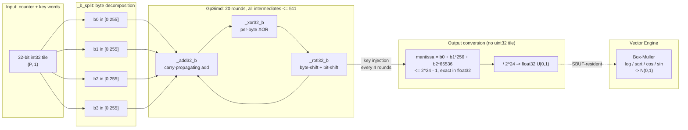

# trnrand: the integer-multiply gap pointed to a better algorithm

The [previous trnrand post](../2026-04-15-trnrand-four-engine-rng/) closed with:
"the silicon just needs one more op to let the library say it out loud."
[aws-neuron-sdk#1308](https://github.com/aws-neuron/aws-neuron-sdk/issues/1308)
is still open. trnrand 0.4.0 ships hardware-validated uniform RNG on trn1 anyway
— not by fixing Philox, but by using Threefry4x32-20, the PRNG Salmon et al.
designed in the same SC'11 paper for hardware without fast integer multiply.
The library said it out loud without waiting for the op.

<!-- more -->

## The problem

Philox 4x32-10 needs one primitive NKI cannot provide exactly: a 32x32-bit
integer multiply returning both halves (hi, lo) of the 64-bit result. NKI
routes all 32-bit tile operations through the Vector Engine's float32 activation
path, which represents integers exactly only up to 2^24 (approximately 16.7M).

The first attempted fix was to decompose the multiply into 8-bit byte
sub-products, keeping each sub-product under 2^16 — well inside the float32
ceiling. The decomposition is arithmetically correct. A pure-numpy port
(`_mul32_hi_lo_numpy`) verifies it bit-exact against a Python unbounded-integer
ground truth. The kernel compiled, the sub-products were right, and the Philox
output was still wrong.

The problem was not the multiply. Philox counter values exceed 2^24 the moment
the counter advances past the first lane. The moment such a value enters an NKI
tile — via `nl.copy`, `nl.bitwise_and`, `nl.right_shift`, anything — it gets
rounded through float32 before the multiply decomposition can run. The input is
already corrupted. No kernel-level decomposition can work around a lossless-load
problem. The concrete failure: for input `0x7FFFFFFF` the kernel returns
`0x80000000` outright — the NaN-cast sentinel — because the MSB triggers the
float32 INT_MIN rounding path. Distribution mean on trn1: 0.31 vs the
expected 0.50.

## What the architecture suggests

Threefry4x32-20 (same Salmon SC'11 paper, same test vectors, same statistical
guarantees as Philox) uses only three primitives: 32-bit add, XOR, and
rotate-left. None require integer multiply. All three decompose cleanly into
byte arithmetic on NKI.

If a 32-bit word is stored as four separate 8-bit byte tiles — each a `(P, 1)`
uint32 tile with value in [0, 255] — then:

- **Addition** propagates carries byte-by-byte. Each intermediate sum is at most
  255 + 255 + 1 = 511 < 2^10 — two orders of magnitude below float32's
  exact-integer ceiling.
- **XOR** operates per-byte independently. Each output byte is in [0, 255].
- **Rotate-left** by (q bytes + r bits) reindexes bytes and shifts by at most
  8 bits. Sub-byte rotation intermediates are at most 32640 < 2^15.

The architecture does not merely permit byte-tile Threefry — it makes it exact
where uint32-tile Philox is approximate. The precision problem is not "float32
is imprecise"; it is "Philox needs one primitive float32 cannot model; Threefry
does not." Salmon et al. designed Threefry specifically for hardware without fast
multiply. Trainium's current NKI substrate is exactly that hardware.



The output conversion is where the approach pays off a second time: the three
least-significant bytes of each output word give a 24-bit mantissa — the maximum
resolution a float32 significand can carry. No uint32 tile is ever assembled. The
kernel goes from counter inputs to float32 uniforms without touching any
representation that exceeds float32's exact-integer ceiling.

## The approach

Every 32-bit word in the kernel — the four counter words, four key words,
running Threefry state, and all intermediate computation — lives as four separate
`(P, 1)` uint32 tiles. The helper `_b_split` extracts four bytes from a
`(P, 1)` int32 tile immediately on load. The kernel never holds a uint32 value
above 255 in any tile for the duration of the 20 Threefry rounds and 5 key
injections.

The fused `threefry_normal_kernel` carries byte-tile state directly into the
Vector Engine Box-Muller stage. Output uniforms are SBUF-resident between the
GpSimd computation and the transcendental stage — no HBM round-trip between the
RNG and the transform. This is the four-engine pipeline described in the prior
post, now realized end to end: counter arithmetic on GpSimd, transcendentals on
the Vector Engine, SBUF-resident output available to downstream consumers such
as trnfft noise injection or the stochastic-trace estimators in trnblas.

Threefry is stateless: outputs are a pure function of `(counter, key)`. Like
Philox, this makes partition-axis splitting trivially correct. Each of 128
partition lanes holds an independent Threefry stream; no state synchronization
across lanes is needed. The batch index occupies the second counter word (c1),
giving disjoint counter ranges across calls by construction.

## Implementation

The three core byte-tile helpers, from
[`trnrand/nki/dispatch.py`](https://github.com/trnsci/trnrand/blob/main/trnrand/nki/dispatch.py):

```python
def _add32_b(a_b, b_b):
    """Carry-propagating 32-bit addition. Each intermediate <= 511."""
    s0 = nl.add(a_b[0], b_b[0], dtype=nl.uint32)   # <= 510
    c0 = nl.right_shift(s0, 8, dtype=nl.uint32)
    r0 = nl.bitwise_and(s0, 0xFF, dtype=nl.uint32)
    s1 = nl.add(nl.add(a_b[1], b_b[1], dtype=nl.uint32), c0, dtype=nl.uint32)
    c1 = nl.right_shift(s1, 8, dtype=nl.uint32)
    r1 = nl.bitwise_and(s1, 0xFF, dtype=nl.uint32)
    s2 = nl.add(nl.add(a_b[2], b_b[2], dtype=nl.uint32), c1, dtype=nl.uint32)
    c2 = nl.right_shift(s2, 8, dtype=nl.uint32)
    r2 = nl.bitwise_and(s2, 0xFF, dtype=nl.uint32)
    s3 = nl.add(nl.add(a_b[3], b_b[3], dtype=nl.uint32), c2, dtype=nl.uint32)
    r3 = nl.bitwise_and(s3, 0xFF, dtype=nl.uint32)
    return [r0, r1, r2, r3]
```

Output conversion per word (unrolled x4 to satisfy the hardware compiler):

```python
b = x0_b
out[:, 0:1] = nl.multiply(
    nl.add(
        nl.add(nl.copy(b[0], dtype=nl.float32),
               nl.multiply(nl.copy(b[1], dtype=nl.float32), _s256,
                           dtype=nl.float32), dtype=nl.float32),
        nl.multiply(nl.copy(b[2], dtype=nl.float32), _s65536,
                    dtype=nl.float32), dtype=nl.float32,
    ),
    inv24, dtype=nl.float32,  # inv24 = 1.0 / 16_777_216.0
)
```

The `_rotl32_b` helper covers all (q, r) combinations through fully unrolled
branches rather than a loop — 64 cases total. The reason is in the next section.

## What didn't work

Three things: one at the algorithm level, and two from the NKI hardware compiler.

**Fixing the Philox multiply works; fixing the Philox inputs doesn't.** The
8-bit byte decomposition of the 32x32-bit multiply is correct and bit-exact.
The mistake was assuming that fixing the multiply would fix the output. The
root cause was one layer up, at the tile-load boundary, where counter inputs
above 2^24 were being silently rounded before any arithmetic began. An
`nki.isa.tensor_copy` path was also considered as a potential bypass around
the VE float32 cast; the AWS Neuron team's response on aws-neuron-sdk#1308
("VE/Scalar engines use FP32 casting for all 32-bit types") indicates this is
a systemic property of the current architecture rather than a single-op
workaround. Threefry removes the question. The outstanding upstream ask remains
specific: document the 2^24 exact-integer ceiling in the NKI type-casting
reference, and provide either a bitwise-exact `nl.copy` path for integer tiles
or a compile-time error when the cast truncates. Filed with a reproducer at
[aws-neuron-sdk#1308](https://github.com/aws-neuron/aws-neuron-sdk/issues/1308).

**The CPU simulator and the trn1 hardware compiler accept different Python
constructs.** Three categories of syntax are silently accepted by the simulator
and rejected by the real compiler, found across three separate SSM hardware
runs after the kernel passed all simulator tests:

1. *Inner function definitions* inside any function in the `@nki.jit` call tree.
   Fix: extract to module level. The `_mul32_hi_lo` helper originally defined
   four inner functions; all became module-level helpers.
2. *List comprehensions* (`[expr for i in range(n)]`) inside jit-traced code.
   Fix: explicit element-by-element construction. This is why `_rotl32_b` is
   fully unrolled rather than a compact loop.
3. *Subscript expressions as left-hand assignment targets* in tuple unpacking.
   `x_b_list[0], x_b_list[1] = _mix_b(...)` is rejected; named-variable
   unpacking (`x0_b, x1_b = _mix_b(...)`) is accepted.

The pattern: where a construct touches Python's dynamic object model at the AST
level, the real NKI compiler may not trace it. Use the simplest syntactic form
available. None of these failures produced a useful error message on first
encounter — each surfaced as a generic compile failure on the trn1 host that had
no simulator analog. A specific ask for AWS: the hardware compiler's rejection
message for inner function defs should name the outer function and the line
number of the inner def; the current message does not.

**NCC_IBIR605 (pre-existing, not a Threefry regression).** The fused
`threefry_normal_kernel` Box-Muller stage is blocked on trn1 by the same
compiler restriction that blocked the standalone `box_muller_kernel` in 0.3.0:
`InstActivation` rejects non-immediate bias parameters when the activation is
`Ln`. The two affected hardware tests are marked `xfail(strict=False)` and
tracked in [trnrand#2](https://github.com/trnsci/trnrand/issues/2). This is
trn1-only; trn2+ and the CPU simulator are unaffected, and it has no bearing
on the Threefry algorithm or the uniform kernel.

## Numbers

No throughput benchmark yet — that's 0.5 scope
([trnrand#3](https://github.com/trnsci/trnrand/issues/3)), deferred until
both uniform and normal have clean trn1 paths. Hardware correctness as of 0.4.0:

| Test | Simulator | trn1 hardware |
|---|---|---|
| KAT vectors (3 Salmon SC'11 reference vectors) | pass | pass |
| Reference parity (128-lane numpy vs NKI output) | pass | pass |
| U[0,1) distribution (mean 0.500 +/- 0.01, var 1/12 +/- 0.005) | pass | pass |
| Seed determinism + seed isolation | pass | pass |
| threefry_normal N(0,1) distribution | pass | xfail (NCC_IBIR605, trnrand#2) |

Four of five `TestThreefryNKI` hardware cases pass. The fifth xfail is
pre-existing trn1 compiler behavior and does not affect the uniform kernel
or the Threefry algorithm on any other platform.

## What's next

**[aws-neuron-sdk#1308](https://github.com/aws-neuron/aws-neuron-sdk/issues/1308)**
stays open. Philox remains the intended long-term primary for on-device RNG —
it is the cuRAND and JAX standard, stateless, and partition-parallel by
construction. Threefry is the production path until AWS ships a true uint32
integer-multiply primitive; at that point Philox hardware validation reopens.

**[trnrand#2](https://github.com/trnsci/trnrand/issues/2)** (NCC_IBIR605) —
the `threefry_normal_kernel` trn1 path unblocks when the trn1 compiler fix
ships. No workaround exists at the kernel level; trn2+ and the simulator path
are clean today.

**[trnrand#3](https://github.com/trnsci/trnrand/issues/3)** — benchmarks vs
cuRAND on equivalent generation sizes. Deferred to 0.5; the comparison is only
useful once both chips have end-to-end correct on-device paths.

The gamma, chi-squared, beta, and Poisson distributions (added in 0.2.0, CPU
paths only) all wait on on-device acceleration via NKI kernels built on top of
the uniform primitive validated here.

## Takeaway

The float32 exact-integer ceiling that blocks Philox on Trainium does not block
Threefry, because Threefry was designed for exactly that constraint. Byte-tile
arithmetic is not a workaround for the ceiling; it is the representation that
keeps every intermediate at least three orders of magnitude below it. The
four-engine pipeline — GpSimd byte arithmetic, SBUF-resident intermediate
output, Vector Engine transcendentals — is now hardware-validated for uniforms
on trn1. The integer-multiply gap that blocked Philox did not block trnrand;
it identified the algorithm the architecture already preferred.
