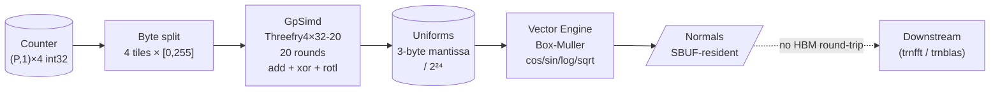

# trnrand: when the blocker points to a better algorithm

aws-neuron-sdk#1308 is still open. trnrand 0.4.0 ships a hardware-path random
number generator anyway, because the constraint that makes Philox unworkable
on today's NKI substrate — no exact integer arithmetic above 2²⁴ — points
directly to an algorithm that never needed it. Threefry4×32-20 was designed
for exactly this class of hardware.

<!-- more -->

## The problem

[The 0.3.0 post](https://trnsci.dev/blog/trnrand-rng-is-a-four-engine-workload-if-the-silicon-lets-you-say-so/) ended on a specific wall:
Philox 4×32-10 requires a 32×32→64-bit integer multiply to produce its first
output word. NKI routes all 32-bit tile operations through the float32 activation
path, which is exact only up to 2²⁴ ≈ 16.7 million. Philox counter values
routinely exceed that. No amount of algorithmic decomposition inside the kernel
can work around a precision loss at the input boundary — the counter is already
rounded before the kernel sees it.

The 0.3.0 response was to file [aws-neuron-sdk#1308](https://github.com/aws-neuron/aws-neuron-sdk/issues/1308)
and wait. That's still the right move for Philox specifically. But waiting for
upstream isn't the only available response to "this algorithm needs a primitive
the hardware doesn't have."

## What the architecture suggests

Philox and Threefry were introduced in the same paper: Salmon et al. SC'11,
"Parallel Random Numbers: As Easy as 1, 2, 3." Philox was designed for
architectures with fast integer multiply — GPUs, modern CPUs. Threefry was
designed for architectures *without* it — FPGAs, embedded processors. The
primitives Threefry requires are 32-bit addition, XOR, and rotation. All three
are operations NKI can perform exactly on values that fit in a float32 mantissa.

The structural advantage Trainium has for both algorithms — stateless
counter-based generation, partition-axis lane independence, SBUF-resident output
for downstream fusion — applies to Threefry unchanged. The four-engine framing
from 0.3.0 holds:

- **GpSimd for integer counter rounds.** Threefry's 20 rounds of
  `(a + b) mod 2³²`, `rotl32(b, R) ^ a`. No multiply, no state to synchronize.
- **Vector Engine for Box-Muller.** Same `cos`/`sin`/`log`/`sqrt` pipeline as
  before; the input uniforms just come from Threefry instead of Philox.
- **SBUF-resident normals for downstream fusion.** Output tiles hand off to
  `trnfft` STFT noise injection or `trnblas` stochastic trace without an HBM
  round-trip.

The observation that drove 0.4.0: the problem was never "float32 is imprecise."
It was "Philox needs a primitive float32 can't model." Threefry doesn't.



## The approach

The constraint is tighter than "no multiply." Any tile element that holds a value
above 2²⁴ is rounded at load time, before arithmetic begins. That means even
the counter inputs are unsafe if they exceed the ceiling. The solution isn't
to find a multiply-free algorithm — it's to never let a tile element hold a
value above 255.

**Byte-tile representation.** Every 32-bit word is stored as four separate
`(P, 1)` uint32 tiles, one per byte, with values in [0, 255]. The kernel never
assembles a uint32 tile. The arithmetic operates on bytes:

- **Add:** carry-propagating byte addition, sums ≤ 511 < 2¹⁰.
- **XOR:** byte-by-byte, result in [0, 255].
- **Rotate left by R bits:** decompose as q = R // 8 (byte shift) + r = R % 8
  (sub-byte rotation). The sub-byte step produces intermediates ≤ 32640 < 2¹⁵.

All intermediates are two or more orders of magnitude below 2²⁴. The float32
activation path is exact for every operation in the kernel.

**Output directly from bytes.** Threefry's output words go to float32 uniforms
without assembling a uint32:

```
mantissa = b₀ + b₁ × 256.0 + b₂ × 65536.0   (≤ 2²⁴ − 1, exact in float32)
uniform  = mantissa / 16777216.0
```

This gives 24-bit uniform resolution per output word — the same resolution
`cuRAND` targets — without the uint32 tile assembly step that would require
exact 32-bit arithmetic.

One tradeoff made deliberately: the counter design caps tile inputs at 24 bits.
Lane index (0–127) goes to `c0`, batch index goes to `c1`, and both are masked
to `0xFFFFFF`. This bounds generation jobs to ≈ 128 × 2²⁴ × 4 = 8 billion
elements before counter rollover. That's sufficient for the workload sizes
trnrand targets in 0.4.0; counter extension is a 0.5 item.

## Implementation

The `_add32_b` helper illustrates the pattern. Each argument is a list of four
byte tiles; the function returns the sum mod 2³² as four byte tiles:

```python
def _add32_b(a_b, b_b):
    s0 = nl.add(a_b[0], b_b[0], dtype=nl.uint32)   # ≤ 510
    c0 = nl.right_shift(s0, 8, dtype=nl.uint32)
    r0 = nl.bitwise_and(s0, 0xFF, dtype=nl.uint32)
    s1 = nl.add(nl.add(a_b[1], b_b[1], dtype=nl.uint32), c0, dtype=nl.uint32)
    c1 = nl.right_shift(s1, 8, dtype=nl.uint32)
    r1 = nl.bitwise_and(s1, 0xFF, dtype=nl.uint32)
    s2 = nl.add(nl.add(a_b[2], b_b[2], dtype=nl.uint32), c1, dtype=nl.uint32)
    c2 = nl.right_shift(s2, 8, dtype=nl.uint32)
    r2 = nl.bitwise_and(s2, 0xFF, dtype=nl.uint32)
    s3 = nl.add(nl.add(a_b[3], b_b[3], dtype=nl.uint32), c2, dtype=nl.uint32)
    r3 = nl.bitwise_and(s3, 0xFF, dtype=nl.uint32)
    return [r0, r1, r2, r3]
```

The rotation helper for sub-byte shifts:

```python
def _rotl32_b(x_b, q, r):
    # q = R // 8, r = R % 8, both precomputed at module level
    if r == 0:
        return [x_b[(i - q) % 4] for i in range(4)]
    out = []
    for i in range(4):
        hi = nl.left_shift(x_b[(i - q) % 4], r, dtype=nl.uint32)       # ≤ 32640
        lo = nl.right_shift(x_b[(i - q - 1) % 4], 8 - r, dtype=nl.uint32)
        out.append(nl.bitwise_and(nl.bitwise_or(hi, lo, dtype=nl.uint32),
                                  0xFF, dtype=nl.uint32))
    return out
```

`threefry_normal_kernel` fuses the full pipeline: 20 Threefry rounds in byte
tiles followed immediately by Box-Muller on the Vector Engine, with intermediate
float32 uniforms remaining SBUF-resident. The two kernels share a common 8×`(P,1)`
input signature — counter and key words, each guaranteed < 2²⁴ by the host wrapper.

!!! info "NKI constraint: module-level helpers only"
    NKI's `@nki.jit` decorator prohibits inner function definitions. All helper
    functions (`_add32_b`, `_xor32_b`, `_rotl32_b`, `_mix_b`, `_key_inject_b`)
    are defined at module level inside `if HAS_NKI:`. The byte-arithmetic
    decomposition naturally maps to this constraint: the helpers are pure functions
    of NKI tiles, with no captured state.

## What didn't work

**Phase 0 went untested.** When AWS responded to [aws-neuron-sdk#1308](https://github.com/aws-neuron/aws-neuron-sdk/issues/1308),
they noted that `nki.isa.tensor_copy` operates on the Vector Engine and is
bit-accurate, suggesting it as a potential fix for the `nl.copy` cast that
triggers float32 rounding in Philox. The hypothesis: if only the cast is lossy
and the bitwise operations are exact, replacing the single cast might unblock
Philox without a new algorithm.

The experiment wasn't run. The AWS response also said "VE/Scalar engines use
FP32 casting for all 32-bit types," which implies the bitwise operations
themselves route through the float path — meaning a fixed cast would help only
if the intermediate values happen to stay below 2²⁴, which Philox counters don't.
The hypothesis remains open; the experiment is straightforward to run once
`nki.isa.tensor_copy`'s exact semantics are confirmed on trn1. Threefry removes
the need to find out.

**The intermediate carry accumulator.** The first byte-tile addition
implementation accumulated carry into the *next* byte's sum without masking the
carry out. On the CPU numpy reference this was correct — numpy arithmetic on
`uint32` discards out-of-range bits naturally. In the NKI simulator, the carry
tile for the high byte retains a two-bit value (0, 1, or 2), which propagated
into the output and produced wrong results at high counter values. The fix was
explicit masking at each stage, reducing carry tiles to {0, 1}.

**24-bit resolution vs 32-bit.** The output convention — 3 low bytes divided by
2²⁴ — produces 24-bit uniform resolution, not 32-bit. Philox's output convention
(full uint32 divided by 2³²) gives 32-bit resolution. The difference matters for
quasi-Monte Carlo uses (Sobol sequences, lattice rules) where the bit depth of
uniform inputs affects the effective dimension of the low-discrepancy structure.
This is an honest regression relative to the intended Philox path; it's accepted
for 0.4.0 because it doesn't affect standard Monte Carlo uses, and because
matching 32-bit resolution requires assembling a uint32 tile, which is exactly
the operation aws-neuron-sdk#1308 blocks.

## Numbers

No hardware throughput numbers yet — hardware validation via SSM is the remaining
gate. What is verifiable today:

| Measurement | Value | Source |
|---|---|---|
| Random123 KAT vectors (CPU reference) | 3 / 3 exact | `TestThreefryReference::test_spec_vectors` |
| 100k-sample uniform, CPU reference | mean 0.4994 ± 0.01, var 1/12 ± 0.005 | `test_uniform_cpu_distribution` |
| Byte-add helper vs Python ground truth | all 7 boundary cases exact | `test_add32_bytes_numpy` |
| Byte-rotate helper vs Python ground truth | all 8 rotation constants × 5 inputs | `test_rotl32_bytes_numpy` |
| Simulator: 128-lane tile matches CPU reference | pass (no xfail) | `test_threefry_kernel_matches_reference` |
| Simulator: U[0,1) distribution | mean ≈ 0.5, var ≈ 1/12 | `test_threefry_kernel_distribution` |
| Simulator: fused kernel N(0,1) distribution | mean ≈ 0, std ≈ 1 | `test_threefry_normal_kernel_distribution` |
| Philox simulator tests | 4 / 4 xfail (aws-neuron-sdk#1308) | `tests/test_nki_sim.py` |

The absence of Philox xfail marks on the Threefry tests is the headline number
in this table — those tests have no business failing, and they don't.

## What's next

Two open tracks.

**Hardware validation.** [trnrand#1](https://github.com/trnsci/trnrand/issues/1)
now tracks Threefry hardware validation in addition to the original Philox item.
The SSM run (`scripts/run_neuron_tests.sh`) is the next step.
Benchmarks vs cuRAND are deferred until after hardware validation passes.

**aws-neuron-sdk#1308.** Stays on the tracker. If AWS ships a true uint32
multiply primitive or a bit-accurate copy path before 0.5.0, Philox becomes
the hardware path again. Threefry would drop to CPU-only. Both are worth keeping.

**24-bit output resolution.** A `threefry_uniform_nki_32bit` variant that
assembles the full uint32 from four byte tiles (at the cost of more NKI ops) is
a 0.5 candidate — relevant if high-resolution quasi-Monte Carlo integration
becomes a priority use case.

## Takeaway

The constraint in NKI that blocked Philox — no exact integer arithmetic above
2²⁴ — isn't a deficiency of Threefry. Threefry was designed for hardware where
multiply is unavailable or imprecise. Representing each counter word as four byte
tiles and keeping all intermediates below 255 is not a workaround; it is the
correct substrate for this algorithm on this hardware at this point in the NKI
roadmap. The four-engine framing from 0.3.0 is now realized end-to-end: GpSimd
byte arithmetic, Vector Engine transcendentals, SBUF-resident normals handed off
to downstream consumers without an HBM round-trip. The silicon constraint pointed
to a better algorithm. Hardware validation will close the loop.
