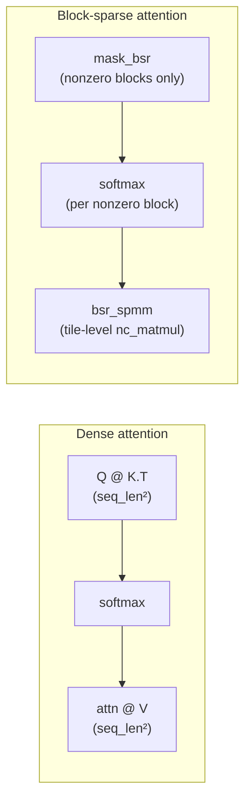

# trnsparse: the attention mask is a BSRMatrix

trnsparse v0.4.2 added a block-sparse attention primitive without writing a new kernel. The mechanism is straightforward in hindsight — `BSRMatrix` already stores a matrix as 128×128 blocks plus a block-level sparsity pattern, and the post-softmax attention weight matrix with a local-window mask is exactly that structure — but the implication took a moment to land: trnsparse, built as a quantum-chemistry cuSPARSE replacement, already spoke transformer.

<!-- more -->

## The problem

Sparse attention restricts which positions can attend to each other. Longformer's local window, BigBird's random-plus-local-plus-global pattern, and the sliding-window variants that have become standard in long-context models all share the same structure: a `(seq_len, seq_len)` matrix that's mostly zero, with nonzero regions concentrated in diagonal bands or specific global positions. The `attn_weights @ V` step is a sparse × dense matmul.

The CUDA route for this — the one Longformer and BigBird actually used — is a hand-written CUDA kernel with custom scatter/gather for each specific pattern. Block-sparse variants exist in triton-lang and xformers. All of them were written because CUDA's memory hierarchy rewards arbitrary-pattern indirect gather, so a kernel that does exactly the right amount of work for any given mask pattern pays off.

On Trainium, the starting assumption is different. The DMA engine does not expose per-element indirect gather at the kernel level as of NKI 0.3.0. What it does expose is tile-shaped loads: 128×128 dense blocks in and out of SBUF. The question is whether that's a limitation or an alignment.

## What the architecture suggests

Trainium's Tensor Engine is a 128-partition systolic array. `nisa.nc_matmul` consumes a 128×K×N tile — not a scatter of individual elements, a tile. The same architectural fact that led trnsparse to BSR for Schwarz-screened Fock builds leads directly to block-sparse attention: **a 128-token attention window is a 128×128 BSR block**.

This is not a coincidence that needs explaining. Trainium was designed primarily for large-model training. Attention IS the workload the hardware was sized for. The 128-partition tile isn't optimized for chemistry; it's optimized for attention, and chemistry happens to sit at the same tile size because physical-space sparsity in integral tensors also clusters at that granularity. The scientific computing workload and the transformer workload aren't the same — but they land in the same format on this silicon.



**Block density arithmetic.** For a local-window mask with window `w` blocks at `seq_len = S` and `block_size = 128`:

| seq_len | window | blocks/row | block density |
|--------:|-------:|-----------:|:--------------|
| 2048    | 2      | 5          | 19.5%         |
| 4096    | 2      | 5          | 9.8%          |
| 8192    | 2      | 5          | 4.9%          |
| 8192    | 4      | 9          | 8.8%          |

At 5% block density, 95% of the `nc_matmul` calls are skipped. That's the regime where the Tensor Engine's per-tile throughput matters, and it's achieved without writing a custom kernel.

## The approach

Three patterns, each representable as a `BSRMatrix`:

**Local window.** Block `(i, j)` stored iff `|i - j| ≤ window`. Identical to Longformer's sliding-window attention at 128-token granularity.

**Dilated.** Block `(i, j)` stored iff `(i - j) % stride == 0`. Covers dilated sparse attention with stride ≥ 1.

**Global tokens.** First `n_global` block-rows attend to all blocks and are attended to by all rows; remaining rows follow a local window. Identical to BigBird's global-token structure.

The computation: build the mask as a `BSRMatrix`, compute `Q @ K.T` masked to `-inf` outside the pattern, softmax, convert the post-softmax weights to a second `BSRMatrix` with the same pattern, call `bsr_spmm(attn_bsr, V)`. That last call runs one `nc_matmul` per nonzero block.

## Implementation

Pattern construction and the core attention function from `examples/block_sparse_attention.py`:

```python
def _local_window_mask(seq_len, block_size, window):
    n_blocks = seq_len // block_size
    block_mask = torch.zeros(n_blocks, n_blocks, dtype=torch.bool)
    for i in range(n_blocks):
        lo, hi = max(0, i - window), min(n_blocks, i + window + 1)
        block_mask[i, lo:hi] = True
    return block_mask.repeat_interleave(block_size, 0).repeat_interleave(block_size, 1)

def block_sparse_attention(Q, K, V, mask_bsr):
    scale = Q.shape[-1] ** -0.5
    scores = (Q @ K.T) * scale
    mask_dense = mask_bsr.to_dense().bool()
    masked = scores.masked_fill(~mask_dense, float('-inf'))
    attn_weights = torch.softmax(masked, dim=-1)
    attn_bsr = trnsparse.BSRMatrix.from_dense(attn_weights, block_size=mask_bsr.block_size)
    return trnsparse.bsr_spmm(attn_bsr, V)
```

`bsr_spmm` is the third `torch.autograd.Function`-wrapped NKI kernel in the library. The backward routes gradients through the stored blocks; block-selection is treated as a discrete gate (non-differentiable). The wrapping pattern follows [`trnsci/trnsci#3`](https://github.com/trnsci/trnsci/issues/3).

## What didn't work

**Score materialization is still O(seq_len²).** The example computes the full `Q @ K.T` before masking. At `seq_len=8192` with `head_dim=64`, that's a 256 MB float32 intermediate. The memory win from 5% block density is lost before `bsr_spmm` sees the work. The `bsr_spmm` step itself is correct and efficient; the score computation step isn't sparse yet.

The fix is a fused tile-level kernel: for each nonzero block `(i, j)` in the mask, load `Q[i*b:(i+1)*b]` and `K[j*b:(j+1)*b]`, compute the score tile, accumulate a running row-max for online softmax (Flash Attention-style), multiply by `V[j*b:(j+1)*b]` in the same pass. That kernel avoids the `seq_len²` intermediate entirely.

The authoring challenge is the same one that closed [#24](https://github.com/trnsci/trnsparse/issues/24): `nl.affine_range` doesn't support iteration-carried scalar state (running max, running denominator sum). The `"Unexpected output dependencies"` error on in-place accumulation across `affine_range` levels killed the fused CG kernel; it will show up here too for the softmax accumulator. The two-pass approach — one pass for row maxima, one for softmax + accumulate — sidesteps this but costs 2× HBM reads for K and V.

**PyTorch CPU is faster at small seq_len.** On the CPU fallback path (the only measurable path before Trainium hardware), dense `attn_weights @ V` beats `bsr_spmm` at seq_len ≤ 512 because the PyTorch BSR fallback doesn't exploit the block structure. The honest note in the example output: "bsr_spmm wins at large seq_len on Trainium, where dispatch overhead amortizes against the tile-level nc_matmul throughput advantage." The crossover is the same one that applies to `bsr_spmm` for Fock builds.

## What's next

- [#25](https://github.com/trnsci/trnsparse/issues/25) — fused tile-level attention score computation, no `seq_len²` intermediate. Parked on `nl.affine_range` scalar carry or a two-pass alternative.
- [#22](https://github.com/trnsci/trnsparse/issues/22) — fused CG/power-iteration with SBUF-resident A. Same architectural wall as #25.
- [#15](https://github.com/trnsci/trnsparse/issues/15) — row-bucketing CSR SpMM. Still gated on NKI indirect-DMA gather.

The common thread: the next improvements across trnsparse are all blocked on the same two NKI capability gaps (per-element indirect gather, iteration-carried scalar state across `affine_range`). A concrete ask for the Neuron team: a `nl.scan` or `nl.reduce_with_carry` primitive that allows scalar accumulation within a `nl.affine_range` loop body without triggering the output-dependency verifier error. That one primitive unblocks fused CG, fused Flash Attention, and the row-bucketing nnz path simultaneously.

## Takeaway

The 128-token granularity at which sparse attention is natural isn't an accident — it's the Tensor Engine tile. Trainium was designed for attention; that design decision shows up as BSR being the right format for any block-128-structured sparse workload, including the Schwarz-screened integral tensors that motivated trnsparse in the first place. A library built for quantum chemistry found it already spoke transformer when a transformer needed it to. The next step (the fused score kernel) is the place where the two workloads finally require different treatment — and where an NKI primitive would unblock both at once.
