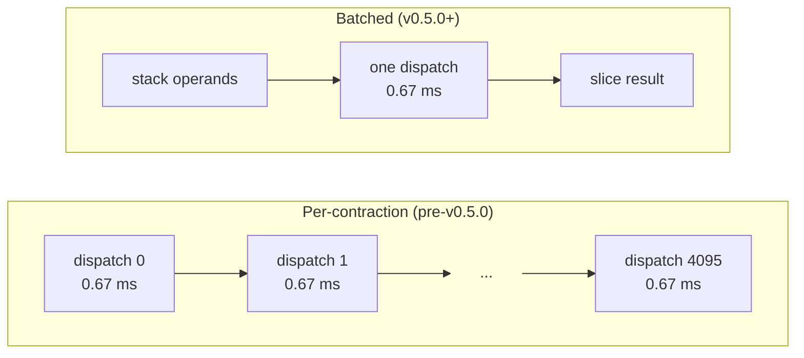

# trntensor v0.3.0–v0.7.0: dispatch granularity is the architecture

[Phase 1](https://trnsci.dev/blog/trntensor-when-the-kernel-boundary-is-the-api/) shipped fused NKI primitives for DF-MP2 and the 4-index AO→MO transform — single-program kernels that outperform the equivalent multi-dispatch CUDA plan sequences in HBM traffic. That architectural argument held. What didn't hold was the assumption that per-contraction dispatch was an acceptable cost in a workload that runs 4,096 of them. Phase 2 through v0.7.0 fixed that, and the fix is the same idea one level up: the dispatch boundary should be at the loop, not the iteration.

<!-- more -->

## The problem

DF-MP2 with a reasonable molecule (nocc=64) runs a pair loop: for each occupied-orbital pair `(i, j)`, one contraction `einsum("ap,bp->ab", B[i], B[j])`. That's 4,096 contractions. At the per-dispatch overhead measured in [#33](https://github.com/trnsci/trntensor/issues/33): 4,096 × 0.67 ms = **2.75 s** of dispatch overhead before a single useful FLOP. The Tensor Engine finishes each contraction in well under 1 ms at those shapes. The wrapper costs more than the work.

Two named fused primitives — `mp2_energy` and `ao_to_mo_transform` — were supposed to avoid this by running the whole loop as one NKI program. They did, but only at small shapes. Phase 1 shipped with undocumented shape ceilings:

| Primitive | Ceiling | What it excluded |
|---|---|---|
| `mp2_energy` | nvir ≤ 128, naux ≤ 128 | aug-cc-pVDZ has naux ≈ 300+ |
| `ao_to_mo_transform` | nbasis ≤ 512 | cc-pVTZ naphthalene has nbasis ≈ 572 |

The ceilings weren't hardware limits. SBUF and PSUM are large enough to accumulate arbitrary tile loops. The limits were in the kernels: each inner contraction filled a single tile and stopped. The tile loop was missing.

## What the architecture suggests

The 0.67 ms XLA dispatch floor is structural. Python dispatch calls the lazy XLA tracer, which looks up the compiled NEFF in the in-process cache, hands off to the NeuronCore queue, and synchronizes. The same property appeared in [trnblas Phase 3](https://trnsci.dev/blog/trnblas-phase-3-from-215-slower-to-36-faster-in-one-kernel-boundary-move/): at `nocc²` pairs the per-dispatch overhead swamps the computation entirely. Both libraries hit the same wall; trntensor's version manifests through `multi_einsum`, not a single fused kernel.

Two levers exist below the hardware floor:

- **Operand residency.** `to_xla()` pre-pins shared tensors — the DF coefficient array `B`, orbital energies `eps_occ`, `eps_vir` — once, before the loop. Subsequent dispatches skip the host→device transfer. The transfer cost at 2048² is 4.08 ms; the kernel is 0.97 ms. Paying the transfer once and amortizing it across the loop is the correct accounting.
- **Batching homogeneous contractions.** A pair loop where every iteration has the same subscript and the same shapes is a batched matmul waiting to happen. Detect it, stack the operands, one `nki_batched_matmul` dispatch, slice the result. The 4,096-dispatch loop becomes one.

The K-tiling ceiling was the same principle at the kernel level. SBUF doesn't constrain total naux — it constrains tile size. PSUM's `accumulate=True` flag is exactly the mechanism for accumulating across tile loops without SBUF round-trips. The single-tile `nc_matmul` in Phase 1 was a lazily incomplete loop body.



## The approach

Three fixes shipped across v0.3.0–v0.7.0, each targeting one of the three manifestations of the dispatch-boundary problem:

1. **`to_xla()` / `from_xla()` + `mark_step()` barrier** (v0.3.0): pins shared tensors to XLA device memory before the dispatch loop; `mark_step()` flush prevents unbounded lazy graph growth and serves as the correctness barrier for [#39](https://github.com/trnsci/trntensor/issues/39).
2. **`_try_batched_multi_einsum` in `multi_einsum`** (v0.5.0): detects homogeneous contraction batches, stacks operands, dispatches once, slices. The 2.75 s overhead drops to one 0.67 ms dispatch.
3. **K/M-tiling for `mp2_energy`** (v0.6.0) **and K/N-tiling for `ao_to_mo_transform`** (v0.7.0): inner tile loops with `accumulate=True` on PSUM replace the single-tile ceiling; naux and nbasis are now unrestricted in practice.

The deliberate tradeoff in the batching detector: it only fires when all contractions in a `multi_einsum` call share subscript, operand shapes, and the planner selects `strategy="matmul"`. Heterogeneous lists fall through to per-contraction dispatch. Over-detecting and batching incompatible contractions produces wrong results; under-detecting adds dispatch overhead. The conservative path was chosen; a richer pattern-matcher is tracked as a follow-up.

## Implementation

**Homogeneous batching detection** (`trntensor/einsum.py`):

```python
def _try_batched_multi_einsum(contractions: list) -> list[torch.Tensor] | None:
    if len(contractions) < 2:
        return None
    subscripts = contractions[0][0]
    if not all(c[0] == subscripts for c in contractions):
        return None
    if not all(len(c) == 3 for c in contractions):
        return None
    plan = plan_contraction(subscripts, contractions[0][1], contractions[0][2])
    if plan.strategy != "matmul":
        return None
    shape_key = (contractions[0][1].shape, contractions[0][2].shape)
    if not all((c[1].shape, c[2].shape) == shape_key for c in contractions):
        return None

    A_stack = torch.stack([c[1].T if plan.transA else c[1] for c in contractions])
    B_stack = torch.stack([c[2].T if plan.transB else c[2] for c in contractions])
    out_stack = nki_batched_matmul(A_stack, B_stack)
    return [out_stack[i] for i in range(len(contractions))]
```

The function returns `None` on any heterogeneity; `multi_einsum` falls back to the per-contraction path. The stack→dispatch→slice structure is the entirety of the batching logic — it doesn't need to be more complex.

**K-tiling loop in `mp2_energy_kernel`** — the inner loop that lifted naux from ≤128 to any size:

```python
for k_p in nl.affine_range(NAUX // TILE_K):
    p_off = k_p * TILE_K
    Bi_m = nl.load_transpose2d(B[i, m_off:m_off+TILE_M, p_off:p_off+TILE_K])
    Bj_n = nl.load_transpose2d(B[j, n_off:n_off+TILE_M, p_off:p_off+TILE_K])
    nisa.nc_matmul(dst=psum_T, stationary=Bi_m, moving=Bj_n, accumulate=True)
```

`accumulate=True` on PSUM lets the k_p loop accumulate partial products without writing back to SBUF between iterations. TILE_K=128 is the tile size the hardware constrains; loop depth is unconstrained. The kernel body is the tile; the loop is the mechanism. Phase 1's single-tile kernel was a loop with one iteration.

## What didn't work

**`mark_step()` as a pipeline opportunity.** Profiling at 1024² showed `nki_tot (2.935 ms) < sum-of-steps (3.156 ms)` — the kernel and `to_cpu` transfer already partially overlap under the lazy evaluator. The natural experiment was to remove `mark_step()` and let the lazy XLA graph grow, hoping the evaluator would auto-batch adjacent NKI kernels. This is blocked by [#39](https://github.com/trnsci/trntensor/issues/39): the combined lazy graph for the full `ao_to_mo_transform → mp2_energy` pipeline triggers `Shared memory is only supported on trn2, but inst__I-9-0:_mem_0_0_set is using Shared memory on an unsupported target` — on a trn1. The compiler optimistically targets trn2; the guard is missing somewhere in the Neuron lowering pass. Escalated to [aws-neuron/aws-neuron-sdk#1311](https://github.com/aws-neuron/aws-neuron-sdk/issues/1311). `mark_step()` stays as a correctness barrier until that resolves.

**NEFF on-disk profiling.** In NKI 0.3.0 on the torch_xla path, NEFF files are compiled in-memory and not surfaced to the filesystem. `NEURON_PROFILE` and `NEURONX_DUMP_TO` produced no artifacts. `neuron-profile capture -n` requires a standalone `.neff` file. Trainium's Tensor Engine peak at fp32 is 47.5 TFLOPS; at 1024² matmul the kernel time is 3.4 ms, implying roughly 1.1% TE utilization — but that number comes from wall-clock ÷ peak, not from an actual hardware counter. The `nki.compiler` direct-compile path would yield an extractable NEFF; until that lands, TE utilization is an estimate.

**Lazy XLA auto-batching.** The lazy evaluator fuses ops, but non-deterministically. Relying on it to batch adjacent homogeneous `@nki.jit` calls would produce correct results sometimes and hard-to-diagnose wrong results other times. Explicit stack+dispatch is auditable: the batch boundary is a named function, not a runtime side effect.

## Numbers

All measurements: trn1.2xlarge, NKI 0.3.0, warm NEFF cache.

**Table 1: dispatch overhead, nocc=64 (4,096 pairs)**

| Path | Dispatch overhead | Note |
|---|---|---|
| Per-contraction (pre-v0.5.0) | 4,096 × 0.67 ms = **2.75 s** | before a single FLOP |
| Batched (v0.5.0+) | **0.67 ms** (one dispatch) | kernel-dominated |

**Table 2: 2048² fp32 matmul — residency effect**

| Config | Time |
|---|---:|
| PyTorch baseline | 23.27 ms |
| NKI unpinned | 2.94 ms |
| NKI pre-pinned (`to_xla`) | 1.60 ms |
| Speedup (pre-pinned vs PyTorch) | **5.65×** |

At 1024², TE utilization is approximately 1.1% — dispatch-dominated. At 2048², the kernel runs in 0.97 ms but device→host transfer takes 3.14 ms: transfer dominates, not the kernel. Trainium's Tensor Engine is sized for large, sustained workloads; feeding it with small contractions one at a time is the wrong shape regardless of how well the kernel itself runs.

## What's next

- **Phase 4 — sharded contractions across chips** ([trntensor#30](https://github.com/trnsci/trntensor/issues/30)): multi-chip pair-energy once the per-chip kernel is no longer dispatch-dominated.
- **Phase 5 — trn2 fused multi-contraction paths** ([trntensor#31](https://github.com/trnsci/trntensor/issues/31)): trn2's shared memory enables cross-kernel fusion that trn1 cannot express; pending [#39](https://github.com/trnsci/trntensor/issues/39) resolution.
- **Formal TE utilization** once `nki.compiler` yields an extractable NEFF. The ~1.1% estimate at 1024² is not a number to be proud of, and it's not fully trustworthy without a hardware counter behind it.
- **Upstream [aws-neuron/aws-neuron-sdk#1311](https://github.com/aws-neuron/aws-neuron-sdk/issues/1311)**: the trn2-codegen-on-trn1 bug is the remaining blocker for lazy-graph pipeline experiments.

## Takeaway

Dispatch granularity is the architecture. A 0.67 ms fixed floor per dispatch means the kernel boundary should be placed at the loop level, not the iteration level — the same lesson trnblas reached in Phase 3, now applying to einsum-style contractions. For DF-MP2 with 4,096 pair contractions, one batched NKI dispatch replaces 4,096 individual ones and eliminates 2.75 s of overhead that was invisible until it dominated. The tiling work — K/M-tiling for `mp2_energy`, K/N-tiling for `ao_to_mo_transform` — is the same principle applied to the kernel interior: the tile loops are the kernel; TILE_K=128 is what the hardware constrains, not the loop depth above it. The library's job is to put the loop in the right place.
