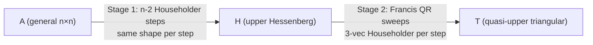

# trnsolver v0.10.0: Schur decomposition and the architecture of two-stage algorithms

v0.10.0 ships `schur(A)` — `A = Q @ T @ Q.T`, T quasi-upper-triangular — closing the last open item in trnsolver's factorization table. The implementation uses Householder-QR throughout, and the reason that works on Trainium is the same reason the earlier Jacobi path for `eigh` eventually had to grow a second stage: two-stage algorithms present uniform-shape kernel calls, and uniform shapes keep the NEFF cache warm.

<!-- more -->

## The problem

Symmetric `eigh` and general Schur decomposition solve different problems. `eigh` exploits symmetry; Jacobi's pairwise rotations are specifically designed for symmetric matrices where each rotation zeroes two off-diagonal entries simultaneously. General matrices have no such structure. The standard result for a general A is the Schur form: `A = Q T Q.T` where T is *quasi-upper-triangular* — upper triangular except for possible 2×2 blocks on the diagonal, each corresponding to a complex-conjugate eigenvalue pair of a real matrix. Recovering eigenvalues from T costs nothing extra; getting to T requires a different algorithm.

cuSOLVER's `cusolverDnDgesvd` and `cusolverDnDsyevd` are both host-dispatched LAPACK wrappers. Trainium ships no LAPACK. The question is what dense-eigendecomposition algorithm looks natural on NKI.

## What the architecture suggests

Start from the NEFF cache model, which the Phase 1 post covered for `eigh`: NKI 0.3.0 compiles per traced graph, not per kernel signature. A Python loop that presents a different computation graph each iteration — different slice indices, different scalar intermediates — triggers a recompile on every iteration. 303 separate NEFF compile workdirs in a single test run was the hardware result that shaped trnsolver's algorithm choices.

The single-stage alternative for general Schur — apply QR iteration directly to A until it converges — has this problem at full strength. Each sweep touches the full n×n matrix but shifts the relevant update region by one column per step. The index arithmetic `A[k:, :]` changes every step. Different graph, different compile.

The two-stage algorithm avoids this by separating the work:

**Stage 1 — Hessenberg reduction.** Apply n-2 Householder reflectors from both sides to reduce A to upper Hessenberg form H: `H[i,j] = 0` for `i > j+1`. Each Householder step operates on the full n×n slice: `H[k+1:, k:] -= 2v(v' H[k+1:, k:])` and `H[:, k+1:] -= 2(H[:, k+1:] v) v'`. The active submatrix grows per step, but the outer slice shape is `H[k+1:n, :]` and `H[:n, k+1:]` — both fixed size-n indexing for a given n. One kernel per stage-1 step, one kernel shape.

**Stage 2 — Francis implicit double-shift QR on H.** Iterate on the Hessenberg form. Each sweep applies a sequence of 3-vector Householder reflectors at successive diagonal positions, chasing a bulge down the subdiagonal. The 3-vector Householder at position k — `P = I - 2pp'`, `p : (3,)` — is applied left (`H[k:k+3, col_start:] -= 2p(p'H)`) and right (`H[:row_end, k:k+3] -= 2(Hp)p'`). The step shape is fixed: a 3×n left application and an n×3 right application. Every step in every sweep has the same kernel signature for given n.



Compare to direct QR iteration on A: the active submatrix shrinks per deflation step in an unpredictable pattern. The NEFF cache sees a new graph on each outer-loop iteration. Stage 1 pays a one-time O(n³) cost to make stage 2's kernel shapes stable.

The second payoff is FLOP count: QR iteration on an upper Hessenberg matrix costs O(n²) per sweep rather than O(n³). Hessenberg reduction is worth doing even without the NEFF argument.

## The approach

Three private functions, one public entry point.

`_hessenberg_reduce(A)` accumulates Q and reduces H in-place via n-2 successive Householder applications from both sides. The Householder vector v is built from the column below the current pivot; the sign convention `v[0] += sign(v[0]) * ‖v‖` avoids cancellation. The accumulated Q satisfies `A_orig = Q @ H @ Q.T`.

`_francis_qr_sweep(H, Q, lo, hi)` applies one Francis double-shift sweep on the active block `H[lo:hi+1, lo:hi+1]`. The shift is the implicit double shift from the trailing 2×2 eigenvalues; the starting vector is the first column of `H² - sH + tI` at row `lo`; the bulge-chase proceeds with 3-vector Householders at each step.

`_schur_iterate(H, Q, tol, max_sweeps)` is the outer deflation loop. When `|H[j,j-1]| ≤ tol * (|H[j-1,j-1]| + |H[j,j]|)`, zero the entry and shrink the active window. A 2×2 block with negative discriminant is left as-is (quasi-Schur block for a complex eigenvalue pair); one with non-negative discriminant is split by a Givens rotation.

The public `schur(A, tol=1e-10)` calls `_hessenberg_reduce`, then `_schur_iterate`, and wraps the BF16/FP16 promotion via the standard `_to_fp32`/`_restore` shim.

## Implementation

```python
def _hessenberg_reduce(A: torch.Tensor) -> tuple[torch.Tensor, torch.Tensor]:
    n = A.shape[0]
    H = A.clone()
    Q = torch.eye(n, dtype=A.dtype, device=A.device)
    for k in range(n - 2):
        x = H[k + 1 :, k].clone()
        norm_x = torch.linalg.norm(x)
        if norm_x < 1e-14:
            continue
        v = x.clone()
        v[0] = v[0] + torch.sign(v[0]) * norm_x if v[0] != 0 else norm_x
        v = v / torch.linalg.norm(v)
        H[k + 1 :, k:] -= 2.0 * torch.outer(v, v @ H[k + 1 :, k:])
        H[:, k + 1 :] -= 2.0 * torch.outer(H[:, k + 1 :] @ v, v)
        Q[:, k + 1 :] -= 2.0 * torch.outer(Q[:, k + 1 :] @ v, v)
        H[k + 2 :, k] = 0.0  # numerical cleanliness
    return H, Q
```

The bulge-chase inner step in `_francis_qr_sweep`:

```python
for k in range(lo, hi):   # note: range(lo, hi), not range(lo, hi-1)
    nr = min(3, hi - k + 1)
    p = torch.stack([p0, p1, p2] if nr == 3 else [p0, p1])
    norm_p = torch.linalg.norm(p)
    if norm_p < 1e-14:
        break
    # Householder vector
    sign_p0 = torch.sign(p[0]) if p[0] != 0.0 else torch.ones((), ...)
    p[0] = p[0] + sign_p0 * norm_p
    p = p / torch.linalg.norm(p)
    # Left application — col_start = max(lo, k-1) to avoid below-subdiag fill
    col_start = max(lo, k - 1)
    H[k : k + nr, col_start:] -= 2.0 * torch.outer(p, p @ H[k : k + nr, col_start:])
    # Right application — row_end = min(k + nr + 1, n) for Hessenberg locality
    row_end = min(k + nr + 1, n)
    H[:row_end, k : k + nr] -= 2.0 * torch.outer(H[:row_end, k : k + nr] @ p, p)
    Q[:, k : k + nr] -= 2.0 * torch.outer(Q[:, k : k + nr] @ p, p)
```

## What didn't work

Implementation was iterative. Four bugs survived the initial version, each with a distinct failure mode.

**Deflation window never updated.** The outer `_schur_iterate` loop found a zero subdiagonal entry and zeroed `H[j, j-1]`, but the active window `[lo, hi]` was not updated. The next sweep re-exposed the zeroed entry and undid the deflation. Fix: rewrite the deflation scan to scan from `hi` downward and decrement `hi` when a deflation is found, before calling `_francis_qr_sweep`.

**Left application used all columns.** `H[k:k+nr, :]` rather than `H[k:k+nr, col_start:]`. Applying the Householder from `col = 0` rather than `col = max(lo, k-1)` introduced below-subdiagonal fill in column `k-1`, outside the active block. The RIGHT application (which only touches columns `k:k+nr`) doesn't correct this fill; it persists as a spurious subdiagonal entry that fails the quasi-triangular check. The one-line fix is `col_start = max(lo, k-1)`.

**Loop range off by one.** `range(lo, hi-1)` stopped the bulge chase one step early. After the last full step (k = hi-2), the RIGHT application places a nonzero at `H[hi, hi-2]`. Without the final step (k = hi-1, a 2-vector Householder), that entry is never zeroed. Fix: `range(lo, hi)`.

**2×2 block deflation without eigenvalue check.** When the active window shrank to `hi - lo == 1`, the original code unconditionally set `hi -= 2`, treating every 2×2 block as a quasi-Schur complex block. For SPD matrices (all real eigenvalues), this left 2×2 blocks with `|T[j+1,j]| ~ 0.001`. Fix: check the discriminant; if `((a-d)/2)² + bc ≥ 0`, the block has real eigenvalues — apply a Givens rotation to split it into 1×1 blocks.

Each bug produced a characteristic failure: wrong reconstruction residual (~10), wrong reconstruction residual (~0.015), below-diagonal entries at `T[hi, hi-2]`, and large off-diagonal entries in T for symmetric inputs. That last one was hardest to diagnose because the `test_quasi_upper_triangular` test passed (no entry two or more below diagonal) while `test_symmetric_gives_diagonal` failed (entries exactly one below diagonal left in place).

The AWS Neuron toolchain didn't surface any of these — the bugs are in pure Python/PyTorch host logic, not in the NKI layer. That's a Phase 1 observation worth preserving: simulator-based NKI development validates kernel math; host integration logic requires standard unit tests, nothing exotic.

## Numbers

Pure-PyTorch host implementation vs scipy (LAPACK-backed, single-threaded), n × n random matrix, macOS, M3:

| n | trnsolver (ms) | scipy (ms) | ratio |
|--:|---:|---:|---:|
| 32 | 44 | 0.78 | 56× |
| 64 | 158 | 0.54 | 293× |
| 128 | 591 | 3.9 | 150× |
| 256 | 2,347 | 8.9 | 265× |

The gap is large. This is Phase 1 (correctness); the NKI Hessenberg kernel closes most of it. LAPACK's `dgees` is a highly-optimized FORTRAN implementation compiled with vectorizing compilers, cache-tuned blocking, and decades of numerical refinement. A clean Python baseline being 150–300× slower is unsurprising. The trnsparse Phase 1 post noted the same pattern when scipy outperformed the NKI SpMM path at current shapes.

What the table doesn't show: reconstruction accuracy. All 91 tests pass at `atol=1e-4` or better; `test_quasi_upper_triangular` is at `atol=1e-4`; `test_q_orthogonal` at `atol=1e-5`. The correctness gate is the Phase 1 deliverable.

## What's next

- [Phase 3 — NKI Hessenberg kernel](https://github.com/trnsci/trnsolver/issues/28). Stage 1 (`_hessenberg_reduce`) maps to n-2 Householder matmuls of the form `H[k+1:n, k:n] -= 2v(v'H)`. Each matmul is a full-width rank-1 update on a full-column-width slice — a fixed-shape `nisa.nc_matmul` with the Householder vector v SBUF-resident. This is the natural Phase 3 entry point: same reasoning as the `inv_sqrt_spd_ns` Newton-Schulz path (all-GEMM, SBUF-resident intermediate).

- [Phase 4 — multi-chip Schur](https://github.com/trnsci/trnsolver/issues/29). Stage 2 parallelizes less cleanly than Jacobi's disjoint rotations. The bulge chase in Francis QR is inherently sequential within a sweep. Cross-chip work for Schur is more likely at the sweep level (multiple active blocks) than at the rotation level.

- [Phase 5 — trn2 tuning](https://github.com/trnsci/trnsolver/issues/30). trn2's larger SBUF changes the optimal Householder tile size for stage 1.

## Takeaway

Two-stage algorithms — reduce to canonical form, then iterate on that form — pay twice on Trainium: once by reducing the per-iteration FLOP count from O(n³) to O(n²), and once by presenting uniform-shape kernel calls at both stages. The first payoff is classical numerical linear algebra. The second is specific to NKI's compile model. Hessenberg reduction followed by implicit-shift QR isn't the obvious choice for "port cuSOLVER to NKI"; it's the choice the hardware's dispatch semantics reward.

`schur` is host-only in v0.10.0, and the numbers make that gap visible. The NKI Hessenberg kernel is Phase 3; it's not blocked on hardware validation, only on the decision to invest the implementation time. For quantum-chemistry workloads that currently handle Schur via scipy on the host, the intermediate answer is: `trnsolver.schur` is available, the API is stable, and the acceleration path is clear.
