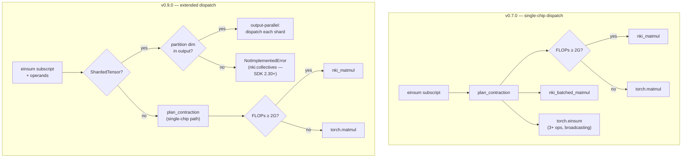

# trntensor v0.8.0–v0.9.0: dispatch owns routing and placement

v0.8.0 closed a gap where every binary step in a 3+ operand chain bypassed the dispatch layer entirely — calling `torch.einsum` directly, invisible to the FLOP threshold and the NKI kernel, silently skipping up to 134 GFLOP of Tensor Engine work per chain. v0.9.0 added the first multi-chip abstraction: `ShardedTensor` and output-parallel einsum dispatch, the foundation for DF-MP2 with basis sets that don't fit in single-chip HBM. Both changes are the same insight applied at different scales: the dispatch layer is where decisions about *what code runs* and *where data lives* belong.

<!-- more -->

## The problem

**Part A — v0.8.0.** The greedy path planner ([v0.6.0](https://github.com/trnsci/trntensor/issues/29)) selects an optimal binary-contraction order for 3+ operand einsums and decomposes the chain into binary steps. The problem was in `_execute_path`'s per-step dispatch line:

```python
# Before v0.8.0 — bypasses the dispatch layer
result = torch.einsum(sub, ops[i], ops[j])
```

Every binary step routed directly to `torch.einsum`. The FLOP threshold was never checked. `plan_contraction` was never called. `nki_matmul` was never reached. For a 3-operand chain at 512³ shapes, each binary step is ~134 GFLOP — well above the 2 GFLOP dispatch threshold — and every one of them was silently handed to CPU PyTorch.

A second bug was uncovered in the same pass. `_plan_binary` assumes A's free dims appear before B's in the output — what the code called "standard form." The greedy path planner doesn't guarantee this. For the subscript `"kl,ik->il"` — produced when the planner prefers to contract the smaller-cost pair first — `_plan_binary` transposed both operands and returned shape `(11, 7)` instead of `(7, 11)`. This was latent before v0.8.0 because `torch.einsum` is subscript-aware and corrected the transposition automatically. Once the fix routed steps through `einsum()`, the wrong shape surfaced.

**Part B — v0.9.0.** cc-pVTZ naphthalene (nbasis ≈ 572) fits on single-chip HBM with room to spare. cc-pVQZ buckminsterfullerene (nbasis ≈ 4500, naux ≈ 15000) does not — the full ERI tensor is approximately 1.2 TB. No amount of K-tiling or batching changes the capacity arithmetic. And nothing in the dispatch layer could express "this tensor lives across chips" — every path assumed a dense tensor resident on one NeuronCore.

## What the architecture suggests

The dispatch layer is where decisions about routing and placement belong. v0.7.0 closed the per-contraction routing gap for single-chip work. Two structural gaps remained:

- **Routing gap** (v0.8.0): the path planner produced binary subscripts that arrived at `_execute_path` but then short-circuited past the dispatcher.
- **Placement gap** (v0.9.0): tensors can be physically distributed across chips, but the dispatch layer had no vocabulary to describe this.



The single-chip graph is complete at v0.7.0. v0.9.0 adds `ShardedTensor` as a first-class input type: the dispatcher branches before `plan_contraction`, checks whether the partition dimension appears in the output (output-parallel) or is contracted over (reduce-parallel), and routes accordingly.

## The approach

**v0.8.0 — routing fix, two changes.**

First, replace the `torch.einsum` direct call with a call through `einsum()`:

```python
# After v0.8.0 — routes through the dispatcher
result = einsum(sub, ops[i], ops[j], precision=plan.precision)
```

Second, normalize operand order before dispatch. `_plan_binary` expects A's free dims first. The fix checks the first character of `inter_str` against `free_i` and swaps if needed:

```python
step_contracted = (set(inputs[i]) | set(inputs[j])) - set(inter_str)
free_i = set(inputs[i]) - step_contracted
if inter_str and inter_str[0] not in free_i:
    sub = f"{inputs[j]},{inputs[i]}->{inter_str}"
    result = einsum(sub, ops[j], ops[i], precision=plan.precision)
else:
    sub = f"{inputs[i]},{inputs[j]}->{inter_str}"
    result = einsum(sub, ops[i], ops[j], precision=plan.precision)
```

**v0.9.0 — placement foundation.**

Three additions to `trntensor.parallel`:

1. `ShardedTensor(chunks, partition_dim)` — wraps a list of dense chunks with partition metadata.
2. `scatter(tensor, dim, n_shards)` / `gather(st)` — split a tensor across shards and reconstruct.
3. `einsum()` dispatch extension — detects `ShardedTensor` operands before entering `plan_contraction`.

Output-parallel sharding is implemented; reduce-parallel is not (blocked on `nki.collectives`). The deliberate tradeoff: output-parallel trades latency for capacity. It does not improve throughput. For the cc-pVQZ C₆₀ case, sharding enables the computation to happen at all; it does not make it faster than a hypothetical single-chip run.

## Implementation

**v0.8.0 fix** — `_execute_path` in `trntensor/einsum.py`, full change:

```python
step_contracted = (set(inputs[i]) | set(inputs[j])) - set(inter_str)
free_i = set(inputs[i]) - step_contracted
if inter_str and inter_str[0] not in free_i:
    sub = f"{inputs[j]},{inputs[i]}->{inter_str}"
    result = einsum(sub, ops[j], ops[i], precision=plan.precision)
else:
    sub = f"{inputs[i]},{inputs[j]}->{inter_str}"
    result = einsum(sub, ops[i], ops[j], precision=plan.precision)
```

**v0.9.0 usage** — scatter/gather + output-parallel einsum:

```python
from trntensor import einsum
from trntensor.parallel import scatter, gather

# cc-pVQZ C₆₀: eri too large for single chip → shard along μ across 8 chips
eri_sharded = scatter(eri, dim=0, n_shards=8)
C_occ_sharded = scatter(C_occ, dim=0, n_shards=8)
B_sharded = ao_to_mo_transform(eri_sharded, C_occ_sharded, C_vir)
B = gather(B_sharded)
```

Each shard of `eri_sharded` is an independent dense tensor. `ao_to_mo_transform` detects `ShardedTensor` inputs, dispatches each shard to its NeuronCore independently, and returns a `ShardedTensor` output. `gather()` concatenates along the partition dimension.

## What didn't work

**`_plan_binary` assumption scope.** The operand normalization in v0.8.0 checks only whether `inter_str[0]` is in `free_i` — which covers the common 2D matmul case, the only case currently routed to `nki_matmul`. For higher-rank intermediates with multi-character output subscripts, the check could still produce a misoriented output. A complete fix would require a `transOut` permutation field on `ContractionPlan` and a full output-permutation comparison. That's a real but infrequently-exercised case (it only surfaces when the planner's cost model prefers a contraction order that produces a non-standard subscript *and* the result is a higher-rank tensor *and* subsequent contractions depend on dimension ordering). Filed as a known niche; the `torch` strategy fallback handles it correctly. The partial fix ships because the common case is correct and the risk profile of the full fix is higher than the risk of the known niche.

**Sequential dispatch overhead.** The current `ShardedTensor` dispatch loop is sequential Python: for `n_shards=8`, dispatch overhead is 8 × 0.67 ms = 5.36 ms. Output-parallel sharding trades latency for capacity — the whole point is enabling computations that were impossible before, not accelerating ones that were possible. On hardware, each shard would target a different NeuronCore; the Python dispatch loop is a single-threaded stand-in for a collective that Neuron doesn't expose yet. The per-shard overhead is the honest current cost.

**Reduce-parallel blocked.** Contracting over the partition dimension would require an allreduce across chips. `nki.collectives` is not present in NKI 0.3.0 Stable. `einsum()` raises `NotImplementedError("reduce-parallel sharding requires nki.collectives — available in SDK 2.30+")` when a `ShardedTensor`'s partition dim is a contracted index. This is the boundary the design hits: output-parallel is expressible today; reduce-parallel is not. Surfacing the error message with an explicit version note — rather than silently falling back to CPU or producing wrong results — is a deliberate choice. The Neuron team can see the feature request at the raise site.

## Numbers

v0.8.0 is a correctness fix, not a performance change. The relevant measure is what was silently missed:

| Subscript | FLOPs per binary step | Before v0.8.0 | After v0.8.0 |
|---|---|---|---|
| `"ij,jk,kl->il"` at 512³ | ~134 GFLOP | `torch.einsum` (CPU) | `plan_contraction` → `nki_matmul` |
| `"ij,jk,kl->il"` at 128³ | ~2 GFLOP | `torch.einsum` (CPU) | below threshold → `torch.matmul` |

v0.9.0 — capacity, not speed:

| Config | ERI fits on chip? | Approach | Dispatch overhead |
|---|---|---|---|
| nbasis=572 (naphthalene, cc-pVTZ) | Yes (~915 MB) | No sharding needed | Unchanged |
| nbasis=4500 (C₆₀, cc-pVQZ) | No (~1.2 TB) | 8-chip output-parallel | 8 × 0.67 ms = 5.36 ms |

The 512³ row in the routing table is the meaningful one: 134 GFLOP of Tensor Engine work was silently routed to CPU PyTorch on every multi-operand chain at that size. v0.8.0 does not change wall-clock time by a known amount — it changes where the work lands.

## What's next

- **Phase 4.2 — reduce-parallel sharding + hardware placement** ([trntensor#30](https://github.com/trnsci/trntensor/issues/30)): blocked on `nki.collectives` in SDK 2.30+; output-parallel is the placeholder.
- **Phase 5 — trn2 fused three-contraction kernel** ([trntensor#31](https://github.com/trnsci/trntensor/issues/31)): trn2 shared memory enables cross-kernel accumulation trn1 can't express.
- **Formal TE utilization profile**: the `nki.compiler` direct-compile path is not yet stable; TE utilization remains a wall-clock estimate rather than a hardware counter read.
- **`_plan_binary` full output-permutation fix**: niche case, deferred. A `transOut` field on `ContractionPlan` is the right fix shape.

The `nki.collectives` gap is also a concrete feature request for the Neuron team: reduce-parallel sharding is the natural complement to output-parallel, and without it the multi-chip story is half-told. The interface would need at minimum `nki.collectives.allreduce(tensor, op=SUM)` callable from within a `@nki.jit` program. The trntensor usage would be: each shard contracts over its partition of the contraction index, then allreduces the partial result before storing.

## Takeaway

The dispatch layer is where both routing decisions and placement decisions belong. v0.8.0 completed the routing side: every binary step in a 3+ operand chain now routes through `plan_contraction`, and the operand normalization ensures `_plan_binary` always sees operands in the orientation it expects. v0.9.0 began the placement side: `ShardedTensor` is the dispatch layer's first vocabulary for cross-chip data distribution, and the output-parallel path is its first sentence in that vocabulary. The constraint it immediately runs into — `nki.collectives` not in NKI 0.3.0 — is the honest current limit of Trainium's programming model, not of the design. The design is already waiting for the primitive.
