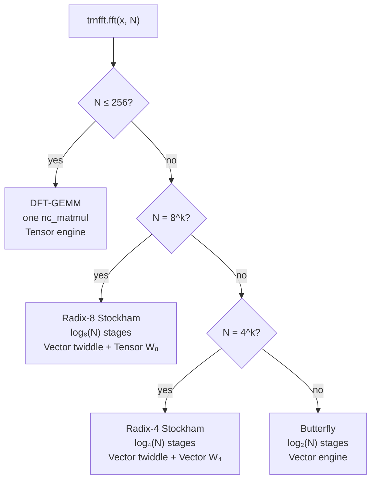

# trnfft: FFT is a GEMM, and then it isn't

trnfft v0.12–v0.15 shipped three new FFT dispatch paths — DFT-GEMM, Stockham
radix-4 with twiddle precomputation, and Stockham radix-8 with a Tensor-engine
W₈ kernel — producing 20–37% improvements over the butterfly baseline at medium
and large N. The architectural argument running through all three is the same:
on Trainium, the bottleneck is not arithmetic but engine utilization and kernel
launches. Whether that argument holds at a given N, and at what cost, is where
most of the engineering work actually lived.

<!-- more -->

## The problem

cuFFT works by dispatching radix-2 (or mixed-radix) butterfly stages, each one
a massively parallel warp-per-butterfly operation on the GPU. A Trainium port
runs into two problems immediately.

The first is cosmetic but structural: Trainium has no complex dtype. trnfft's
`ComplexTensor` wraps a split real/imaginary pair and expresses every operation
as four real FP32 tensor ops. That's the same Strassen-style identity the
existing `_complex_gemm_kernel` already exploits:

```python
C_real = A_real @ B_real − A_imag @ B_imag
C_imag = A_real @ B_imag + A_imag @ B_real
```

Four real matmuls, which maps cleanly to four `nisa.nc_matmul` accumulations
into PSUM.

The second problem is structural and not cosmetic: butterfly stages run on the
Vector engine. Each stage is a twiddle multiply (FP32 element-wise) followed by
a butterfly add/subtract. Both operations land on the Vector engine. The Tensor
engine — the part of the chip with most of the compute throughput — never fires
during an FFT.

The question driving v0.12–v0.15: *is there a formulation of FFT that routes
meaningfully through the Tensor engine?*

## What the architecture suggests

The Tensor engine's native operation is `nc_matmul`: a batched systolic-array
matrix multiply accumulating into a FP32 PSUM tile. Its partition dimension is
fixed at 128; its free dimension goes to 512. At training workloads, the engine
is fed with contiguous tiles of large matrices, and the per-launch overhead
amortizes over thousands of multiply-accumulate operations.

What the architecture suggests, then, depends on N.

**Small N (≤ 256):** the entire DFT fits in one systolic-array matmul. The DFT
matrix W is N×N. For N=256, `(B, 256) @ (256, 256)` is a single `nc_matmul`
call. One Tensor-engine launch replaces log₂(N) = 8 Vector-engine butterfly
stages. The O(N²) arithmetic is usually cited as a reason not to do this; on
Trainium, the one-launch/Tensor-engine advantage outweighs the FLOP count
until the PSUM accumulation error floor binds — measured at N=256 in FP32.

**Medium N (power-of-4, > 256):** one matmul can't cover the whole transform
without exceeding the precision budget. Stockham radix-4 decomposes N into
log₄(N) stages of 4-point DFTs. The critical observation: W₄ has coefficients
{1, −1, i, −i}, meaning the W₄ matvec reduces to adds and sign flips. *No
multiplications.* The Tensor engine is idle in each stage; the twiddle multiply
(which does require real FP32 multiplications) dominates the per-stage cost.

**Large N (power-of-8, > 256):** W₈ has entries exp(−2πi·j·k/8), which include
±√2/2 ± i√2/2. These require actual multiplications. Using the Tensor engine for
the W₈ matmul now earns its keep.

The dispatch table that results:



## The approach

### DFT-GEMM (v0.12)

`_fft_via_gemm` constructs the N×N DFT matrix W on CPU, transfers it once, and
dispatches `complex_gemm(x, W)` — a single `nc_matmul` call per transform.
Dispatch condition: `n <= _DFT_GEMM_THRESHOLD` and `precision != "kahan"`.
The threshold is precision-bound, not performance-bound: at N=512, FP32 PSUM
accumulation exceeds the 1e-3 relative-error tolerance. N=256 stays inside it.

### Stockham radix-4 with twiddle precomputation (v0.13)

The initial radix-4 implementation computed twiddle factors per-stage inside the
loop — one `torch.cos`/`torch.sin` + expand + CPU-to-device transfer per stage.
Profiling revealed that twiddle recomputation was the dominant overhead term, not
the kernel time or permute cost. The fix: precompute all log₄(N) twiddle tensors
on CPU before the loop, transfer them as independent standalone tensors (slicing
an XLA device tensor creates `DynamicSlice` HLO ops that bust the NEFF cache).
This alone delivered the 6–9% improvement over butterfly that made radix-4 the
default path for power-of-four N > 256.

### Stockham radix-8 with Tensor-engine W₈ (v0.15)

`stockham_radix8_w8_kernel` takes pre-twiddled `(total_groups, 8)` input and
applies W₈ via four `nisa.nc_matmul` calls — the standard complex GEMM
decomposition:

```python
@nki.jit
def stockham_radix8_w8_kernel(a_re, a_im, w8_re, w8_im):
    ...
    for m in nl.affine_range(n_partition_tiles):
        ar_t = nl.load_transpose2d(a_re[m_off:m_off + groups_chunk, :8])
        ai_t = nl.load_transpose2d(a_im[m_off:m_off + groups_chunk, :8])
        nisa.nc_matmul(dst=psum_cr, stationary=ar_t, moving=w8_r, accumulate=True)
        nisa.nc_matmul(dst=psum_cr, stationary=ai_t, moving=neg_w8_i, accumulate=True)
        nisa.nc_matmul(dst=psum_ci, stationary=ar_t, moving=w8_i, accumulate=True)
        nisa.nc_matmul(dst=psum_ci, stationary=ai_t, moving=w8_r, accumulate=True)
        ...
```

W₈ is symmetric (W₈[j,k] = W₈[k,j] since j·k = k·j), so `W₈ = W₈ᵀ` and the
matrix can be passed directly as the moving tile without transposition. The
twiddle multiply runs on the XLA device as a PyTorch element-wise op before the
kernel call — not in NKI — for a reason documented in the next section.

## What didn't work

**The benchmarking saga.** Nine consecutive hardware runs all returned a 17,997-byte
JSON file — exactly SSM's 24,000-character `StandardOutputContent` limit applied
to a base64-encoded 18 KB payload. pytest-benchmark stores every raw timing sample;
a 5-benchmark JSON was ~500 KB. Nine different approaches to stripping the file
before fetching — single-quote Python args, double-quote args, base64-encoded
scripts, `set -e` compound commands — all silently succeeded at the SSM level
while producing empty stdout. Root cause was never definitively identified (the
strip script's file writes never persisted, for reasons the remote execution
environment didn't surface). Fix: a single SSM command reads, strips, and
base64-encodes the JSON in memory via Python, writing ~400 chars to stdout
instead of 18 KB.

**Thread C gather regression.** Profiling showed the radix-4 driver's
`reshape + permute + .contiguous() + reshape` chain costs ~97 µs per stage —
~10% of total. The intuition: replace these four PyTorch ops with a single
precomputed flat-index gather, reducing XLA graph nodes from 8 to 2 per stage.
Hardware result: 11–39% *slower* across all tested N. Neuron's transpose HLO is
a hardware-optimized DMA permute path; GatherOp with non-affine indices is not.
The permute stays.

**Radix-8 kernel-local scratch buffer.** The initial radix-8 kernel used an
internal `nl.ndarray(buffer=nl.shared_hbm)` scratch to bridge two phases:
twiddle multiply (Vector engine, writes scratch) and W₈ matmul (Tensor engine,
reads scratch via `nl.load_transpose2d`). This compiled and passed simulator
tests, then failed NEFF compilation on hardware with no useful error. The
constraint, discovered by inspection: `nl.load_transpose2d` in NKI 0.3.0 only
accepts *function-argument* HBM tensors as its source — kernel-local allocations
are not addressable. Fix: move twiddle multiply to the PyTorch driver as an
element-wise XLA op, and make the NKI kernel W₈-only, taking external HBM
tensors as input. A concrete upstream ask: `nl.load_transpose2d` should either
accept kernel-local `shared_hbm` allocations or produce a compile-time error
that names the constraint instead of failing silently.

## Numbers

Hardware bench: trn1.2xlarge, Neuron SDK 2.29.0, NKI 0.3.0, 2026-04-20.

| N    | DFT-GEMM (µs) | Radix-8 (µs) | Radix-4 (µs) | Butterfly (µs) | Auto-dispatch path |
| ---- | ------------- | ------------ | ------------ | -------------- | ------------------ |
| 64   | ~1 883        | 3 402        | 4 254        | 4 767          | DFT-GEMM           |
| 256  | ~1 882        | —            | 5 446        | 6 067          | DFT-GEMM           |
| 512  | n/a           | **4 483**    | —            | ~6 600 (est.)  | Radix-8            |
| 1024 | n/a           | —            | 6 628        | 7 399          | Radix-4            |
| 4096 | n/a           | **5 917**    | 8 424        | 9 387          | Radix-8            |

DFT-GEMM values at N=64/256 are from v0.12 on SDK 2.24; other values on SDK 2.29.
N=512 butterfly is extrapolated from per-stage timing (~739 µs/stage × 9 stages).

**Forward error** matters as much as wall-clock time. The `precision="fast"` butterfly
accumulates O(u log₂N) FP32 rounding error; `precision="kahan"` (Dekker 2Prod
compensated complex multiply) cuts it by 7–8× at no algorithmic change:

| N    | fast rel error | kahan rel error | improvement |
| ---- | -------------- | --------------- | ----------- |
| 256  | 1.41e-6        | 1.92e-7         | 7.3×        |
| 512  | 2.15e-6        | 2.69e-7         | 8.0×        |
| 1024 | 2.04e-6        | 3.02e-7         | 6.8×        |
| 4096 | 3.60e-6        | 4.55e-7         | 7.9×        |

Both paths are below 1e-3. Use `set_precision("kahan")` when your forward-error
budget is tight — iterative solvers, spectral methods, anything that chains
multiple FFTs.

**Where Trainium is well-indexed for this:** the Tensor engine maps naturally
to both the small-N DFT-GEMM case (one large matmul) and the medium-N W₈ case
(batched 8×8 matmuls across all groups simultaneously). The partition dimension
absorbs all `total_groups` rows in one pass.

**Where it is not well-indexed:** N values that are not powers of 2, 4, or 8
fall to the butterfly path, which stays Vector-engine throughout. Non-power-of-2
FFTs use Bluestein's algorithm (three power-of-2 FFTs), which chains errors through
the 3-FFT pipeline. `precision="double"` is the escape hatch for those paths, at
the cost of CPU roundtripping since Trainium's PSUM is always FP32.

## What's next

- **Mixed-radix Stockham shipped (v0.16).** N=1024 ([8,8,4,4], 4 stages, −15% vs
  radix-4) and N=2048 ([8,8,8,4], 4 stages, first Stockham coverage) are live.
  `_mixed_radix_plan(n)` finds the optimal `[8^a, 4^b]` decomposition for any
  power-of-2 N.
- **Iterative FFT refinement (research direction).** Compute FFT in BF16 using the
  Tensor engine; use the FP32 PSUM accumulator as a residual buffer; apply one
  correction step. The result: BF16 throughput, near-FP32 accuracy — enabled by
  PSUM being a structural FP32 accumulator that no one has exploited for FFT on a
  production deterministic systolic array. This is the next post.
- **Multi-NeuronCore distribution.** Large N FFTs (N > 4096) partitioned across
  NeuronCores. Linear speedup with core count; CLAUDE.md "future" since v0.11.

Issues tracking the above are open on [trnsci/trnsci](https://github.com/trnsci/trnsci/issues).

## Takeaway

FFT on Trainium is a problem about matching transform structure to engine
capabilities, not about minimizing FLOP count. The DFT matrix IS a matmul —
at small N, skipping the butterfly entirely and using one Tensor-engine call
is the right answer. At larger N where O(N²) error is prohibitive, the question
becomes which radix decomposition lets the Tensor engine participate in the
per-stage computation. W₄ uses {1, −1, i, −i} and needs no multiplications;
W₈ uses irrational entries and does. That distinction — not the stage count,
not the arithmetic complexity — is what determined the dispatch hierarchy.
The Tensor engine is idle during radix-4 stages; it is active during radix-8.
Hardware validated both claims.
