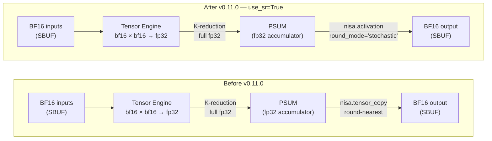

# trntensor v0.11.0: stochastic rounding at the PSUM→SBUF boundary

v0.11.0's headline is one argument: `precision="sr"` on a matmul dispatch call. The architectural story is that Trainium's PSUM buffer makes stochastic rounding a one-instruction hardware primitive instead of an external library. Anyone using trntensor for iterative BF16 workloads — Krylov solvers, iterative refinement, or long batched contractions — should care about this.

<!-- more -->

## The problem

BF16 has a unit roundoff u ≈ 2⁻⁸ ≈ 0.0039. For a dot product of length K with round-nearest accumulation, Wilkinson's bound gives a worst-case error of K·u. At K=512, that's a worst-case error of ~2.0 per output element — and it's directional, not random. Coherent rounding bias across tiles accumulates. Krylov methods with BF16 accumulation stagnate without correction for K ≥ ~300, not because BF16 can't represent the answer, but because round-nearest introduces a systematic deflection that each iteration reinforces rather than cancels.

The standard GPU response involves either promoting to FP32/TF32 for the full computation — which changes the memory and bandwidth economics — or layering a compensated-summation library like ReproBLAS over the standard BLAS calls. Neither is a one-instruction fix. On BF16 FMA chains, rounding error is distributed: each multiply-add step rounds separately, and there is no single accumulated-FP32 accumulator to intercept.

The cuBLAS model for this workload is a patch on top of the normal path. CUDA 13's FP64 DGEMM emulation via Ozaki on FP8 tensor cores is the same post-FP64 design arriving through a different route — compensated accumulation as an explicit layer rather than a native one.

## What the architecture suggests

Trainium's Tensor Engine accumulates BF16 multiply-adds into a FP32 PSUM buffer. This is not a software choice; it is determined by the systolic array's data path. The K-reduction across an entire tile completes in FP32. The downcast from FP32 PSUM to BF16 SBUF is one explicit step at the end.

This is not how a GPU FMA chain works. On a GPU, rounding is distributed across K steps. No single FP32 accumulator exists to intercept. Fixing round-nearest bias on a GPU requires either the full-FP32 promotion or a compensated-summation overlay — both add overhead, and neither is one instruction.

On Trainium, the PSUM buffer is architecturally separate from SBUF. The downcast step is explicit and programmable. That structure creates exactly one controlled place to apply stochastic rounding: the PSUM→SBUF boundary at the end of each (m,n) tile.



The PSUM buffer existed before v0.11.0. The FP32 K-reduction existed before v0.11.0. What v0.11.0 adds is the awareness that one parameter change at the PSUM→SBUF step turns round-nearest into mean-zero SR. The hardware had the primitive; the library just didn't surface it.

This matters specifically because Connolly–Higham–Mary (SIAM J. Sci. Comput., 2021) establishes that SR replaces the worst-case K·u bound with a mean-zero √K·u probabilistic bound. The √K scaling is the critical difference for iterative methods: √K·u grows slower than K·u, and the mean-zero property means errors don't accumulate coherently across iterations. For K=512 in BF16: worst-case round-nearest error ~2.0; SR mean error ~0.063 (14.5×√512 × 2⁻⁸). The gap is not marginal.

## The approach

`precision="sr"` is a new value on the existing `precision` parameter at the `einsum()` call site. The routing is deliberate:

| `precision=` | Strategies reached | PSUM→SBUF step |
|---|---|---|
| `"fast"` (default) | matmul, bmm, torch, path | `nisa.tensor_copy` (round-nearest) |
| `"sr"` | matmul only | `nisa.activation(..., round_mode="stochastic")` |
| `"dd"` | matmul only (gated, trnblas#22) | double-double accumulation (future) |

`"sr"` is a no-op for `"bmm"`, `"torch"`, and `"path"` strategies. Those strategies do not go through the NKI matmul kernel and have no PSUM buffer to apply SR at. This scoping is intentional, not a gap. Applying SR to a `torch.einsum` result would be noise injection, not rounding control — there is no FP32 accumulator to round from.

The `ContractionPlan` carries `precision` forward to `_execute_matmul`, which passes `use_sr=(plan.precision == "sr")` to `nki_matmul`. The `sr` semantics are: on hardware, `nisa.activation(..., round_mode="stochastic")` at the per-tile PSUM→SBUF boundary; on CPU, `_stochastic_round_cpu` applied to the FP32 `torch.matmul` result before downcast. The CPU mock enables `precision="sr"` to be tested in CI without hardware.

## Implementation

The kernel change (`trntensor/nki/_kernels.py`):

```python
# Both paths allocate the same c_sbuf — the branch is only in how PSUM is written.
c_sbuf = nl.ndarray((tile_m, tile_n), dtype=a.dtype, buffer=nl.sbuf)
if use_sr:
    nisa.activation(
        psum,
        bias=None,
        scale=1.0,
        out_dtype=a.dtype,
        round_mode="stochastic",
        dst=c_sbuf,
    )
else:
    nisa.tensor_copy(src=psum, dst=c_sbuf)
```

`nisa.activation` with `round_mode="stochastic"` is a NKI 0.3.0 / Neuron SDK 2.29+ primitive. The call site replaces one line (`tensor_copy`) with one call. No tiling logic changes. No accumulation loop changes. The entire SR difference is at this one boundary.

The CPU mock (`trntensor/nki/dispatch.py`):

```python
def _stochastic_round_cpu(x: torch.Tensor, dtype: torch.dtype) -> torch.Tensor:
    """CPU stochastic rounding from float32 to dtype.

    Named stand-in for the per-tile nisa.activation(..., round_mode='stochastic')
    applied at the PSUM→SBUF boundary in the NKI matmul kernel. Enables
    precision='sr' to be tested on CPU without hardware.

    Mean rounding error is zero (Connolly–Higham–Mary, SIAM J. Sci. Comput. 2021).
    """
    if x.dtype == dtype:
        return x
    x32 = x.float()
    x_lo = x32.to(dtype)
    x_lo_f = x_lo.float()
    ulp = (x_lo_f.abs() * torch.finfo(dtype).eps).clamp_min(torch.finfo(dtype).tiny)
    x_hi = (x_lo_f + torch.sign(x32 - x_lo_f) * ulp).to(dtype)
    x_hi_f = x_hi.float()
    gap = (x_hi_f - x_lo_f).abs().clamp_min(1e-38)
    p = ((x32 - x_lo_f).abs() / gap).clamp(0.0, 1.0)
    return torch.where(torch.rand_like(x32) < p, x_hi, x_lo)
```

Like `_mock_allreduce` from [v0.10.0](https://trnsci.dev/blog/trntensor-test-surface-names-the-interface/), the name is the documentation. The docstring identifies the production primitive and the paper that guarantees the statistical contract. The implementation is the correctness proof.

## What didn't work

**Testing SR correctness requires statistics, not point equality.** The initial test approach was `assert_close(sr_result, fast_result)`, which fails correctly — but for the wrong reason. A single SR sample is *supposed* to differ from round-nearest; that's the point. `assert_close` failing on a SR result isn't evidence SR is broken; it's evidence SR ran.

The right test measures the distributional property. `test_sr_mean_zero_bias` in `TestPrecisionSR` uses `torch.ones(128, 512) @ torch.ones(512, 128)` — a (128, 128) output where each element is exactly 512.0 in FP32. BF16 can't represent 512.0 exactly (it can, as it happens — but the test uses a biased input precisely because "exact" values aren't the interesting case). For random inputs, `test_sr_result_close_to_fast` runs 20 samples and checks that `|mean(SR) - fast| < 0.05 * |fast|`. A single sample can be arbitrarily far; 20 samples converge. The test suite is measuring a distribution, not an output.

**`precision="sr"` scope is kernel-level, not einsum-level.** An early design considered applying SR inside `_execute_contraction` to the result of any einsum call, regardless of strategy. That's wrong. SR means something specific: rounding from FP32 PSUM to BF16 SBUF at the tile boundary. Applied to the final result of a `torch.einsum` call, it's random quantization noise applied to an output that was never an FP32 accumulator. The `"sr"` parameter now propagates to the kernel level and is silently downgraded to round-nearest for strategies that don't go through `nki_matmul`. The plan logs this explicitly: `"Only applies to the matmul strategy; other strategies use fast rounding."`

**`_stochastic_round_cpu` ULP edge case.** When `x32` is exactly representable in the target dtype, `x_lo_f == x32`: the distance from `x_lo` is zero, and the probability `p` should be 0 (no rounding needed). The `clamp_min(1e-38)` on `gap` guards against division-by-zero at that case. Without it, `gap` is 0.0, `p` is NaN, and `torch.where` selects from `x_hi` on NaN comparison (undefined behavior). The clamp costs nothing; the NaN was silent and intermittent, surfacing only on round numbers in test inputs.

**Toolchain gap: the CPU simulator doesn't support `round_mode` in `nisa.activation`.** When running under `TRNTENSOR_USE_SIMULATOR=1`, the simulator path does not support `round_mode="stochastic"` — it falls through to `_stochastic_round_cpu` via the same `HAS_NKI=False` branch. This means simulator runs test the statistical contract of SR but do not validate the actual MLIR path that fires on hardware. The hardware SR path requires a real trn1 instance with NKI 0.3.0 / SDK 2.29+. A concrete ask for the Neuron team: the CPU simulator should support all `round_mode` variants in `nisa.activation`. Regression-testing the SR path without hardware access is blocked on this. The [NKI 0.3.0 simulator release](https://trnsci.dev/blog/the-dev-loop-just-got-a-lot-shorter/) added substantial coverage; `round_mode` support would close the remaining gap for SR-correctness CI.

## Numbers

No hardware benchmark table for v0.11.0. `precision="sr"` on a real trn1 instance is the correct path for measuring both the error-distribution improvement and the per-tile latency overhead of `nisa.activation` vs `nisa.tensor_copy`. That run hasn't happened yet — the simulator gap described above means the hardware path has not been validated beyond the NKI API call being syntactically correct against the SDK 2.29 headers.

What the CPU tests measure and what they don't:

| What is tested | Test | What it validates |
|---|---|---|
| SR produces mean-zero error | `test_sr_mean_zero_bias` (20 samples) | Statistical contract of `_stochastic_round_cpu` |
| SR result close to fast-rounding mean | `test_sr_result_close_to_fast` | Distribution width — samples don't diverge wildly |
| `precision="sr"` no-ops for non-matmul | `test_sr_noop_for_bmm` | Scoping is correct in the dispatcher |
| `precision="sr"` propagates through path | `test_sr_propagates_through_path` | End-to-end plan → kernel plumbing is wired |

What a hardware run would show: per-tile latency of `nisa.activation(..., round_mode="stochastic")` vs `nisa.tensor_copy`, and whether the mean-zero property holds at the PSUM level (which has different rounding structure than the mock's FP32→BF16 step). The mock is an accurate stand-in for the statistical contract; it is not a stand-in for the hardware timing.

## What's next

- **v0.12.0 — mixed output+reduce-parallel sharding** ([trntensor#30](https://github.com/trnsci/trntensor/issues/30)): the `NotImplementedError("mixed output+reduce-parallel sharding not yet implemented")` from v0.10.0 is the next deferred item. The two-shard-type classification is already in `_execute_sharded`; the missing piece is merging the classification passes.
- **SDK 2.30+ — `nki.collectives.allreduce`**: when this lands, `_mock_allreduce` from v0.10.0 becomes a one-line hardware swap. Same pattern as v0.11.0's `_stochastic_round_cpu` relationship to `nisa.activation`.
- **`precision="dd"` (double-double)**: gated on trnblas Phase 2 double-double GEMM kernels ([trnblas#22](https://github.com/trnsci/trnblas/issues/22)). When those land, trntensor's multi-contraction path gets FP32-accuracy output from BF16 inputs via compensated matmul. SR and DD are complementary: SR corrects the PSUM→SBUF boundary; DD adds a full compensated accumulation layer for the cases where SR's √K·u bound still isn't tight enough.
- **Hardware SR validation**: the simulator gap makes this a manual step. It will happen on a trn1 instance when the scheduler permits; until then, v0.11.0 ships as an API-complete, CPU-tested release with the hardware path pending.

Live roadmap: [trnsci.dev/roadmap/](https://trnsci.dev/roadmap/). Suite tracker: [trnsci/trnsci#1](https://github.com/trnsci/trnsci/issues/1).

## Takeaway

The architectural insight in v0.11.0 is not that stochastic rounding is a good idea — that's Connolly–Higham–Mary (2021). The insight is that Trainium's PSUM buffer makes SR a one-instruction hardware primitive rather than a software overlay. On a GPU FMA chain, rounding is distributed across K steps; fixing it requires either full-FP32 promotion or a compensated-summation library. On Trainium, the FP32 K-reduction completes in PSUM before any downcast happens. SR at the PSUM→SBUF boundary costs one `nisa.activation` call per tile. The silicon codified this separation — PSUM as FP32 accumulator, SBUF as the typed output — in 2020. v0.11.0 is the dispatch layer catching up to what the hardware already offered.
