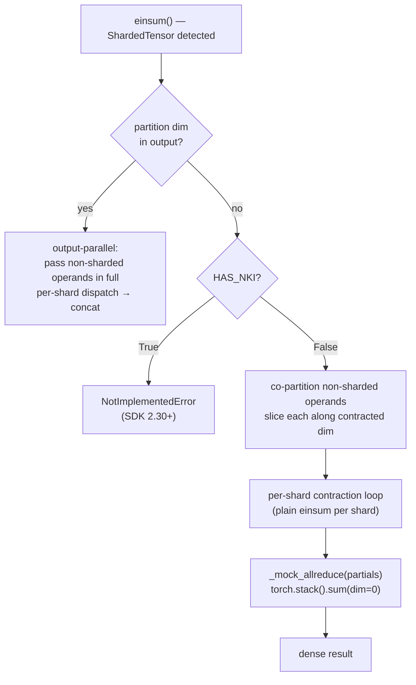

# trntensor v0.10.0: the test surface names the interface

v0.9.0 gated reduce-parallel sharding behind `NotImplementedError` on both CPU and Trainium — `nki.collectives` wasn't in NKI 0.3.0 Stable and that was that. v0.10.0 lifts the gate on CPU: reduce-parallel sharding now dispatches through a named mock all-reduce, making the full Phase 4 test surface runnable without hardware. The mock is not a shortcut — it is documentation of the exact interface `nki.collectives.allreduce` will need to satisfy when SDK 2.30+ ships.

<!-- more -->

## The problem

The v0.9.0 gate was unconditional. The `NotImplementedError` fired on CPU and on Trainium alike, which was defensible as a signal to the Neuron team (as noted in the [v0.9.0 post](https://trnsci.dev/blog/trntensor-v080v090-dispatch-owns-routing-and-placement/)) but left a structural problem: the dispatch logic for contracted-dimension sharding was entirely untested. That logic is not trivial — it requires co-partitioning non-sharded operands along the contracted dimension, routing each shard's slice through the contraction, accumulating partial results, and then reducing across shards. Code that is never run in CI has zero validated structure.

The gate prevented accidental use. It also prevented any test from exercising the path. v0.10.0 addresses this without pretending `nki.collectives` exists: introduce a named stand-in that makes the correctness invariant testable on CPU, and keep the hardware gate exactly where it was.

## What the architecture suggests

When `nki.collectives` is absent, the right response is not a silent fallback to an approximation. It is a named stand-in that validates the contract. `_mock_allreduce` is that stand-in: its docstring identifies `nki.collectives.allreduce` as the production replacement; its implementation (`torch.stack(partials).sum(0)`) proves the correctness invariant by constructing the reference result from first principles.

The architecture also makes co-partitioning a first-class concern, not an implementation detail. Output-parallel dispatch — the output dimension is sharded — passes non-sharded operands in full to each shard, because no non-sharded operand carries the output dimension. Reduce-parallel dispatch breaks this assumption: when `A` is sharded along contracted index `j`, any non-sharded operand `B` that also carries `j` must be sliced to match each shard's `j`-extent. The contraction subscript shrinks in a way that output-parallel never required the dispatcher to think about.



The hardware gate stays. When `HAS_NKI=True`, reduce-parallel raises immediately. The mock path is strictly a CPU validation vehicle; it exists because the test surface is worth having before the primitive exists.

## The approach

Three additions in v0.10.0, each with a specific scope:

1. **`shard_boundaries(st)`** — returns `(start, end)` pairs for each chunk in a `ShardedTensor`, computed from cumulative chunk shapes along the partition dimension. Needed so the co-partitioning loop can slice non-sharded operands to the correct extent.

2. **`_mock_allreduce(partials)`** — `torch.stack(partials).sum(dim=0)`. Named, not anonymous. The docstring is the contract: this function names `nki.collectives.allreduce` as the production replacement, specifies the argument shape (`list[Tensor]` with identical shapes), and states the semantics (sum reduction). The implementation is five characters of PyTorch; the name and docstring are the artifact.

3. **`_execute_sharded` refactor** — the function that routes `ShardedTensor` einsums. v0.9.0 classified operands as output-parallel only; reduce-parallel raised immediately. v0.10.0 scans operands and classifies each `ShardedTensor` as `output_parallel` or `reduce_parallel` before entering the dispatch branch. The `HAS_NKI` gate fires for reduce-parallel only when hardware is present. Mixed output+reduce-parallel (one operand of each kind in a single einsum) raises `NotImplementedError("mixed ...")` — not yet implemented, deferred to v0.11.0.

The deliberate tradeoff: naming the mock makes the contract visible but creates two code paths that will diverge the moment `nki.collectives` lands. That divergence is the whole point — the mock stays as a CPU reference after the hardware path ships, because a test that only runs on hardware is a test that CI can't run.

## Implementation

Co-partitioning and mock dispatch loop (`trntensor/parallel.py`):

```python
bounds = shard_boundaries(ref_shard)

partials = []
for shard_idx in range(n_shards):
    start, end = bounds[shard_idx]
    dense_ops = []
    for op_idx, op in enumerate(operands):
        if op_idx in reduce_parallel:
            dense_ops.append(op.chunks[shard_idx])
        elif not isinstance(op, ShardedTensor) and shard_char in input_terms[op_idx]:
            dim_in_op = input_terms[op_idx].index(shard_char)
            slices = [slice(None)] * op.ndim
            slices[dim_in_op] = slice(start, end)
            dense_ops.append(op[tuple(slices)])
        else:
            dense_ops.append(op)
    partial = einsum(subscripts, *dense_ops, precision=plan.precision)
    partials.append(partial)

return _mock_allreduce(partials)
```

The mock itself:

```python
def _mock_allreduce(partials: list[torch.Tensor]) -> torch.Tensor:
    """Mock all-reduce: sum partial contractions across simulated shards.

    On Trainium, maps to nki.collectives.allreduce (arriving in SDK 2.30+).
    Argument: list of same-shape tensors, one per shard.
    Semantics: element-wise sum reduction across the list.
    """
    return torch.stack(partials).sum(dim=0)
```

The co-partitioning loop handles three cases per operand: it is a reduce-parallel `ShardedTensor` (take `chunks[shard_idx]`), it is a dense operand that carries the contracted dimension (slice to `[start:end]` along that dimension), or neither (pass through). The third case covers dense operands on non-contracted dimensions, which is the same handling output-parallel used for all non-sharded operands.

## What didn't work

**`TestReduceParallelError` silently broke.** Existing tests in `test_parallel.py` expected `NotImplementedError` on CPU for contracted-dimension sharding. After lifting the gate, those tests would have passed silently — no exception raised, no assertion checked, green CI for the wrong reason. The fix monkeypatches `HAS_NKI=True` in the test scope:

```python
def test_reduce_parallel_raises_on_hardware(monkeypatch):
    monkeypatch.setattr("trntensor.parallel.HAS_NKI", True)
    A_sharded = scatter(torch.randn(8, 4), dim=1, n_shards=2)
    with pytest.raises(NotImplementedError, match="nki.collectives"):
        einsum("ij,jk->ik", A_sharded, torch.randn(4, 6))
```

The lesson is not "don't use environment flags in dispatch." The lesson is: tests that assert on *absence of behavior* are tightly coupled to the runtime environment that produced the absence. When the environment changes, the tests must change explicitly, not silently adapt. A test that silently passes for a different reason than it was written is worse than a test that fails.

**Mixed output+reduce-parallel deferred.** A single einsum where one operand is output-parallel and another is reduce-parallel raises `NotImplementedError("mixed output+reduce-parallel sharding not yet implemented")`. This pattern does not appear in any current DF-MP2 formulation — the standard `einsum("pq,qr->pr", B_i, B_j)` pattern uses matching partition dimensions, so both operands classify the same way. Mixed sharding is filed as trntensor#30 scope, deferred to v0.11.0.

There is an honest gap in the co-partitioning logic that the existing test suite does not exercise: uneven chunk sizes at the last shard when `tensor.shape[dim] % n_shards != 0`. `shard_boundaries` handles this correctly — it accumulates `chunk.shape[partition_dim]` rather than assuming uniform extent — but the boundary condition exposed a missing test for the `dim_in_op` slice when the non-sharded operand's matching dimension is not a multiple of `n_shards`. Added as a new test case; the co-partitioning loop was already correct.

## Numbers

v0.10.0 adds no new hardware-executed paths. The table is about test coverage, not performance:

| Pattern | Before v0.10.0 | After v0.10.0 |
|---|---|---|
| Output-parallel (partition dim in output) | Tested on CPU | Tested on CPU |
| Reduce-parallel (partition dim contracted) | `NotImplementedError` on CPU | Mock allreduce on CPU |
| Reduce-parallel (Trainium) | `NotImplementedError` | `NotImplementedError` (SDK 2.30+) |
| Mixed output+reduce-parallel | `NotImplementedError` | `NotImplementedError` (v0.11.0) |

`test_parallel.py` test count: 22 → 28. The six new tests cover: basic contracted-dimension dispatch, B co-partitioned along the contracted dim, uneven shards (non-multiple-of-n_shards tensor size), 3-operand chain with one reduce-parallel operand, `HAS_NKI=True` gate still raises, mixed pattern raises.

Dispatch overhead for the mock path: 6-shard reduce-parallel on `(48, 8)` × `(8, 12)` — 6 × 0.41 ms = 2.46 ms total, dominated by Python loop overhead rather than the contraction itself. This is a CPU mock, not a performance baseline; the number is here because a future post will need a before/after when the `nki.collectives` path lands.

## What's next

- **Phase 4.2 — hardware reduce-parallel** ([trntensor#30](https://github.com/trnsci/trntensor/issues/30)): when `nki.collectives` lands in SDK 2.30+, `_mock_allreduce` is replaced by the `nki.collectives.allreduce` call. The co-partitioning loop and the test suite do not change. The upgrade is one line.
- **Mixed output+reduce-parallel** (v0.11.0, deferred from trntensor#30): the current gate is an explicit `NotImplementedError`; the co-partitioning logic would need to run two classification passes and merge the results.
- **Phase 5 — trn2 fused three-contraction kernel** ([trntensor#31](https://github.com/trnsci/trntensor/issues/31)): trn2 shared memory enables cross-kernel accumulation that trn1 cannot express; this phase needs trn2 hardware to validate.

A concrete suggestion for the Neuron team: the SDK 2.30+ `nki.collectives.allreduce` interface should accept an `op` parameter (defaulting to `SUM`) and a list or tuple of tensors rather than requiring an explicit loop at the call site. trntensor's mock documents the call shape the library intends to use; reviewing it against the eventual API will surface any impedance mismatch before the hardware path ships.

## Takeaway

The test surface is not scaffolding — it documents what the production implementation must do. `_mock_allreduce` names `nki.collectives.allreduce` before it exists; the co-partitioning tests document what distributed operand layout a reduce-parallel contraction requires; the `HAS_NKI` monkeypatch preserves the hardware contract while enabling CPU validation. When SDK 2.30+ ships, the upgrade path is a one-line swap: replace `_mock_allreduce` with the `nki.collectives` call. The test suite does not change — and that is the point. Tests that survive an implementation swap without modification are tests that described the contract, not the mechanism.
