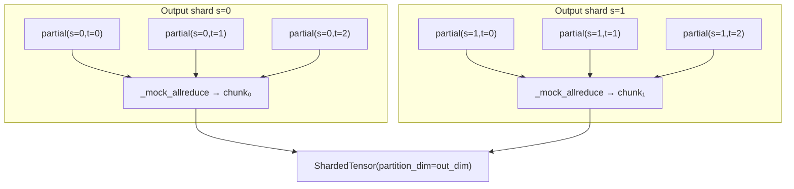

# trntensor v0.12.0: the last NotImplementedError — completing the sharding contract

v0.12.0 closes the last `NotImplementedError` on the CPU-testable sharding surface. The `_execute_sharded` function could already name two operand types — output-parallel (sharding dimension maps to an output index) and reduce-parallel (sharding dimension maps to a contracted index) — but a single einsum containing both kinds raised `NotImplementedError("Mixed…")`. v0.12.0 replaces that raise with a nested dispatch loop. The architectural story is that Trainium's multi-chip topology named this loop structure before the code existed to implement it.

<!-- more -->

## The problem

Phase 4 of trntensor introduced `ShardedTensor` and output-parallel einsum dispatch in [v0.9.0](https://trnsci.dev/blog/trntensor-dispatch-owns-routing-and-placement/). [v0.10.0](https://trnsci.dev/blog/trntensor-test-surface-names-the-interface/) lifted the reduce-parallel gate on CPU, replacing `NotImplementedError` with `_mock_allreduce` and proving the correctness contract without hardware. [v0.11.0](https://trnsci.dev/blog/trntensor-stochastic-rounding/) added `precision="sr"` at the PSUM→SBUF boundary.

What none of those releases addressed: the mixed case. An einsum like `"ij,jk,ki->i"` can have one operand sharded along output dimension `i` (output-parallel) and another sharded along contracted dimension `j` (reduce-parallel). The two operands don't disagree about anything fundamental. They use different protocols — output-parallel operands scatter their output; reduce-parallel operands contribute partial sums that need all-reducing — but there's nothing in the classification logic that forbids combining them. The `NotImplementedError` was a placeholder for the work, not an architectural limit.

The real problem: writing the mixed path before the two pure paths existed would have been premature. Getting output-parallel correct, then getting reduce-parallel correct, creates the primitives the mixed path composes. v0.12.0 assembles the final piece.

## What the architecture suggests

Trainium's multi-chip topology makes the loop structure obvious once the classification is in place. Consider a 2-chip-by-2-chip grid:

- **Output-parallel dimension**: different chips hold different slices of the output. No communication needed between chips in this dimension — each chip owns its output slice independently. Embarrassingly parallel.
- **Reduce-parallel dimension**: multiple chips hold partial sums for the same output element. Communication required: every chip must contribute its partial before any chip has the final result. This is the `nki.collectives.allreduce` dimension.

The nested loop mirrors this topology exactly. The outer loop iterates over output shards — the free dimension, no communication cost. The inner loop iterates over reduce shards — the cost dimension, one all-reduce per output shard.



Columns are reduce shards — they're summed. Rows are output shards — they're assembled. The grid is `out_n_shards × rp_n`; those two dimensions are independent, and neither constrains the other.

On CPU, the inner loop cost is `torch.stack(partials).sum(0)` — `_mock_allreduce`, free for testing purposes. On Trainium (HAS_NKI=True), the same path raises `NotImplementedError` pointing at `nki.collectives.allreduce` (SDK 2.30+), same as the pure reduce-parallel case. The CPU mock makes the full mixed-path test suite runnable in CI today; the hardware swap is one function call when the SDK ships.

The architecture named the loops. The code followed.

## The approach

The design is deliberate about where each concern lives:

| Concern | Where handled |
|---|---|
| Operand classification (output-parallel vs. reduce-parallel) | `_execute_sharded` scan, before the dispatch branch |
| Output shard iteration | Outer loop in mixed dispatch — free dimension |
| Reduce shard iteration | Inner loop — cost dimension, feeds `_mock_allreduce` |
| Co-partitioning when op spans both dimensions | Per-operand slice logic inside the inner loop |
| Hardware gate | `HAS_NKI` check, fires for any reduce-parallel path |

The co-partitioning concern is the subtlety. An output-parallel operand chunk (shape `(M_s, J_full)`) paired with a reduce shard `(J_t, K)` has mismatched `j` dimensions unless the chunk is also sliced along `j`. The inner loop must check whether an output-parallel chunk spans the contracted dimension and, if so, slice it to match the current reduce shard's extent before passing both to the recursive `einsum()` call.

Without this, `einsum("ij,jk->ik", A_sharded_i, B_sharded_j)` raises a shape mismatch in the inner contraction. The fix is three lines. Finding it required being explicit about what "output-parallel" actually means — it means the partition dimension maps to an output index, not that the operand carries no contracted dimensions.

3-operand chains work naturally: the inner `einsum()` call receives dense tensors and dispatches through `_execute_path`, which handles multi-operand contractions via the greedy path planner added in v0.6.0.

## Implementation

The nested dispatch loop (`trntensor/parallel.py`):

```python
output_chunks = []
for out_s in range(out_n_shards):
    partials = []
    for rp_t in range(rp_n):
        start, end = bounds[rp_t]
        dense_ops = []
        for op_idx, op in enumerate(operands):
            if op_idx in output_parallel:
                chunk = output_parallel[op_idx][1].chunks[out_s]
                if shard_char in input_terms[op_idx]:   # co-partition if spans reduce dim
                    slices[dim_in_chunk] = slice(start, end)
                    dense_ops.append(chunk[tuple(slices)])
                else:
                    dense_ops.append(chunk)
            elif op_idx in reduce_parallel:
                dense_ops.append(reduce_parallel[op_idx][1].chunks[rp_t])
            elif shard_char in input_terms[op_idx]:     # co-partition plain tensor
                slices[dim_in_op] = slice(start, end)
                dense_ops.append(op[tuple(slices)])
            else:
                dense_ops.append(op)
        partial = einsum(subscripts, *dense_ops, precision=plan.precision)
        partials.append(partial)
    output_chunks.append(_mock_allreduce(partials))
return ShardedTensor(output_chunks, partition_dim=out_dim)
```

The operand dispatch inside the inner loop handles four cases: output-parallel `ShardedTensor` with co-partitioning needed, output-parallel `ShardedTensor` without it, reduce-parallel `ShardedTensor`, and plain dense operand that needs co-partitioning. The fourth case covers operands that are neither sharded type but still carry the contracted dimension — they participate in the reduce dimension's slicing without being a `ShardedTensor` themselves.

## What didn't work

**The co-partitioning gap.** The first implementation of the inner loop took the output-parallel chunk and passed it directly to the inner `einsum()` without checking whether it also spanned the contracted dimension. The resulting shape mismatch error was clear enough (`size mismatch for dimension j: 64 vs 8`), but the fix required understanding why the error occurred: "output-parallel" describes the relationship between the partition dimension and the *output* index, not the relationship between the operand and the contraction. An output-parallel operand can carry contracted dimensions too, and if the reduce-parallel shard covers only a slice of that contracted dimension, the output-parallel chunk must be sliced to match. Three lines, once the concept was clear.

**The test inversion.** `test_mixed_output_reduce_raises` had to become `test_mixed_cpu_no_longer_raises`. That test existed to document the gap — it asserted that the mixed path wasn't implemented yet. The moment the feature landed, the test inverted: a test that had been passing by asserting `NotImplementedError` was now passing by asserting the opposite. The right action was to delete it and write the positive test. A test that documents absence is not a test of a contract; it's a test of a placeholder. When the placeholder is replaced, the test's job is done and it should go with it.

**Tolerance differences.** 2-operand mixed paths test at `atol=1e-5`. 3-operand chains test at `atol=1e-4`. The looser tolerance for 3-operand paths is not a precision regression; it reflects float32 accumulation across multiple `_execute_path` steps. The greedy path planner decomposes multi-operand contractions into binary steps, and each step accumulates floating-point rounding independently. The 3-operand tests exercise this path deliberately; the tolerance reflects what the composition actually produces, not an aspirational bound.

**Toolchain note.** The hardware mixed-path (`HAS_NKI=True`) raises `NotImplementedError` pointing at `nki.collectives.allreduce` in SDK 2.30+. That interface hasn't shipped yet, which means the hardware mixed path has had zero actual test coverage beyond the gate check. The CPU mock path has been tested. The NKI compiler path through `nki.collectives` will need to be validated on hardware when SDK 2.30+ is available. A concrete ask for the Neuron team: the `nki.collectives.allreduce` interface should accept a list or tuple of tensors and an `op` parameter defaulting to `SUM` — the mock documents exactly the calling convention trntensor intends to use, and reviewing it against the eventual API before it ships would surface any impedance mismatch early.

## Numbers

v0.12.0 adds no new hardware-executed paths. The table is about test coverage:

| Pattern | Before v0.12.0 | After v0.12.0 |
|---|---|---|
| Output-parallel (partition dim in output) | Tested on CPU | Tested on CPU |
| Reduce-parallel (partition dim contracted) | Mock allreduce on CPU | Mock allreduce on CPU |
| Mixed output+reduce-parallel | `NotImplementedError` on CPU | Nested loop on CPU |
| Any reduce-parallel (Trainium) | `NotImplementedError` (SDK 2.30+) | `NotImplementedError` (SDK 2.30+) |

`TestMixedParallel` adds 6 tests: basic 2-operand, 3-operand chain, output shard count verification, uneven chunk sizes, `HAS_NKI=True` gate still raises, `alpha` kwarg propagation. Total passing: 133 → 139. Skipped (simulator): 12.

Mixed-path tolerance: `atol=1e-5` (2-operand), `atol=1e-4` (3-operand). Both are float32 accumulation artifacts, not NKI precision differences — there is no NKI path here yet.

Dispatch overhead for the mock mixed path: for a 2-shard output-parallel × 3-shard reduce-parallel case on `(16, 8)` × `(8, 12)`, the outer loop runs 2 × 3 = 6 `einsum()` calls plus 2 `_mock_allreduce` invocations. Python loop overhead dominates at these sizes. This number will not matter in production — on hardware, the outer loop is chip-local work and the inner loop is the `nki.collectives.allreduce` call, which is a hardware collective.

## What's next

- **SDK 2.30+ (`nki.collectives.allreduce`)**: when this lands, `_mock_allreduce` is replaced by the `nki.collectives` call in both the reduce-parallel path (v0.10.0) and the mixed path (v0.12.0). One function swap. The tests do not change. This is the completion of the arc that began with v0.10.0: name the operation, mock the hardware, prove the contract, swap the implementation when the SDK ships.
- **`precision="dd"` (double-double)**: gated on trnblas Phase 2 double-double GEMM kernels ([trnblas#22](https://github.com/trnsci/trnblas/issues/22)). Scaffolding is in `ContractionPlan.precision`; raises `NotImplementedError` until trnblas ships. When it does, trntensor's multi-contraction path gets FP32-accuracy output from BF16 inputs via compensated matmul.

Live roadmap: [trnsci.dev/roadmap/](https://trnsci.dev/roadmap/). Suite tracker: [trnsci/trnsci#1](https://github.com/trnsci/trnsci/issues/1).

## Takeaway

v0.10.0 through v0.12.0 is a three-release arc with a single through-line: name the operation, mock the hardware, prove the contract. `_mock_allreduce`, `_stochastic_round_cpu`, and the mixed nested loop are all named for what they represent — a contract with the hardware — not for what they are, which is CPU stand-ins. The naming discipline matters because it determines what has to change when SDK 2.30+ ships: one function call in two places, no test changes. The CPU-testable sharding surface is now complete. All three patterns — output-parallel, reduce-parallel, mixed — run in CI. What's left is swapping the mocks for the hardware collectives when the SDK ships. The architecture named the loops; the implementation followed; the tests will survive the swap unchanged.
