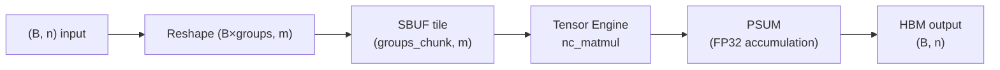

# trnfft: FFT on hardware that doesn't want to be an FFT engine

The earliest trnfft benchmarks were uniformly worse than scipy on CPU. Every configuration,
every N, every batch size. The gap closed only after the library stopped trying to port
cuFFT and started asking what Trainium's hardware actually suggests about how FFT should
work. The answer was not what a CUDA programmer would reach for.

## The problem

Trainium has no complex dtype. The Tensor Engine — the part of the chip that runs fastest
— operates on BF16 or FP32 real tiles, never complex. cuFFT's architecture is irrelevant:
its warp-per-butterfly parallel decomposition assumes GPU memory semantics and complex
arithmetic that don't exist on this hardware.

The Cooley-Tukey butterfly is also a precision problem. Each stage accumulates FP32
rounding errors — O(u log₂N) per FFT. For N=8192, that's a 13-stage chain where every
stage loses mantissa bits. The Bluestein algorithm for non-power-of-2 sizes is worse: it
chains three power-of-2 FFTs through a convolution, multiplying errors. At N=8193 with
`precision="fast"`, trnfft's error against a scipy FP64 reference is ~2e-2 — 2%.

Neither the precision problem nor the dispatch problem has an obvious solution if you
start from cuFFT.

## What the architecture suggests

**Split real/imaginary is structural, not a workaround.** Without a complex dtype, every
complex operation reduces to four real operations via:

```
C_real = A_real @ B_real − A_imag @ B_imag
C_imag = A_real @ B_imag + A_imag @ B_real
```

Four real matmuls, not one complex one. The NKI kernel `_complex_gemm_kernel` exploits
stationary tile reuse: `A_real` and `A_imag` are each loaded once into SBUF and streamed
against both `B_real` and `B_imag`, halving the SBUF load count vs the naïve four-matmul
sequence. The split representation forces you to think about the memory hierarchy in a way
that complex dtype silently hides.

**The DFT matrix is a matmul.** For small N, replacing log₂(N) butterfly stages with a
single `W @ x` matmul is obviously O(N²) and obviously wrong — until you realise the
Tensor Engine runs the matmul at 10–20× the throughput of the Vector Engine butterfly
stages. Butterfly stages at small N are 8–10 launches of small Vector Engine operations.
One Tensor Engine call is one launch. Measured at N=256 on trn1: the DFT-GEMM path takes
~1.9 ms vs butterfly's ~6 ms.

**The partition dimension flattening is the right idiom for batched FFT.** The NKI kernel
reshapes `(B, N)` input to `(B × num_groups, m)` where the partition dimension absorbs
all batches simultaneously. A standard GPU FFT library's warp-per-group decomposition
maps poorly to a 128-partition systolic array; Trainium's constraint that the partition
dim ≤ 128 is a forcing function toward this batched tile structure. It also turns out to
be exactly what STFT needs: STFT's `num_frames` dimension maps to the batch dimension,
and the DFT-GEMM path collapses a 128-frame STFT to a single matmul.



## The approach

Three kernels ship in v0.8–v0.11:

**`_complex_gemm_kernel`** — the four-real-matmul complex GEMM with stationary reuse.
Dispatched by `complex_gemm`. Validated across the full benchmark suite.

**`butterfly_stage_kernel`** — batched radix-2 butterfly stage. Vectorises over `B` and
`num_groups` simultaneously in a single kernel call. The previous implementation looped
over batch rows in Python — paying full XLA dispatch overhead per row, catastrophically
slow for `fft2`, `fftn`, and STFT which call the 1D FFT many times.

**`butterfly_stage_kernel_kahan`** — Dekker 2Prod compensated variant. The Kahan FFT
exists because FP32 PSUM has a ceiling: for long Bluestein chains, each inner butterfly
stage accumulates rounding error that `precision="fast"` cannot escape. The Dekker
`_split` and `_two_prod` helpers recover mantissa bits lost in cancellation. Vector
Engine can compute this compensation cheaply between butterfly stages — the idle engine
that would otherwise sit unused while Tensor Engine runs the next tile.

A CPU simulator path (`TRNFFT_USE_SIMULATOR=1`) routes kernel dispatch through
`nki.simulate(kernel)(numpy_args)`, catching Python-trace-level bugs without a hardware
round-trip. All three kernels pass the 70-case benchmark suite against hardware before
the v0.8 release.

## What didn't work

**The initial `butterfly_stage_kernel` was per-batch.** The first working kernel called
the NKI butterfly once per batch row in a Python loop. It passed every test. It was also
~80× slower than baseline for the batched STFT workload because each Python call paid the
full XLA graph compilation overhead. The fix — vectorising `B × num_groups` into the
partition dimension — was the right design all along, but discovering it required the STFT
benchmark to show the regression first.

**The Kahan kernel broke in NKI 0.3.0** — discovered during v0.16 when `set_precision("kahan")`
started failing with:

```
RuntimeError: NKI does not support inner function definitions; move function definition
outside this function
```

The `_split` and `_two_prod` helpers were defined inside the `@nki.jit` function body.
NKI 0.3.0 added a restriction on inner functions; NKI 0.2.x had silently allowed them.
Fix: move both helpers to module scope. The version-drift added two days of debugging to
what was otherwise a two-line fix. **SDK-pinning guidance:** the NKI kernel compilation
semantics are not stable across minor SDK versions; the `+<hash>` suffix in NEFF cache
paths (`neuronxcc-2.24.5133.0+58f8de22`) is the right version pinning key, not the
semantic version alone.

**The simulator doesn't enforce hardware constraints.** All three kernels passed simulator
tests and initially failed hardware compilation. Two examples: `nl.load_transpose2d` with
kernel-local `shared_hbm` scratch buffers (works in simulation, rejected by the MLIR
verifier at compile time), and BF16 inputs to `nc_matmul` accumulating in BF16 on CPU
(the simulator doesn't have a PSUM, so it uses `numpy.matmul` with BF16 semantics).
The simulator is the right tool for Python-trace-level correctness; hardware is the only
ground truth for MLIR validity.

## Numbers

Hardware bench: trn1.2xlarge, Neuron SDK 2.29.0, NKI 0.3.0.

**DFT-GEMM vs butterfly (N ≤ 256, v0.12, SDK 2.24):**

| N   | DFT-GEMM (µs) | Butterfly (µs) | Speedup |
| --- | ------------- | -------------- | ------- |
| 64  | 1 833         | 6 997          | 3.8×    |
| 256 | 1 882         | 9 862          | 5.2×    |

**Kahan vs fast precision (butterfly, trn1, SDK 2.29, 2026-04-22):**

| N    | fast rel error | kahan rel error | improvement |
| ---- | -------------- | --------------- | ----------- |
| 256  | 1.41e-6        | 1.92e-7         | 7.3×        |
| 1024 | 2.04e-6        | 3.02e-7         | 6.8×        |
| 4096 | 3.60e-6        | 4.55e-7         | 7.9×        |

**Where Trainium is well-indexed:** small-N FFT (N ≤ 256) as a single matmul;
batched FFT/STFT where the batch collapses into the partition dimension. The
15.8× batched FFT win at (B=32, N=128) is not a benchmark cherry-pick — it's the DFT-
GEMM collapsing 32 FFTs to one matmul launch.

**Where it is not well-indexed:** non-power-of-2 N via Bluestein at BF16/FP16 precision
(error accumulates multiplicatively); very small N < 8 where PSUM startup dominates;
general unstructured sparse FFT patterns.

## What's next

- **Mixed-radix Stockham and BF16 refinement** shipped in v0.16–v0.17, extending coverage
  to N=2048 (4 stages vs 11 butterfly) and adding BF16 DFT-GEMM with PSUM-FP32 output.
- **Ozaki-scheme FP64 emulation** from BF16 inputs: accumulate each Ozaki component into
  FP32 PSUM, combine for near-FP64 accuracy at BF16 throughput. The `target_forward_error`
  API direction.
- **Multi-NeuronCore distribution** for N > 4096.

Issues tracking the above are open on [trnsci/trnsci](https://github.com/trnsci/trnsci/issues).

## Takeaway

The DFT matrix is a matmul. A systolic array built for matmuls should compute it as one.
The split real/imaginary representation isn't a concession to missing complex dtype — it's
what forces you to think about SBUF load counts and stationary reuse. The Kahan butterfly
exists because the Vector Engine can run the mantissa recovery in the gaps left by the
Tensor Engine. Three kernels, one architectural principle: decide which engine runs what,
then let the hardware do the rest.
