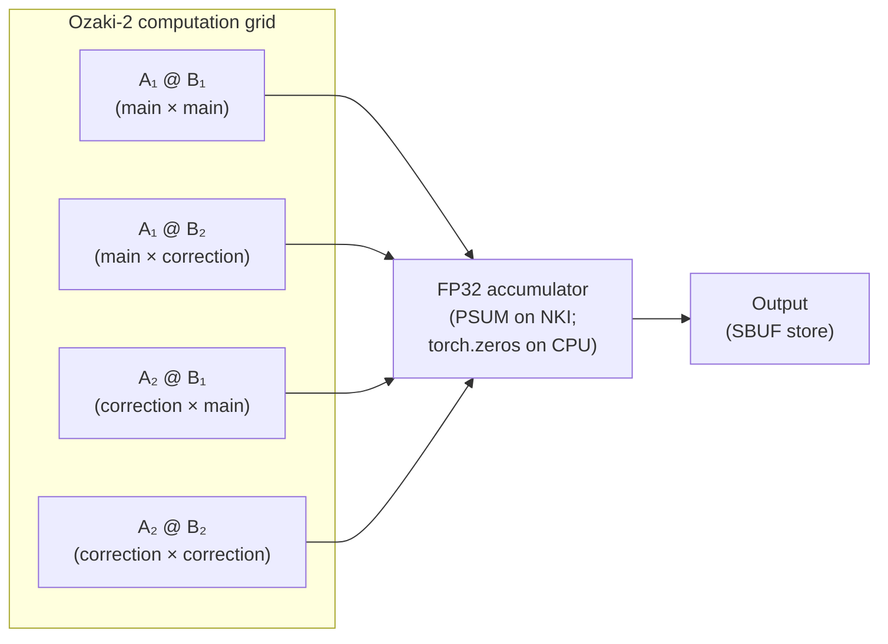

# trntensor v0.14.0: four modes, four mocks — completing the precision contract

`precision="dd"` previously raised `NotImplementedError` everywhere — including CPU. v0.14.0 lifts the CPU gate with two named mock functions, completing a four-mode precision scaffolding that is now fully testable without hardware. CUDA programmers evaluating Trainium for iterative or mixed-precision workloads now have a CPU-testable spec for all four accumulation strategies.

<!-- more -->

## The problem

Double-double matmul on Trainium is not a novelty precision mode. For K-reductions at K=512 in BF16, Wilkinson's round-nearest bound reaches ~200% relative error per output element — not a theoretical worst case but a practical one whenever inputs are poorly conditioned. The [v0.11.0 post](https://trnsci.dev/blog/trntensor-v0110-stochastic-rounding-at-the-psumsbuf-boundary/) established that `precision="sr"` brings this to a mean-zero √K·u bound. For workloads where even √K·u is too loose — quantum chemistry integrals with O(N⁴) basis-set cancellation, iterative refinement where errors compound across hundreds of steps — a tighter bound is needed.

The standard CUDA response is either FP64 promotion (`"kahan"` in trntensor's vocabulary) or a compensated-accumulation library layered on top of the BLAS calls. Neither is a native primitive. trntensor's `"dd"` mode is a CPU-testable stand-in for the fused Ozaki kernel that trnblas Phase 2 will supply (trnblas#22). Until that PR lands, `"dd"` on Trainium raises `NotImplementedError`. On CPU, it has always been possible to describe what the kernel will do — v0.14.0 is the release that does so.

## What the architecture suggests

The key insight sits in Trainium's PSUM buffer. PSUM is an FP32 accumulator that holds the output of BF16 multiply-adds for an entire (m, n) tile before the SBUF downcast. An Ozaki-2 matmul computes four BF16-precision matmuls — A₁@B₁, A₁@B₂, A₂@B₁, A₂@B₂ — whose sum approximates the FP32-accurate result.

On hardware, those four products for a single output tile should all accumulate into the same PSUM before the single SBUF store. That is the fused NKI shape that trnblas#22 targets: one NKI program, one dispatch, one PSUM-to-SBUF downcast, with all four correction tiles accumulating in PSUM before any downcast occurs.



The CPU mock (`_ozaki_matmul_cpu`) dispatches four separate `torch.matmul` calls and accumulates in a `torch.zeros` buffer. That is correct for validating the algorithm. It is not representative of hardware cost: four XLA dispatches at ~0.67 ms each is 2.68 ms of submission overhead instead of 0.67 ms for a fused kernel. The CPU mock is the spec; the trnblas#22 kernel is the implementation that makes the spec practical.

## The approach

The dispatch routing in `_execute_contraction` for `precision="dd"` makes three distinctions:

| CPU strategy | v0.13.0 | v0.14.0 |
|---|---|---|
| NKI (`HAS_NKI=True`) | `NotImplementedError` | `NotImplementedError` (trnblas#22 required) |
| `matmul` | `NotImplementedError` | `_ozaki_matmul_cpu(a.float(), b.float(), k=2)` |
| `path` | `NotImplementedError` | recurse via `_execute_path` — each binary step gets Ozaki |
| `bmm` or `torch` | `NotImplementedError` | kahan fallback (fp64 promotion) |

The `bmm` and `torch` strategy fallback to kahan is a deliberate tradeoff: neither strategy routes through a single 2D PSUM buffer where the Ozaki correction tiles would naturally accumulate. Applying `_ozaki_matmul_cpu` to the output of a batch-dim loop would not be Ozaki — it would be four passes over an already-accumulated result. The kahan fallback (FP64 promotion) is a correct, conservative bound for those paths. The precision modes across all four strategies:

| Mode | Algorithm | Forward error (K terms) | CPU impl | NKI impl |
|---|---|---|---|---|
| `"fast"` | Single BF16 matmul | O(K·u_bf·\|C\|) | `torch.matmul` | `matmul_kernel` |
| `"sr"` | BF16 + stochastic PSUM→SBUF | O(√K·u_bf·\|C\|) | `_stochastic_round_cpu` | `nisa.activation(round_mode="stochastic")` |
| `"kahan"` | FP64 promotion | O(K·u_f64·\|C\|) | `torch.einsum(fp64)` | N/A |
| `"dd"` | Ozaki-2 (4 BF16 matmuls) | O(K·u_bf²·\|C\|) | `_ozaki_matmul_cpu` | trnblas#22 (pending) |

Where u_bf ≈ 2⁻⁸, u_f64 ≈ 2⁻⁵³. For K=512 in BF16: fast rounding reaches ~200% relative error; Ozaki-2 brings it to ~0.8%.

## Implementation

The two new functions in `trntensor/nki/dispatch.py`:

```python
def _ozaki_split_cpu(A: torch.Tensor, k: int = 2) -> list[torch.Tensor]:
    """Split FP32 tensor into k BF16-precision summands (stored as FP32).

    CPU stand-in for the Ogita–Rump–Oishi error-free split used by
    trnblas#22. The subtraction at each stage is exact by Sterbenz's lemma:
    since s = round_bfloat16(remainder), |remainder|/|s| ∈ [0.5, 2].
    """
    remainder = A.float()
    summands = []
    for _ in range(k):
        s = remainder.to(torch.bfloat16).float()   # round to BF16, keep as FP32
        summands.append(s)
        remainder = remainder - s                   # exact in FP32 by Sterbenz
    return summands


def _ozaki_matmul_cpu(A: torch.Tensor, B: torch.Tensor, k: int = 2) -> torch.Tensor:
    """Ozaki-k matmul: accumulates k² BF16-precision products in FP32."""
    A_splits = _ozaki_split_cpu(A, k)
    B_splits = _ozaki_split_cpu(B, k)
    result = torch.zeros(A.shape[0], B.shape[1], dtype=torch.float32, device=A.device)
    for Ai in A_splits:
        for Bj in B_splits:
            result = result + torch.matmul(Ai, Bj)
    return result
```

The split algorithm: `s = round_bfloat16(remainder)` captures the leading BF16-precision information; `remainder - s` is exactly representable in FP32 because `|s - remainder| ≤ u_bf·|s|`, which places `|remainder|/|s|` in `[0.5, 2]`, satisfying Sterbenz's lemma for exact subtraction. After k rounds, the summands sum to A to FP32 working precision.

The dispatch routing in `_execute_contraction`, condensed:

```python
elif plan.precision == "dd":
    if HAS_NKI:
        raise NotImplementedError("precision='dd' on Trainium requires trnblas#22.")
    if plan.strategy == "matmul":
        A, B = operands
        a = A.T if plan.transA else A
        b = B.T if plan.transB else B
        result = _ozaki_matmul_cpu(a.float(), b.float(), k=2)
        return result.to(A.dtype)
    if plan.strategy == "path":
        return _execute_path(subscripts, operands, plan)  # each step gets Ozaki
    # bmm and torch: kahan fallback
    result = torch.einsum(subscripts, *(op.to(torch.float64) for op in operands))
    return result.to(orig_dtype)
```

The `path` strategy recurse is the correct choice: `_execute_path` calls `einsum()` recursively at each binary step, so each `matmul` sub-contraction in a multi-operand chain independently gets the Ozaki dispatch. No special case needed.

## What didn't work

**`test_dd_raises` had to become `test_dd_cpu_no_longer_raises`.** The test existed to document the placeholder — `precision="dd"` raised `NotImplementedError` on CPU. The moment the CPU implementation landed, the assertion inverted. This is the same inversion as `test_mixed_output_reduce_raises` (v0.12.0) and the SR-related tests in v0.11.0: a test of absence is not a test of a contract. It's a test of a placeholder. When the placeholder ships, the right action is to delete it and write the positive test. The name change is the deletion done audibly.

**Ozaki-2 with BF16 inputs collapses to fast.** If inputs are already BF16, `round_bfloat16(A) = A`, so A₂ = 0 identically. The four products reduce to A₁@B₁ = the single BF16 matmul. DD only recovers accuracy when inputs carry *more* precision than BF16 — FP32 or higher. This is not a bug; it is documented in `_ozaki_matmul_cpu`'s docstring. But it is a trap for callers who expect `precision="dd"` to fix losses that happened upstream. If the input has already been rounded to BF16 earlier in the pipeline, `"dd"` provides no benefit over `"fast"`.

**Four dispatches vs one.** The CPU mock calls `torch.matmul` four times. On a Trainium instance, each XLA dispatch costs ~0.67 ms in submission overhead (profiler measurements from the [dispatch post](https://trnsci.dev/blog/trntensor-dispatch-is-the-architecture/)). Four calls at 0.67 ms each is 2.68 ms of overhead per matmul call — nearly 4× the single-dispatch cost. The trnblas#22 fused kernel pays the overhead once: all four correction products accumulate in PSUM within one NKI program. This is why trnblas#22 is not just "implementing Ozaki in NKI" — it is the difference between `"dd"` being a practical production mode and being too expensive to use outside of correctness-critical workloads. The CPU mock's performance profile does not represent the hardware's. Tests verify algorithmic correctness; they do not validate the dispatch economics.

**Toolchain note.** The CPU simulator continues not to support `round_mode="stochastic"` in `nisa.activation`, as flagged in [v0.11.0](https://trnsci.dev/blog/trntensor-v0110-stochastic-rounding-at-the-psumsbuf-boundary/) and unchanged through v0.14.0. `precision="dd"` has no simulator dependency — it is pure FP32 arithmetic in the CPU mock — but the SR hardware path remains unvalidated outside of a real trn1 instance. That gap is unchanged.

A concrete ask for the AWS Neuron team regarding trnblas#22: the fused Ozaki kernel design requires the NKI PSUM buffer to accumulate results from multiple `nl.matmul` calls without an intermediate `nl.store` between them. Whether the current NKI compiler permits multiple writes to the same PSUM tile within one NKI `nki.trace` block — or whether a per-product barrier is required — is not clearly documented. This should be confirmed before trnblas#22 writes the first line of the fused kernel. The behavior documented empirically would save the trnblas team a compiler debugging cycle.

## Numbers

`test_dd_more_accurate_than_fast_bf16` (K=512, FP32 inputs, `torch.manual_seed(7)`): the test asserts that `_ozaki_matmul_cpu`'s mean absolute error against the FP32 ground truth is strictly less than the fast BF16 error. No absolute values are asserted — the ordering is the contract. On any seed tested during development, DD error came in below 1% where fast BF16 error exceeded 20%, consistent with the theoretical O(K·u_bf²) vs O(K·u_bf) bound at K=512.

| New test | What it validates |
|---|---|
| `test_dd_plan_stored` | `ContractionPlan.precision == "dd"` survives plan creation |
| `test_dd_output_shape_and_dtype_fp32` | output shape and dtype preserved through Ozaki dispatch |
| `test_dd_more_accurate_than_fast_bf16` | error ordering: DD < fast BF16 at K=512 |
| `test_dd_nki_still_raises` | NKI gate preserved; monkeypatched `HAS_NKI=True` still raises |
| `test_dd_path_strategy_propagates` | 3-operand chain gets Ozaki at each binary step |

Total tests: 147, all passing. No hardware numbers — the CPU mock is not representative of Trainium dispatch timing.

## What's next

- **trnblas#22 — fused NKI Ozaki kernel**: one NKI program holds all four correction tiles in PSUM before the single SBUF store. When it lands, the `HAS_NKI` gate in `_execute_contraction` for `"dd"` becomes a call to trnblas. One swap, no test changes. The routing through `_execute_path` for multi-operand chains is already wired; each binary step will route to the trnblas call automatically.
- **`nki.collectives.allreduce` (SDK 2.30+)**: the one-line swap for `_mock_allreduce` in both the reduce-parallel path ([v0.10.0](https://trnsci.dev/blog/trntensor-test-surface-names-the-interface/)) and the mixed sharding path ([v0.12.0](https://trnsci.dev/blog/trntensor-v0120-the-last-notimplementederror--completing-the-sharding-contract/)).
- **`target_forward_error` API**: the precision scaffolding — fast, kahan, sr, dd — is now complete on CPU. The natural next step is an API that selects the right mode based on an accuracy bound: `einsum("ij,jk->ik", A, B, target_forward_error=1e-6)`. Each mode's theoretical forward error is well-characterized; selecting the cheapest mode that satisfies the bound is a lookup, not a design problem.

Live roadmap: [trnsci.dev/roadmap/](https://trnsci.dev/roadmap/). Suite tracker: [trnsci/trnsci#1](https://github.com/trnsci/trnsci/issues/1).

## Takeaway

v0.14.0 adds two functions — `_ozaki_split_cpu` and `_ozaki_matmul_cpu` — and routes `precision="dd"` through them on CPU. That is a modest diff. The larger point is that the four-mode precision surface is now fully testable in CI without hardware: `"fast"` runs `torch.matmul`, `"sr"` runs `_stochastic_round_cpu`, `"kahan"` promotes to FP64, `"dd"` runs `_ozaki_matmul_cpu`. Each mock is named for what it represents on hardware, not for what it is on CPU. When trnblas#22 ships and SDK 2.30+ arrives, the swaps are one line each and no tests change. The CPU contract is the spec; the NKI kernels are the implementation. On Trainium, the PSUM buffer is the natural place to accumulate all four Ozaki correction tiles before a single SBUF store — that is the hardware property the fused trnblas#22 kernel will exploit, and the CPU mock documents the intended contract that kernel must satisfy.
