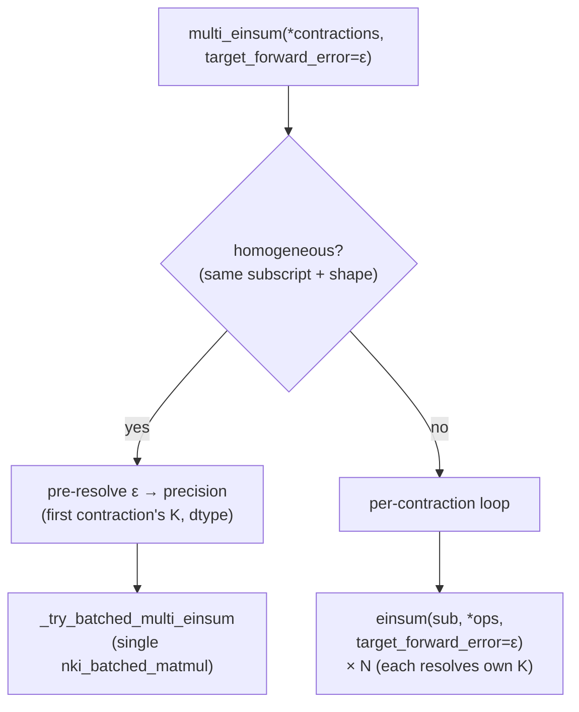

# trntensor v0.16.0: extending the precision contract to multi_einsum

v0.15.0 gave `einsum()` a `target_forward_error=` argument — the caller specifies a relative error bound, the library picks the cheapest mode that satisfies it. v0.16.0 extends the same contract to `multi_einsum()`. A precision API that works for single contractions but silently doesn't apply to batched calls is a leaky abstraction, and this is the patch that closes it.

<!-- more -->

## The problem

`multi_einsum(*contractions, precision=)` was the natural API for DF-MP2's inner loop: many independent contractions sharing operands, dispatched in one call with amortized XLA overhead. After v0.15.0, `einsum()` accepted `target_forward_error=`, but `multi_einsum()` did not. A caller who had already adopted `target_forward_error=` for single-contraction paths had to switch back to explicit `precision=` when calling `multi_einsum()` — knowing the right mode required carrying the K-and-dtype arithmetic that `target_forward_error=` was designed to eliminate.

The [v0.15.0 post](https://trnsci.dev/blog/trntensor-v0150-the-caller-specifies-the-error-the-library-picks-the-mode/) includes "multi_einsum threading" as the first item in "What's next." This is that item.

## What the architecture suggests

`multi_einsum` has two internal dispatch paths, and they have fundamentally different precision-resolution requirements.

The **homogeneous batching path** (`_try_batched_multi_einsum`) fuses N identical matmuls into a single `nki_batched_matmul` call. It exists to amortize the ~0.67 ms fixed XLA dispatch cost across a batch: instead of N individual kernel launches, one. The batching abstraction requires a single `use_sr` flag — there is no per-element precision at the hardware level. One batched kernel, one precision mode. Because all contractions in a homogeneous batch share the same subscript and operand shapes, they also share the same K. Pre-resolving TFE once from the first contraction's K is exact, not conservative.

The **per-contraction fallback** executes N independent `einsum()` calls. Each contraction can have its own subscript, operand shapes, and dtype — and therefore its own K. This path is naturally per-contraction: each call resolves its own precision independently. Two contractions with K=4 and K=512 in the same `multi_einsum(..., target_forward_error=0.1)` call would get `"fast"` and `"sr"` respectively — the right mode for each, not the conservative mode for both.

The diagram shows where the two paths branch and where TFE resolution happens:



The asymmetry is not a bug — it mirrors a real boundary. The homogeneous batching optimization trades per-contraction precision resolution for dispatch efficiency. That tradeoff is now explicit rather than implicit.

## The approach

`multi_einsum` gains a `target_forward_error: float | None = None` kwarg with the same mutual-exclusion rule as `einsum()`: combining it with an explicit `precision=` raises `ValueError` at the `multi_einsum` boundary before any contraction runs.

For the homogeneous path, TFE is pre-resolved to a `batched_precision` using the first contraction's K and dtype. This resolved string — `"fast"`, `"sr"`, `"dd"`, or `"kahan"` — is passed to `_try_batched_multi_einsum`, which accepts only `precision=`. No changes to `_try_batched_multi_einsum` itself are needed; the resolution happens before the call.

For the fallback path, `target_forward_error=` is threaded directly into each `einsum()` call. Each call computes its own K from its own subscript and operand shapes, and calls `select_precision_for_error` independently. The fallback loop was already per-contraction; the change is one additional kwarg forwarded per iteration.

One deliberate tradeoff: the homogeneous path's pre-resolution uses the first contraction's K, not the maximum K across all contractions. For a true homogeneous batch (identical subscript and shapes), these are identical. If the batch somehow contained varying K values, the pre-resolution would be wrong — but varying K within a homogeneous batch is structurally impossible given the equality constraint that defines the path.

## Implementation

The pre-resolution block in `multi_einsum()`, inserted between shared-tensor XLA pinning and the homogeneous batching attempt:

```python
batched_precision = precision
if target_forward_error is not None and subst:
    from .plan import _parse_subscripts, select_precision_for_error

    _c0 = subst[0]
    _input_str, _output_str = _parse_subscripts(_c0[0])
    _size_map: dict[str, int] = {}
    for _term, _op in zip(_input_str.split(","), _c0[1:], strict=False):
        for _ch, _sz in zip(_term, _op.shape, strict=False):
            _size_map[_ch] = int(_sz)
    _K = 1
    for _ch in {_ch for _ch in _size_map if _ch not in _output_str}:
        _K *= _size_map[_ch]
    _dtype = _c0[1].dtype if len(_c0) > 1 else torch.float32
    batched_precision = select_precision_for_error(_dtype, _K, target_forward_error)
```

The fallback loop gains one forwarded argument:

```python
result = einsum(
    subscripts, *ops, precision=precision, target_forward_error=target_forward_error
)
```

When `target_forward_error` is set, `precision` remains `"fast"` (the default, which `einsum()` ignores when TFE is present). When `target_forward_error` is `None`, the behavior is identical to pre-v0.16.0. Full source: [`trntensor/einsum.py`](https://github.com/trnsci/trntensor/blob/main/trntensor/einsum.py).

## What didn't work

**Resolving TFE upfront from the maximum K across all contractions** was the first approach: compute `K_max = max(K_i for each contraction)`, call `select_precision_for_error(dtype, K_max, target)`, apply uniformly. This is correct but over-conservative: a `multi_einsum` with K=4 and K=512 at `target_forward_error=0.1` would use `"sr"` for both, because K=512 needs SR. The K=4 contraction could use `"fast"` — 8 ms cheaper on a trn1.2xlarge per kernel launch in BF16 at the relevant tile size — but the global-maximum approach doesn't know that. Per-contraction resolution in the fallback path avoids this.

**Threading TFE into `_try_batched_multi_einsum` itself** was the other candidate. The batching function receives the already-substituted contraction list; adding per-element K computation inside it would require re-parsing subscripts that were already parsed during the pre-resolution step. For homogeneous batches, the result would be identical to the pre-resolution approach (same K, same dtype, same target). The surgery was not worth it.

**Toolchain note, still open.** The CPU simulator does not support `round_mode="stochastic"` in `nisa.activation`. This was first flagged in the [v0.11.0 post](https://trnsci.dev/blog/trntensor-v0110-stochastic-rounding-at-the-psumsbuf-boundary/) and is still open. `target_forward_error=` selections that route through `"sr"` run `_stochastic_round_cpu` in CI. `target_forward_error=` in `multi_einsum` makes this path easier to reach than any previous release — callers who previously knew to use `precision="sr"` knew they were on a specific path; callers using TFE may not. The request to the Neuron team stands: simulator support for `round_mode` in `nisa.activation` would let SR-selecting TFE code be validated in CI before hardware testing.

## Numbers

The test suite adds 5 cases in `TestTargetForwardErrorMultiEinsum`, bringing the total to 158.

| Test | What it validates |
|---|---|
| `test_tfe_basic_result_correct` | Single-contraction `multi_einsum` with TFE produces correct shape/dtype |
| `test_tfe_matches_explicit_precision` | K=16 BF16 target=1e-5 → `"kahan"`; result numerically identical to `precision="kahan"` |
| `test_tfe_heterogeneous_per_contraction` | K=4 (`"fast"`) and K=512 (`"sr"`) in same call both resolve and produce correct shapes |
| `test_tfe_ambiguous_raises` | `precision=` + `target_forward_error=` raises `ValueError` |
| `test_tfe_homogeneous_batch_respected` | K=16 BF16 target=1e-5 in homogeneous batch → `"kahan"`; results identical to explicit `precision="kahan"` |

`test_tfe_homogeneous_batch_respected` is the canary for the pre-resolution path: it verifies that a tight target routes the homogeneous batch away from `"fast"` (the default) and into `"kahan"`, and that the results match. Without pre-resolution, the homogeneous batch would silently use `"fast"` regardless of TFE — there is no per-element precision in a batched kernel dispatch.

No hardware timing. v0.16.0 adds no new NKI kernel paths; dispatch overhead is identical to v0.15.0.

## What's next

The `target_forward_error=` surface is now complete at the contraction layer:

- `einsum()` — v0.15.0
- `multi_einsum()` — v0.16.0

Remaining directions from here:

- **Adaptive error estimation**: measure actual residuals using idle VectorE cycles rather than static Wilkinson bounds. When an output tile's residual exceeds the target, escalate precision for that tile only — without re-dispatching the full contraction. The static bounds are conservative; adaptive estimation would reduce unnecessary SR and DD selections at intermediate K values.
- **trnblas#22**: the fused NKI Ozaki kernel that makes `precision="dd"` practical on hardware. Currently `"dd"` on Trainium raises `NotImplementedError`; the fused path would make it a single dispatch. `target_forward_error=` selections that route to `"dd"` would benefit automatically.
- **SDK 2.30+** (`nki.collectives.allreduce`): the one-line swap for `_mock_allreduce` in the reduce-parallel sharding path.
- **`solve(A, b, target_forward_error=ε)`** (trnsolver): the suite-level target. The contraction layer needed to speak error bounds before the solver layer could. That part is done.

Live roadmap: [trnsci.dev/roadmap/](https://trnsci.dev/roadmap/). Suite tracker: [trnsci/trnsci#1](https://github.com/trnsci/trnsci/issues/1).

## Takeaway

A precision API that covers `einsum()` but not `multi_einsum()` is a leaky abstraction — callers who switch to the multi-contraction path lose the contract they were relying on. v0.16.0 makes `target_forward_error=` uniform across the public API surface. The interesting architectural wrinkle is that `multi_einsum`'s two dispatch paths require different resolution strategies: the homogeneous batching path resolves once before the dispatch because the hardware requires a uniform `use_sr` flag; the per-contraction fallback resolves independently per call because each contraction can have its own K. That asymmetry was already present in the codebase — v0.16.0 makes it explicit and testable.
